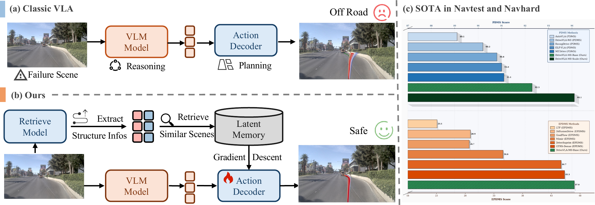
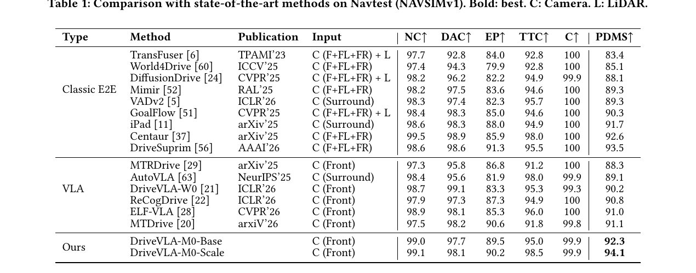

<p align="center">
    <h1 align="center">DriveVLA-M0: Failure-Aware Memory Augmentation for Autonomous Driving</h1>
    <h3 align="center">Base Model and Retrieve Model Deployment on NAVSIM 1.1</h3>
    <h3 align="center">
        <a href="https://arxiv.org/abs/2608.10413">Paper</a> |
        <a href="https://github.com/ZebinX/DriveVLA-M0">Code</a> |
        <a href="https://huggingface.co/XXXXing/DriveVLA-M0">Hugging Face Weights</a> |
        <a href="https://www.modelscope.cn/models/ArteMe/DriveVLA-M0">ModelScope Weights</a> |
        <a href="#deployment">Deployment</a>
    </h3>
</p>

<br/>

> [**DriveVLA-M0: Failure-Aware Memory Augmentation for Autonomous Driving**](https://arxiv.org/abs/2608.10413) <br>
> Zebin Xing*, Yupeng Zheng*, Qiang Chen, Linbo Wang, Yichen Zhang, Pengxuan Yang, Junli Wang, Deheng Qian, Xiaoqing Ye, Junyu Han, Yifeng Pan, Qichao Zhang, Dongbin Zhao <br>
> ACM Multimedia, 2026

<p align="center">
    
</p>

This repository packages the NAVSIM 1.1 deployment code for **DriveVLA-M0**, including the Base Model agent and the structurally grounded **Retrieve Model** used for map and agent retrieval experiments.

DriveVLA-M0 augments a VLA-based autonomous driving planner with failure-aware latent memory. The full framework stores past failure cases, retrieves structurally similar scenarios through decoupled map and agent embeddings, and injects retrieved knowledge through lightweight test-time adaptation. This release focuses on the NAVSIM 1.1 Base Model and Retrieve Model code paths that are needed for deployment and checkpoint verification.

<br/>

## News

* **12 Aug, 2026:** Released the cleaned NAVSIM 1.1 DriveVLA-M0 deployment package with Base Model and Retrieve Model checkpoints verified on A800.
* **ACM MM 2026:** DriveVLA-M0 is prepared as a failure-aware memory augmentation framework for autonomous driving.

## Highlights

* **NAVSIM-native agent layout.** DriveVLA-M0 is integrated as a NAVSIM agent under `navsim/agents/EpisodeDrive`, following the same agent-style integration pattern used by NAVSIM projects such as GoalFlow and DiffusionDrive.
* **Base Model deployment.** The DriveVLA-M0 Base Model is exposed through the compatibility target `EpisodeDriveAgent` and can be evaluated directly with NAVSIM PDMS scripts.
* **Structurally grounded retrieval.** The Retrieve Model decouples static road structure and dynamic agent interaction cues for map/agent retrieval visualization.
* **Checkpoint-compatible naming.** Public documentation uses DriveVLA-M0. The current NAVSIM Python target keeps `EpisodeDriveAgent` as a compatibility entry point so that verified checkpoints load without changing the module state-dict layout.

## Method Overview

DriveVLA-M0 contains two major stages:

1. **Offline memory generation.** Failure-prone scenes are identified by oracle simulation metrics, and their intermediate scene representations, trajectory clusters, and expert signals are written into a latent memory pool.
2. **Online inference with retrieval and TTT.** The Retrieve Model extracts map and agent keys for the current scene, retrieves structurally similar historical cases, and enables scenario-specific correction through decoupled LoRA-based test-time training.

In this release, the deployable components are:

| Component | NAVSIM target | Purpose | Weights |
| --- | --- | --- | --- |
| DriveVLA-M0 Base Model | `navsim.agents.EpisodeDrive.episodedrive_agent.EpisodeDriveAgent` | Planning / PDMS evaluation | [Hugging Face](https://huggingface.co/XXXXing/DriveVLA-M0) / [ModelScope](https://www.modelscope.cn/models/ArteMe/DriveVLA-M0) |
| Retrieve Model | `navsim.agents.EpisodeDrive.retrieve_model.retrieve_agent.RetrieveModelAgent` | Map and agent retrieval verification | [Hugging Face](https://huggingface.co/XXXXing/DriveVLA-M0) / [ModelScope](https://www.modelscope.cn/models/ArteMe/DriveVLA-M0) |

Both checkpoint groups are available from the Hugging Face and ModelScope mirrors above.

Hydra configs:

```bash
agent=episode_drive
agent=episode_drive_retrieve
```

## Results

Main paper NAVSIMv1 result reported for DriveVLA-M0:

<p align="center">
    
</p>

## Repository Layout

```text
DriveVLA-M0/
|-- navsim/
|   `-- agents/
|       `-- EpisodeDrive/
|           |-- episodedrive_agent.py
|           |-- drivevla_base_agent.py
|           |-- action_decoder.py
|           |-- retrieve_model/
|           |-- score_module/
|           `-- layers/
|-- configs/
|   |-- base_model_navtest.yaml
|   `-- retrieve_model_vehicle_only_multiview_agentw5.yaml
|-- scripts/
|   |-- run_base_pdms.sh
|   `-- run_retrieve_visualization.sh
|-- tools/
|   `-- verify_retrieve_model.py
|-- requirements.txt
|-- requirements-episode-drive.txt
`-- environment.yml
```

## Citation

If you find DriveVLA-M0 useful, please consider citing:

```BibTeX
@inproceedings{xing2026drivevlam0,
  title={DriveVLA-M0: Failure-Aware Memory Augmentation for Autonomous Driving},
  author={Xing, Zebin and Zheng, Yupeng and Chen, Qiang and Wang, Linbo and Zhang, Yichen and Yang, Pengxuan and Wang, Junli and Qian, Deheng and Ye, Xiaoqing and Han, Junyu and Pan, Yifeng and Zhang, Qichao and Zhao, Dongbin},
  booktitle={Proceedings of the 34th ACM International Conference on Multimedia},
  year={2026}
}
```

## Acknowledgement

This repository is built on top of [NAVSIM](https://github.com/autonomousvision/navsim), [nuPlan](https://www.nuscenes.org/nuplan), and OpenScene data tooling. The README layout follows the clean research-project style used by GoalFlow. We also thank the open-source autonomous driving community for prior work on VLA planning, retrieval, and memory-augmented agents.

## Contact

For questions, please open an issue or contact the authors listed in the paper.

<p align="right">(<a href="#top">back to top</a>)</p>
