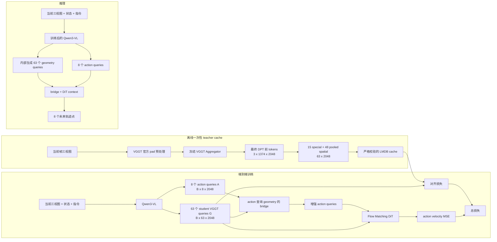

# VGGT 路线完整算法说明（当前实现）

> **历史说明（2026-08-11）**：本文记录的是已经在训练的 V1（63-token、4×4、final
> DPT-pre、双规划入口）实现，现仅用于复现实验和解释旧日志，不再代表新训练配置。完整 V2
> 已改为 layer11 pure-global、15 个文本 token、195-slot memory 和单一 8-waypoint reader，
> 见 [`V2_ALGORITHM.md`](V2_ALGORITHM.md)。

> 实现快照：`feature/add-VGGT`，工作树基于 commit
> `9dd6b71b324a58de005dc669394295b9354d189c`。本文描述的是当前工作树中的实际实现，
> 不是已完成实验的结果报告。文中的“预期”“目的”表示设计动机，不能替代训练和 NAVSIM 评估证据。

## 1. 一句话说明

这是一套从 Qwen3-VL 到 Flow Matching 轨迹头的独立端到端规划算法：训练时，用冻结的
VGGT 对当前三视图提取离线几何特征，监督 Qwen 内部 63 个可学习的 VGGT query；规划器再让
8 个未来 action query 主动读取这些 query，并把完整 query 序列交给 DiT。推理时不运行
VGGT、不读取 teacher cache，也不依赖任何 baseline 规划 checkpoint、draft 轨迹或 residual
refiner。

因此，VGGT 在这里是“只在训练期出现的表示教师”，而不是部署时串联在规划器前面的另一个
大模型。

## 2. 先区分四个容易混淆的对象

| 对象 | 内容 | 是否包含规划能力 | 使用阶段 |
|---|---|---:|---|
| 原始 VGGT checkpoint | 官方 VGGT 权重，本路线只加载其中的 `Aggregator` | 否 | 离线 cache 生成 |
| VGGT query cache | 每个 NAVSIM token 的 `[63, 2048]` teacher 特征和 `[63]` mask | 否 | 训练监督 |
| `Qwen3-VL-2B-VGGTAction` | 在现有 WorldAction VLM 词表上加入 63 个 VGGT 特殊 token 的 Qwen 权重目录 | 否；新增 token 初始为随机 embedding | 训练初始化和推理词表 |
| 训练产生的 planner checkpoint | Qwen、action head、aligner、planner bridge 的联合训练权重 | 是 | 推理和评估 |

`Qwen3-VL-2B-VGGTAction` 不是“训练好的 VGGT 规划模型”。它只是让 tokenizer 和 Qwen
embedding 表认识 63 个新 query token。真正的几何表征和规划能力来自后续端到端训练。

## 3. 总体数据流



训练和推理使用同一条 student 规划路径。两者的唯一区别是：训练额外读取离线 teacher
target 并计算对齐损失；推理完全删除右侧 teacher 分支。

## 4. 规划任务和输入输出契约

### 4.1 当前时刻输入

每个 NAVSIM 样本使用：

- 当前帧三视图，固定顺序为 `cam_f0, cam_l0, cam_r0`，即前、左前、右前；
- metadata 中的 frame index 为 `3`；policy 和 teacher cache 均使用这一时刻；
- 当前运动状态 `[1, 4]`；
- 当前导航命令组成的自然语言 instruction。

状态的四个通道和 action 使用相同的表示：

```text
[x_normalized, y_normalized, sin(heading), cos(heading)]
```

状态先经过 `action_input_model: 4 -> 2048 -> 2048`，再替换 prompt 中唯一的 history
token embedding。它没有作为额外状态序列再次输入 action head。

### 4.2 监督轨迹

轨迹标签为 `[B, H=8, 4]`。每一个 waypoint 都相对当前帧 `t=3` 的 ego pose 表示，
不是逐步累加的相邻帧 delta：

\[
x_n = \frac{x-x_{mean}}{x_{std}},\qquad
y_n = \frac{y-y_{mean}}{y_{std}},
\]

\[
a_h = [x_n, y_n, \sin(\Delta\theta), \cos(\Delta\theta)].
\]

当前代码中的统计量是：

```text
x_mean = 10.172484, x_std = 8.805105
y_mean =  0.360762, y_std = 2.277741
```

推理后用相同统计量恢复 `x, y`，并用
`atan2(sin_heading, cos_heading)` 恢复 heading，最终写出 NAVSIM evaluator 兼容的
`[8, 3] = [x, y, heading]` 数组。

### 4.3 禁止的信息泄漏

VGGT teacher 只看当前三视图。GT future trajectory、demonstrated future image、candidate
trajectory 和最终 NAVSIM score 都不会输入 VGGT、Qwen 的 VGGT query writer 或 planner
bridge。因此当前路线没有把未来真值包装成“世界知识”。

## 5. 为什么选择 DPT 前的 VGGT Aggregator 特征

### 5.1 实际提取位置

cache 脚本只实例化：

```text
Aggregator(img_size=518, patch_size=14, embed_dim=1024)
```

然后只从完整 VGGT checkpoint 中加载 `aggregator.*` 权重。depth、point、camera 等 DPT
head 不会实例化，也不会进入训练进程。

三张图片用 VGGT 官方 `load_and_preprocess_images(..., mode="pad")` 处理：

```text
单样本输入               [V=3, 3, 518, 518]
batch 输入                [B, 3, 3, 518, 518]
最终 Aggregator 输出      [B, 3, 1374, 2048]
```

每个 view 的 1374 个 token 由以下部分组成：

```text
1 camera token + 4 register tokens + 37 x 37 patch tokens
= 5 special + 1369 spatial
= 1374 tokens
```

特征维度是 2048，而不是构造 Aggregator 时的 `embed_dim=1024`。这是 VGGT Aggregator
交替进行 frame/global attention 后组合中间表示的输出契约，cache 代码会对最终 shape 做
严格断言。

### 5.2 选择它的原因

选择最终 Aggregator、进入 DPT head 之前的表示，设计上有四个理由：

1. 它是 VGGT 共享的几何主干表示，不绑定某一个 depth/point/camera 下游 head。
2. 它同时保留 camera/register 全局 token 和有空间布局的 patch token，便于既监督场景级
   结构，又给规划器保留局部读取能力。
3. VGGT 的 global attention 已经在三个 view 间交换信息；所谓“某个 view 的 token”仍然
   含有跨视角上下文，而不只是单相机纹理。
4. 离线缓存主干 token 后，训练和推理都不需要在线运行 VGGT，计算和部署依赖可控。

这是一项合理的表示选择假设，但不能仅凭“容易对齐”证明它对规划最优。最终层可能偏全局，
而且 4×4 压缩会损失细小障碍物和车道边缘。是否优于中间层、多层组合或 DPT head 特征，仍需
实验回答。

## 6. 从 1374 个 teacher token 压缩到 63 个槽位

直接保存三视图全部 token 会得到 `3 x 1374 x 2048`，对 10 万级样本和训练 I/O 都过重。
当前实现构造固定的紧凑 target：

### 6.1 Special target

保留每个 view 前 5 个 camera/register token，并按 view-major 展平：

```text
T_special: [B, 3, 5, 2048] -> [B, 15, 2048]
```

槽位索引为：

\[
q_{special}=5v+t,\quad v\in[0,2],\ t\in[0,4].
\]

### 6.2 Spatial target

每个 view 的 `37 x 37` patch map 先重排为 `[B*3, 2048, 37, 37]`，在 float32 下做
adaptive average pooling 到 `4 x 4`：

```text
T_spatial: [B, 3, 37, 37, 2048]
        -> [B, 3, 4, 4, 2048]
        -> [B, 48, 2048]
```

槽位索引为：

\[
q_{spatial}=15+16v+4r+c,
\quad v\in[0,2],\ r,c\in[0,3].
\]

### 6.3 最终 target

```text
T = concat(T_special, T_spatial, dim=1)  # [B, 63, 2048]
M                                          # [B, 63], bool
```

顺序始终是“全部 special，再全部 spatial”，不是每个 view 内 special/spatial 交错。

### 6.4 Padding validity 和低方差过滤

VGGT 的 `pad` 预处理会在非方形图片周围产生 padding。cache 生成器按原始宽高计算每个
`14 x 14` source patch 的真实内容覆盖率，再把 validity 同样 pool 到 `4 x 4`。一个 pooled
spatial slot 的有效内容比例至少为 `0.25` 才参与该样本的 alignment。special slot 默认有效。

cache 完成后还会跨全数据集统计每个 slot 的 count 和 variance。方差低于 `1e-6` 的 slot
写入 manifest-wide `active_slot_mask=false`。训练时使用：

```text
alignment_mask = sample.valid_mask AND manifest.active_slot_mask
```

这两个 mask 只控制 teacher 对齐，不会让推理时的 student query 消失。

## 7. Cache 为什么不是普通的 `.pt` 特征目录

每个样本的实际 payload 是：

```text
features:   bfloat16[63, 2048]
valid_mask: bool[63]
```

它由多 rank 写入分片 LMDB，并通过原子写入发布 manifest。manifest 至少绑定：

- VGGT checkpoint SHA-256；
- VGGT repo commit 和本项目 commit；
- datalist SHA-256 和 sample count；
- view order、frame index、preprocess、source/pooled grid；
- query count、feature dim、slot variance、active slot mask；
- extractor 脚本 SHA-256 和每个 rank 的 completion record。

Dataset 初始化时会 fail-fast 校验 datalist hash、样本数、view order、`Q=63` 和
`D=2048`。缺失样本、损坏 record 或不匹配 manifest 不会静默回退到在线 VGGT，也不会拿
GT action 代替。

绝对路径只写入 manifest 的 `diagnostic_paths`，不参与 cache identity。共享代码通过
`VGGT_REPO`、`VGGT_CHECKPOINT`、`NAVSIM_VGGT_CACHE_ROOT` 等环境变量解析各开发者本地路径。

## 8. Student VGGT queries 如何构造

### 8.1 63 个唯一 token

在 Qwen 词表中加入：

```text
15 x <vggt_special_v{v}_t{t}>
48 x <vggt_spatial_v{v}_r{r}_c{c}>
```

新 embedding 使用 `Normal(0, 0.02)` 初始化。每个 token 都有唯一 ID，所以它们天然携带
固定的 view/type/row/column 槽位身份。模型初始化时会检查 63 个 token 全部存在且 ID 唯一。

### 8.2 Prompt 布局

Qwen 正常接收三张图片和自然语言 instruction，然后附加：

```text
<history>
<63 个 VGGT query，顺序与 teacher target 完全一致>
<8 个 action query>
```

Qwen3-VL 的最后一层 hidden state 是：

```text
last_hidden: [B, L, Hq=2048]
```

代码按精确 token ID 查找位置并 gather：

```text
G: [B, 63, 2048]  # student geometry/VGGT queries
A: [B,  8, 2048]  # action queries
```

这些不是从 Qwen visual encoder 另跑一次得到的 feature map，而是和图片、状态、语言共同
经过同一次 Qwen language forward 后的上下文化 token。主训练脚本禁用旧 Qwen feature
cache，避免旧 prompt 不含 VGGT token，也避免视觉编码重复或位置不匹配。

### 8.3 固定槽位的一对一含义

第 `q` 个 student token 总是对齐第 `q` 个 teacher token。例如：

- `<vggt_special_v1_t2>` 对齐左前 view 的第 2 个 register/camera 类 special slot；
- `<vggt_spatial_v2_r3_c1>` 对齐右前 view 的 pooled spatial `(3,1)` slot。

这里没有 Hungarian matching 或可变长度 detection query。固定槽位让监督简单稳定，但也要求
camera 顺序和 preprocessing 严格一致。

还有一个容易忽略的限制：Qwen 是 causal decoder。每个 VGGT query 能看到它之前的图片、
instruction、history 和更早 query，但不能在同一层直接看到后续 query；8 个 action query
位于最后，所以它们可以看到全部 63 个 VGGT query。teacher 的每个 token 则已经经过 VGGT
内部的跨视角全局交互。两种网络的 token 交互结构并不完全同构，对齐损失承担了这部分迁移。

## 9. 特征怎么对齐

### 9.1 维度对齐

当前 Qwen hidden dim 与 VGGT target dim 都是 2048。aligner 仍保留显式投影层：

```text
LayerNorm(2048) -> Linear(2048, 2048)
```

当两端维度相同，Linear weight 初始化为单位矩阵，bias 为 0。这避免刚开始用一个随机矩阵
任意旋转 student 空间。需要精确地说：由于 Linear 前还有可学习 LayerNorm，初始输出是
`LN(G)`，不是未经处理的原始 `G`。

所有 alignment 计算强制使用 float32：

\[
S=P(\operatorname{LN}(G)),\qquad
T_n=\operatorname{LN}(T).
\]

teacher 和 student 分别做 per-token LayerNorm，主要用于消除 BF16 cache、VGGT 和 Qwen
激活尺度的差异。

### 9.2 方向对齐：Cosine loss

\[
\hat S_i=\frac{S_i}{\lVert S_i\rVert_2},\qquad
\hat T_i=\frac{T_{n,i}}{\lVert T_{n,i}\rVert_2},
\]

\[
L_{cos}=\operatorname{MaskedMean}_i
\left(1-\hat S_i^\top\hat T_i\right).
\]

它让一一对应的 student/teacher slot 指向相似特征方向，对跨模型的整体 scale 较稳健。

### 9.3 通道值对齐：SmoothL1

\[
L_{smooth}=\operatorname{MaskedMean}_i
\left(\frac{1}{D}\operatorname{SmoothL1}(S_i,T_{n,i})\right).
\]

SmoothL1 比单纯 cosine 多保留了 LayerNorm 后的通道坐标结构，同时对少量异常维度比 MSE
稳健。它不是在原始未归一化 feature magnitude 上回归。

### 9.4 关系对齐：Relational Gram loss

仅逐 token 对齐可能让 63 个槽位各自拟合，却破坏 teacher 内部的相对场景结构。因此计算：

\[
R_S=\hat S\hat S^\top,\qquad R_T=\hat T\hat T^\top,
\quad R_S,R_T\in\mathbb{R}^{B\times63\times63},
\]

\[
L_{rel}=\operatorname{MaskedMean}_{i,j}
\operatorname{SmoothL1}(R_{S,ij},R_{T,ij}).
\]

pair mask 为 `M_i AND M_j`。这个损失约束 camera/register/spatial slots 之间的相似性图，
而不是只要求 63 次独立回归。

### 9.5 对齐损失和总损失

aligner 内部：

\[
L_{align}=1.0L_{cos}+0.1L_{smooth}+0.05L_{rel}.
\]

trainer 的 named loss 聚合：

\[
L_{total}=1.0L_{action}+0.1L_{align}.
\]

所以展开后的实际系数是：

```text
L_action      1.000
L_cos         0.100
L_smooth      0.010
L_rel         0.005
```

每个 named loss 都必须在 `trainer.loss_weights` 中显式配置；新增损失没有权重会直接报错，
不会被静默忽略。

### 9.6 为什么 planner 不直接使用投影后的 `S`

aligner 会返回 `projected_queries=S` 供诊断，但当前 planner 实际读取的是原始 Qwen hidden
space 中的 `G`。这是有意的：

- alignment 通过同一个 `G` 把 teacher 梯度传回 Qwen；
- planner 始终在 Qwen 的 2048 维原生空间工作；
- 推理时不需要依赖 teacher normalization 或“teacher-space feature”这一额外中间产物。

代价是 projection 层可能吸收一部分对齐难度，使 `S` 对齐得好但原始 `G` 对规划的贡献仍然
有限。因此必须同时观察 alignment 指标和 planning-only gradient，不能只看 cosine。

## 10. VGGT 知识如何在规划中被使用

当前实现有三条利用路径，不只是一个辅助 loss。

### 10.1 路径 0：Qwen 内部的隐式利用

63 个 VGGT query 排在 8 个 action query 之前。由于 Qwen 的 causal self-attention，生成
action query hidden state 的每一层都可以读取前面的全部 VGGT query。因此 gather 出来的原始
`A` 已经可能包含几何信息。

这条路径不容易单独诊断，也是为什么还需要下面两条显式路径。

### 10.2 路径 1：PlanningQueryBridge 的 action-conditioned readout

bridge 输入：

```text
A: [B, 8, 2048]
G: [B, 63, 2048]
M_planner: [B, 63]，当前全部为 True
```

它执行 16-head cross-attention：

\[
Q=\operatorname{LN}_a(A),\qquad
K=V=\operatorname{LN}_g(G),
\]

\[
\Delta A=\operatorname{MHCA}(Q,K,V),
\]

\[
A_{enh}=A+\sigma(\gamma)\Delta A.
\]

其中 scalar gate `sigmoid(gamma)` 初始为 `0.5`。cross-attention output projection 使用
`Normal(0, 1e-3)` 小权重初始化、bias 为 0，所以初始影响较小但非零。它不是 residual
baseline，也不要求初始输出严格等于另一套 planner；其目的只是让完整算法在训练第一步就有
稳定、可导的 geometry-to-action 路径。

这里 8 个 action query 分别对应 8 个未来 waypoint 位置。每个 query 都产生自己的
`[63]` attention distribution，因此不同 horizon 可以检索不同 view/special/spatial slot。

需要强调：这是语义 token attention，不是按预测轨迹坐标做的 BEV/tube sampling。当前模型
没有显式把第 5 个 waypoint 投影到某个相机或 BEV cell。

### 10.3 路径 2：完整 VGGT context 进入 Flow Matching DiT

bridge 只产生 8 个增强 query，但完整的 63 个 `G` 不会被 pool 掉。action head 先拼接：

```text
concat(A_enh, G, dim=1): [B, 8+63, 2048] = [B, 71, 2048]
```

然后 `qwen_proj` 把每个 context token 映射到 action hidden space：

```text
[B, 71, 2048] -> [B, 71, 1536]
```

Flow Matching 的当前 noisy action trajectory 经 ActionEncoder 得到：

```text
x_t:              [B, 8, 4]
action_features:  [B, 8, 1536]
context:          [B, 71, 1536]
```

DiT 的 `hidden_states` 是 8 个 noisy action token，`encoder_hidden_states` 是 71 个 VLM
context token。正式配置有 24 层并启用 interleaved self-attention：偶数层对 71-token
context 做 cross-attention，奇数层在 8 个 action token 间做 self-attention。因此在 24 层
配置中有 12 个显式 context cross-attention block。

这条路径保证了即使 bridge residual 很小，DiT 仍可在每次 velocity prediction 中直接读取
完整的 special/spatial 表示；同时 bridge 提供了动作条件化的早期汇聚。

### 10.4 为什么 planner mask 和 alignment mask 不相同

alignment mask 表示“这个 cache slot 是否有可靠 teacher target”。planner 读取的是 Qwen
真实生成的 63 个 token，它们在推理时也全部存在。因此当前实现对 planner 使用全 True
mask，而不把 teacher padding/低方差 mask 带进规划器。

这样训练和推理的 planner access 完全一致。风险是某个缺少直接 teacher 监督的 slot 仍可被
action loss 使用；它此时更像普通的可学习 planning token。是否应该把 manifest active mask
作为结构 mask，是后续可验证问题，不应在没有实验前默认改动。

## 11. Flow Matching 轨迹学习

训练时，对干净轨迹 `a=[B,8,4]` 采样同 shape 的高斯噪声 `epsilon` 和时间 `t`：

\[
x_t=(1-t)\epsilon+ta,\qquad v^*=a-\epsilon.
\]

`t` 来自 `Beta(alpha=1.5, beta=1.0)` 后按 `noise_s=0.999` 做当前代码中的变换。DiT 预测
velocity，action loss 为：

\[
L_{action}=\operatorname{Mean}\left[(v_\theta(x_t,t,context)-v^*)^2\right].
\]

正式训练的 `repeated_diffusion_steps=8` 表示把同一个样本沿 batch 维复制 8 次，让每次复制
采到不同噪声和 `t`：

```text
actions:        [B, 8, 4]    -> [8B, 8, 4]
action queries: [B, 8, 2048] -> [8B, 8, 2048]
VGGT context:   [B,63, 2048] -> [8B,63, 2048]
```

这不是一次推理中的 8 个 denoising step。推理另设 `num_inference_timesteps=10`：从
`N(0,I)` 初始化 `[B,8,4]`，用 10 次 Euler update 积分预测速度。`A_enh` 和 `G` 在这 10
次更新中保持不变，每一步 DiT 都读取相同的 71-token scene context。

## 12. 梯度究竟更新谁

正式配置 `freeze_modules=''`，也没有加载 baseline planner checkpoint。因此：

- Qwen3-VL 参数由 action loss 和 alignment loss 联合更新；
- 63 个新 token embedding 由两种损失共同学习；
- action input model、Flow Matching action head 由 action loss 更新；
- aligner 由 alignment loss 更新；
- planner bridge 由 action loss更新；
- VGGT Aggregator 永远冻结，只在离线 cache 阶段运行。

对同一个 `G` 来说：

```text
teacher alignment gradient ─┐
                            ├─> Qwen / VGGT query embeddings
planning action gradient  ──┘
```

这正是“既学会 teacher 表示，又让规划使用表示”的耦合位置。仅有第一条梯度会变成容易优化但
可能无用的蒸馏；仅有第二条梯度则无法证明新增容量学到的是 VGGT 知识。

## 13. 完整训练和推理流程

### 13.1 离线准备

1. 给已有 VLM 增加 63 个 VGGT query token，得到 `VGGT_BASE_VLM`。
2. 冻结 VGGT Aggregator，对 train datalist 的当前三视图生成完整 query cache。
3. 严格 validate manifest、rank LMDB 和所有 token record。

### 13.2 每个训练 step

1. Dataset 读取当前三视图、state、instruction、GT `[8,4]` 和 cached teacher `[63,2048]`。
2. Qwen 单次前向产生 `G=[B,63,2048]` 和 `A=[B,8,2048]`。
3. `G` 与 teacher 计算三项 alignment loss。
4. `A` 通过 bridge 检索 `G`，得到 `A_enh`。
5. `A_enh` 和完整 `G` 共同条件化 Flow Matching DiT。
6. 显式加权 `L_action + 0.1 L_align`，一次 backward 联合更新 student planner。

### 13.3 每个推理样本

1. 只读取当前三视图、state 和 instruction。
2. 训练后的 Qwen 自己生成 63 个 `G`；不读取 train cache。
3. bridge 和 DiT 使用与训练相同的 planner access。
4. 10-step Flow Matching 生成 `[8,4]`，解码成 `[8,3]` 并原子写入 `{token}.npy`。

推理入口会显式设置 `framework.vggt.cache.enabled=false`。如果本地缺少 VGGT repo 或 VGGT
checkpoint，已训练 planner 的推理仍然可以运行；只需要匹配的 `VGGT_BASE_VLM` 词表目录和
planner checkpoint。

## 14. 怎么判断模块是否真的学会了

不能只看总 loss。当前实现把“表示学会”“规划在用”“任务变好”拆成三层证据。

### 14.1 表示是否学会 VGGT

| 指标 | 含义 | 健康趋势 |
|---|---|---|
| `vggt/alignment_cosine_all` | 有效 slot 的平均 student-teacher cosine | 上升 |
| `...cosine_special` | 15 个 special slots 的 cosine | 上升 |
| `...cosine_spatial` | 48 个 spatial slots 的 cosine | 上升 |
| `...in_batch_retrieval_top1` | student 场景描述能否找回同 batch teacher 场景 | 高于随机基线 `1/B` |
| `...student_std` | projected student feature 的标准差 | 不应塌缩到 0 |
| `vggt/alignment_loss_cosine`、`...smooth_l1`、`...relational` | 三个未乘 trainer 权重的子损失 | 分别下降，避免一项掩盖另一项 |
| `...valid_ratio` | 当前 batch 参与 alignment 的槽位比例 | 稳定且与 cache 预期一致 |

retrieval 只是 in-batch probe。batch 内重复或相似场景会降低它的解释力，不能把单个绝对值
当作成功阈值。

### 14.2 规划器是否在使用这些 query

| 指标 | 含义 | 健康趋势 |
|---|---|---|
| `vggt/planning_context_grad_norm` | 只由 action 路径回到 `G` clone 的梯度，不含 alignment 梯度 | 持续非零 |
| `vggt/planner_gate_grad_abs` | bridge gate 是否收到规划学习信号 | 持续非零 |
| `vggt/planner_bridge_gate` | 当前 residual gate | 不应长期饱和到 0 |
| `...delta_norm` | bridge 给 action query 的改变量 | 不能始终近 0，也不应突然爆炸 |
| `...attention_entropy` | action→63 slots 的注意力熵 | 应随训练变化，避免永久固定均匀/单点 |
| `...attention_max` | 每个 action query 的最大 attention | 与 entropy 联合解释 |
| `...planner_context_norm` | planner 实际收到的 context 强度 | 稳定、有限 |

`planning_context_grad_norm` 的 hook 注册在只进入 downstream planning 的 `queries.clone()`
上，所以对齐损失本身不能把它“刷成非零”。这是当前最重要的知识利用诊断。

### 14.3 最终是否改善规划

还必须检查：

- held-out action loss，而不只是 train action loss；
- 同一 evaluator、同一 split、同一推理步数下的 NAVSIM 总分和各物理子项；
- navtest 与 navhard，以及 collision、drivable area、progress、comfort 等分项；
- 至少比较多个 checkpoint，避免用单次 100k 终点掩盖中途过拟合或负迁移。

attention map 看起来“集中”并不等于规划有增益；alignment cosine 很高也不等于规划用了它。

### 14.4 checkpoint 归因矩阵

| Alignment | Planning-only gradient | 规划指标 | 解释 |
|---|---|---|---|
| 好 | 非零 | 改善 | 符合预期：表示迁移且被规划使用 |
| 好 | 接近零 | 无改善 | Qwen/aligner 学会复制 teacher，但 planner 忽略它 |
| 差 | 非零 | 改善 | 新 query/bridge 容量可能有用，但不能证明来自 VGGT 知识 |
| 好 | 非零 | 无改善 | 知识被读到，但可能与规划不相关、读取方式不对或损失权重冲突 |
| 差 | 接近零 | 无改善 | 对齐和利用两端都未学好 |
| 好 | 非零 | 变差 | 可能是负迁移、过强辅助目标或粗空间槽位误导规划 |

训练每 50 step 写 `vggt_diagnostics.jsonl`，默认每 5000 step 保存 checkpoint。诊断工具对
最近 100 条记录取中位数：

```bash
python tools/diagnose_vggt_training.py "$RUN_DIR" --window 100
```

工具中的 `gradient > 1e-10`、`student_std > 1e-4` 只是连通性/塌缩 smoke check，不能当成
论文级性能阈值。正式 checkpoint 选择仍应依据趋势和实际验证集/NAVSIM 结果。

## 15. 这套设计合理在哪里

1. **完整算法而非后处理**：没有 frozen baseline proposal、draft 或 residual refiner；图像到
   最终轨迹一次端到端学习。
2. **训练/推理结构一致**：teacher 只提供 loss，planner 始终读取自己的 student `G`；推理
   不会突然失去训练时依赖的在线 VGGT feature。
3. **表示监督不等于利用**：bridge、完整 DiT context 和 planning-only gradient 把“对齐了”
   与“规划用了”显式分开。
4. **多粒度 teacher target**：special token 表达全局相机/场景信息，spatial token 保留粗局部
   布局，关系 loss 再约束它们的内部组织。
5. **工程可运行性**：VGGT 不进入训练 forward；cache 有 manifest 和原子完成协议；不同机器
   的 repo、权重、数据和输出路径由各自环境配置。
6. **任务目标仍占主导**：实际总损失中 action 权重为 1，teacher alignment 的总权重为 0.1。

## 16. 当前实现的边界和风险

### 16.1 它还不是显式 3D/BEV field

48 个 spatial slot 是三张图像上 `37×37 -> 4×4` 的 view-major 网格，没有使用 camera
intrinsics/extrinsics 投到统一 ego BEV。因此：

- 左右相机的相同 `(r,c)` 不表示相同 ego 坐标；
- planner 需要自己从 token 内容和唯一 token ID 中学习跨视角几何关系；
- 没有 trajectory-tube readout 或沿候选轨迹的物理空间采样。

所以更准确的名字是“VGGT 几何 query distillation + planning access”，不是 calibrated
geometry field。

### 16.2 空间压缩较强

每个 view 只剩 16 个 spatial token。它有利于 I/O 和 DiT context 长度，但可能损失小目标、
远处行人、细车道边缘和精确 clearance。special token 能提供全局结构，不能保证补回这些局部
细节。

### 16.3 只有当前帧，没有显式 dynamics

teacher 输入是单时刻三视图，当前没有历史图像序列、future feature teacher、显式 ego-motion
compensation 或动态占据预测。模型可从当前图像和 state 推断运动，但这不是独立监督的 dynamics
field。

### 16.4 对齐投影可能吸收任务

identity 初始化降低了风险，但可学习 `Linear(2048,2048)` 仍可能让 projection 变好，而 Qwen
原生 `G` 改变有限。planning-only gradient 和最终任务指标是必要检查；未来也可比较冻结
identity、低秩投影或直接 feature regression。

### 16.5 三条 access 路径可能冗余

action query 已能在 Qwen 内看到 VGGT query，随后又经过 bridge，DiT 再读完整 context。
这提高了知识被利用的概率，也增加了“到底哪一层在起作用”的归因难度。当前优先目标是先让
完整算法容易学会；结构消融应在首轮完整训练之后进行。

### 16.6 当前完整训练不能单独证明增益来自 VGGT

`supervision_enabled` 和 `access_enabled` 可分别关闭，但当前代码不允许二者同时为 false；
random teacher、batch-shuffled teacher 和严格 equal-capacity control 也尚未实现。因而单次
“supervision+access”完整训练可以回答“完整算法效果如何”，但不能独立完成因果归因。

最小归因组未来应固定数据、训练预算和 action head，至少比较：

```text
1. supervision + access       完整算法
2. supervision + no access    能否学到表示但规划看不到
3. no supervision + access    同等 query/bridge 容量、没有 VGGT teacher
4. shuffled/random teacher    排除任意辅助目标带来的正则化效应
```

这不妨碍先跑完整算法，但在声称“增益来自 VGGT”前必须补齐。

## 17. 与 VGGDrive 思路的关系

当前路线接受了 VGGDrive 类工作的一个核心经验：几何表示容易通过蒸馏学到，不代表规划器会
合理使用。因此除了 alignment，还设置显式 action-conditioned cross-attention 和 action head
内部的完整 context access。

两者并不相同：

- VGGDrive 的核心做法是把 VGGT geometry 通过多层 cross-view geometry enhancement 注入
  VLM decoder；
- 当前实现把 VGGT 作为离线 teacher，部署时由 Qwen 内部 query 近似；
- 当前注入重点位于 planning boundary 和 Flow Matching DiT，而不是在多个 Qwen decoder
  layer 内反复注入；
- 当前方法更轻、teacher-free inference、诊断简单，但显式多层几何融合能力也更弱。

相关资料：

- VGGDrive paper: <https://arxiv.org/abs/2602.20794>
- VGGDrive code: <https://github.com/WJ-CV/VGGDrive>
- VGGT code: <https://github.com/facebookresearch/vggt>

## 18. 正式训练配置

默认单节点 PAI-DLC 配置：

```text
16 PPU x per-device batch 2 x accumulation 1 = effective batch 32
100,000 optimizer steps，5,000 warmup steps
Qwen / action head / aligner / bridge LR = 1e-5
AdamW weight decay = 1e-3
BF16，DeepSpeed ZeRO-2，native SDPA
DiT hidden = 1536，layers = 24
repeated_diffusion_steps = 8
inference Euler steps = 10
checkpoint every 5,000 steps
diagnostics every 50 steps
```

路径不写入共享 YAML。每位开发者只在自己的 `env.local.sh` 或 DLC 环境变量中配置：

```text
VGGT_REPO
VGGT_CHECKPOINT
VGGT_SOURCE_VLM
VGGT_BASE_VLM
NAVSIM_VGGT_CACHE_ROOT
NAVSIM_DATALIST_PATH
DATA_ROOT
NAVSIM_TRAINVAL_SENSOR_ROOT
NAVSIM_EXP_ROOT
```

非交互式单节点 16 PPU 一键入口：

```bash
bash run_vggt_pipeline.sh
```

分阶段入口：

```bash
bash 7-add_vggt_tokens.sh
bash tools/cache_vggt_queries.sh
bash 8-train_vggt_action.sh
```

## 19. 关键代码入口

| 功能 | 实际入口 |
|---|---|
| Framework 注册和端到端连接 | [`QwenOFT_VGGT.py`](../../starVLA/model/framework/QwenOFT_VGGT.py) |
| Baseline-compatible hook 和 train/infer 主干 | [`QwenOFT.py`](../../starVLA/model/framework/QwenOFT.py) |
| 63-token 静态布局 | [`types.py`](../../starVLA/model/modules/vggt_query/types.py) |
| 1374→63 teacher target | [`targets.py`](../../starVLA/model/modules/vggt_query/targets.py) |
| 三项 alignment loss | [`alignment.py`](../../starVLA/model/modules/vggt_query/alignment.py) |
| action-conditioned bridge | [`planner_bridge.py`](../../starVLA/model/modules/vggt_query/planner_bridge.py) |
| VGGT 离线 cache | [`precompute_vggt_query_cache.py`](../../tools/precompute_vggt_query_cache.py) |
| Dataset 和 action normalization | [`navsim_dataset.py`](../../starVLA/dataloader/navsim_dataset.py) |
| DiT context 与 Flow Matching | [`GR00T_ActionHeader.py`](../../starVLA/model/modules/action_model/GR00T_ActionHeader.py) |
| Named loss 与诊断日志 | [`train_starvla.py`](../../starVLA/training/train_starvla.py) |
| Checkpoint 诊断汇总 | [`diagnose_vggt_training.py`](../../tools/diagnose_vggt_training.py) |
| 正式配置 overlay | [`vggt_query_main.yaml`](../../starVLA/config/training/vggt_query_main.yaml) |
| 一键 DLC 流水线 | [`run_vggt_pipeline.sh`](../../run_vggt_pipeline.sh) |

## 20. 最终结论

当前 VGGT 路线不是“让 Qwen 模仿一个 teacher feature 就结束”，而是：

```text
当前三视图
-> Qwen 内部生成具有固定几何语义的 63 个 query
-> 用离线 VGGT target 约束 query 表示
-> 8 个未来 action query 主动检索这些表示
-> Flow Matching DiT 在整个生成过程中继续读取完整表示
-> 直接输出完整未来轨迹
```

它优先解决的是两个最实际的问题：teacher 不进入部署，以及学到的表示必须有可观测、可导的
规划使用路径。当前最需要实验验证的不是“loss 能不能下降”，而是三件事是否同时成立：

1. special/spatial query 确实对齐 VGGT 且不塌缩；
2. action loss 对这些 query 保持非零、有意义的梯度；
3. 同一评估协议下，held-out action 和 NAVSIM 物理指标随 checkpoint 真正改善。

只有三者同时成立，才能说这套完整算法完成了“外部几何知识迁移并被规划有效利用”。而要进一步
声称增益“来自 VGGT”，还需要后续 teacher/no-teacher/shuffled/equal-capacity 对照。
