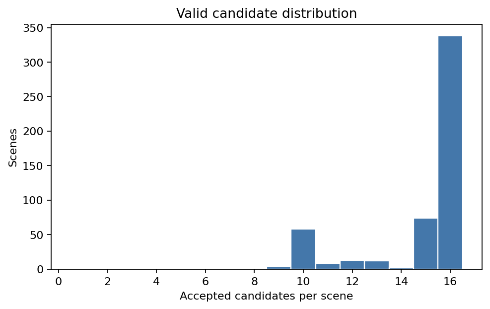
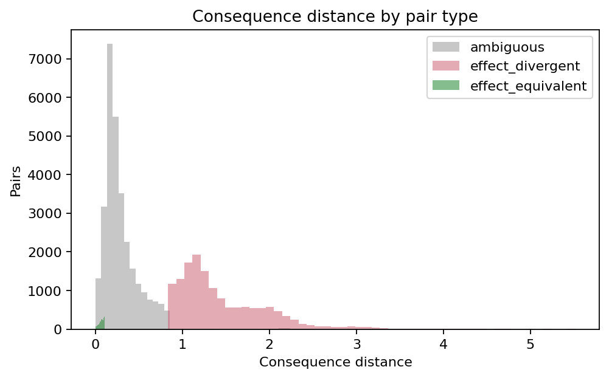
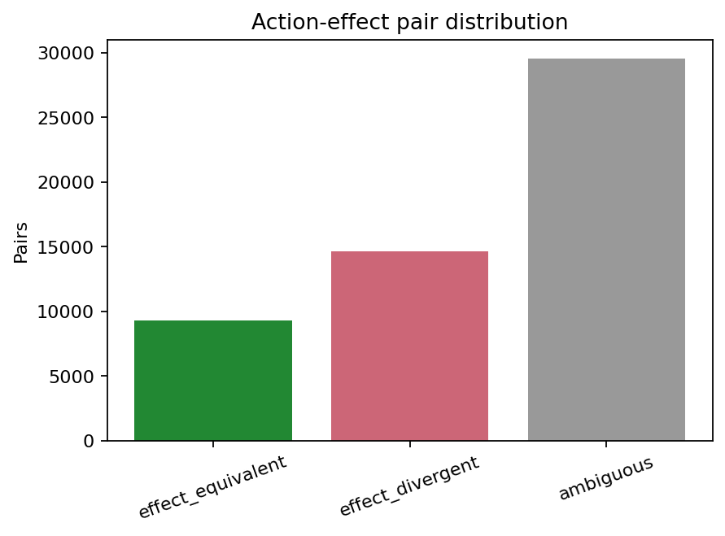
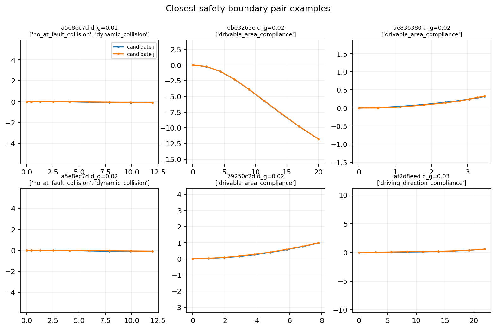
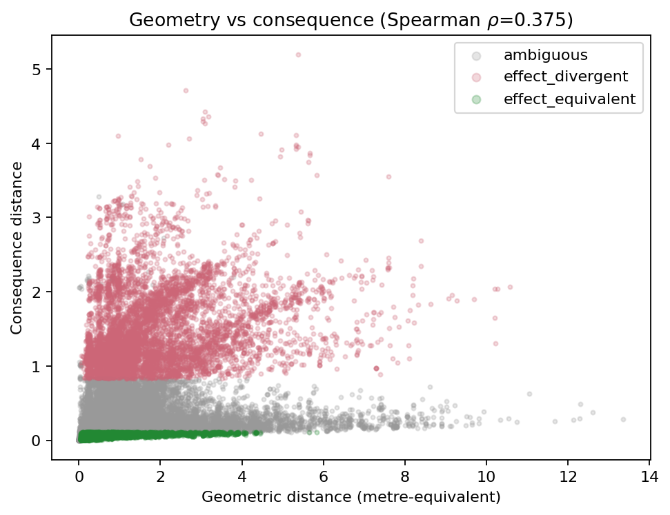
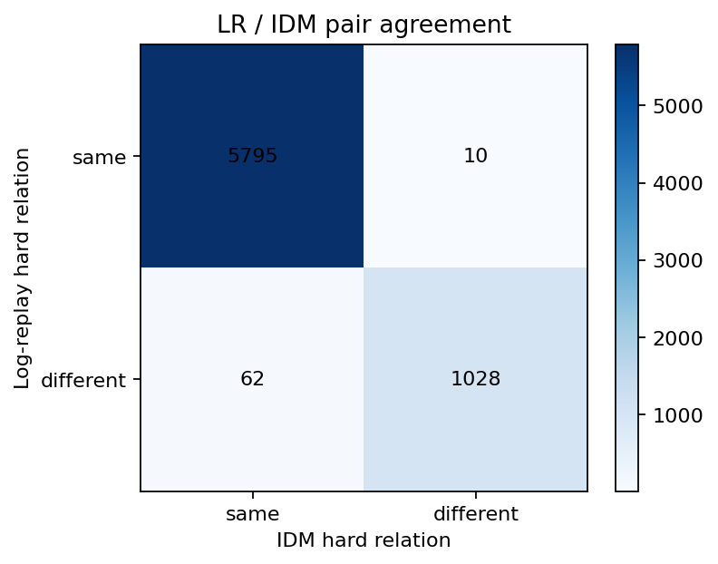
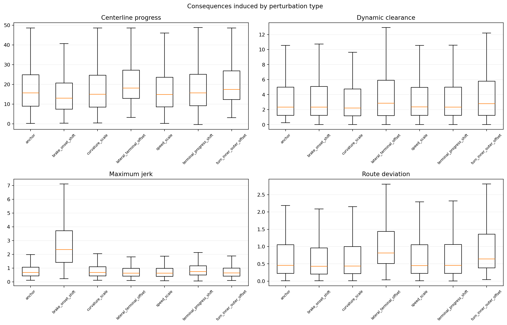

# Action-effect 数据可行性（Phase 4）

状态：**已实现并运行**。统计只使用 `train` split；soft consequence 的 median/IQR/5%–95% 与 pair 阈值均未读取验证集。运行提交基线为 `ad90c9c24c13022ea6f29682003ad3c1fd4e1de4`，生成缓存 manifest 另外记录了未提交源码 tree hash。

## 结论与 Gate 1

**Gate 1：PASS。** 局部候选有效、pair 类型有共存，且后果差异不退化为纯几何距离。

关键证据：512 个场景的每场有效候选中位数为 16.0；同时含 equivalent/divergent pair 的场景比例为 89.8%；安全边界 pair 共 2095 个，覆盖 34.8% 场景；几何/后果距离 Spearman 相关为 0.375（p=0.00e+00）。

该标签是 `replay_grounded_consequence` / `reactive_model` 监督，不是真实因果反事实。真实参与者对未执行动作的反应仍标记为 `unknown`。

## 1. 候选数量与有效性

- 场景数：512；候选总数：8192。
- 运动学有效率：93.27%。
- route proxy 有效率：99.13%。
- 同时通过两项过滤：92.41%。
- 每场有效候选：均值 14.79，中位数 16.0，最小 0。

### 各扰动保留率

| 扰动 | 数量 | 运动学有效率 | route proxy 有效率 | 最终保留率 |
| --- | --- | --- | --- | --- |
| anchor | 512 | 0.992 | 1.000 | 0.992 |
| brake_onset_shift | 1024 | 0.996 | 1.000 | 0.996 |
| curvature_scale | 1024 | 0.996 | 0.935 | 0.931 |
| lateral_terminal_offset | 2048 | 0.821 | 1.000 | 0.821 |
| speed_scale | 1536 | 0.995 | 1.000 | 0.995 |
| terminal_progress_shift | 1024 | 0.995 | 0.996 | 0.991 |
| turn_inner_outer_offset | 1024 | 0.845 | 1.000 | 0.845 |

## 2. Consequence 多样性与 pair 密度

- pair 总数：53513。
- equivalent：9323（17.4%）。
- divergent：14665（27.4%）。
- ambiguous：29525（55.2%）。
- 同时含 equivalent/divergent 的场景：460/512（89.8%）。
- 每场 hard consequence 向量种类：均值 1.39，最大 3。

## 3. 安全边界与主要差异来源

安全边界定义为 hard consequence 不同且几何距离不超过配置阈值；共 2095 个。下图固定选择几何距离最近的样本，不做有利案例筛选。

Hard 差异的主要计数与 soft 归一化差异均保存在 `divergence_metric_drivers.csv`。前五项为：

| metric | kind | count | mean normalized difference |
| --- | --- | --- | --- |
| drivable_area_compliance | hard | 4534 | n/a |
| no_at_fault_collision | hard | 416 | n/a |
| driving_direction_compliance | hard | 358 | n/a |
| dynamic_collision | hard | 317 | n/a |
| static_object_collision | hard | 132 | n/a |

## 4. 几何距离与后果距离

Spearman $\rho=0.375$。散点保留所有 pair 的确定性下采样，不只展示成功案例。

## 5. Log-replay 与 IDM 一致性

IDM 固定哈希子集包含 64 个场景、964 条有效候选、6895 个 pair。

- candidate hard agreement：99.48%。
- pairwise hard-relation agreement：98.96%。
- pairwise PDMS ranking agreement（含共同 tie）：98.45%。

这是 NAVSIM-v2 同一 MetricCache 上的 `log_replay` 与 `reactive_model` 对照；本机没有 pilot train 的官方 v1 MetricCache，因此不能把它夸大成完整 v1/v2 evaluator 复现。它直接覆盖本课题最关心的 traffic-assumption 冲突。

## 6. 扰动类型产生的后果

## 7. 场景类别标签密度

类别由 anchor 的轨迹曲率、intersection occupancy、动态 clearance/TTC 与 pair 多样性确定；一个场景可属于多个类别。

| 类别 | 场景 | 平均有效候选 | 平均 equivalent | 平均 divergent | 安全边界 pair |
| --- | --- | --- | --- | --- | --- |
| candidate_sensitive | 462 | 15.23 | 18.57 | 31.74 | 2087 |
| dynamic_interaction | 449 | 14.76 | 18.16 | 27.34 | 1732 |
| junction | 310 | 15.06 | 18.49 | 29.27 | 1080 |
| near_collision | 229 | 14.52 | 18.48 | 24.20 | 705 |
| static_easy | 59 | 15.63 | 19.61 | 39.95 | 357 |
| straight | 327 | 14.60 | 19.90 | 27.54 | 1350 |
| turning | 185 | 15.12 | 15.22 | 30.60 | 745 |

## 8. 已知限制与假设

- `extended_comfort` 需要跨相邻帧聚合，单场景 cache 中明确为缺失并被 robust-scale coverage 过滤；未用常数伪造。
- TTC 无事件样本是右删失值，缓存使用配置的 5 s 下界并同时保存 `ttc_infraction_observed`。
- `route_proxy_valid` 只是 Phase-1 快速过滤；DAC/DDC/LK 和 centerline 指标以官方 v2 PDM scorer 为准。
- IDM 只覆盖显式、确定性抽取的 64 场景，未计算项为 `reactive_model.available=false`。
- 固定日志无法辨识真实交互响应；对应字段始终属于 `unknown`。

## 9. 可复核产物

- `candidates.csv`：逐候选有效性与 consequence。
- `pairs.csv`：逐 pair 类型、距离、置信度与 LR/IDM order。
- `scenes.csv`：逐场景多样性。
- `perturbation_summary.csv`、`scene_categories.csv`、`divergence_metric_drivers.csv`、`lr_idm_agreement.csv`。
