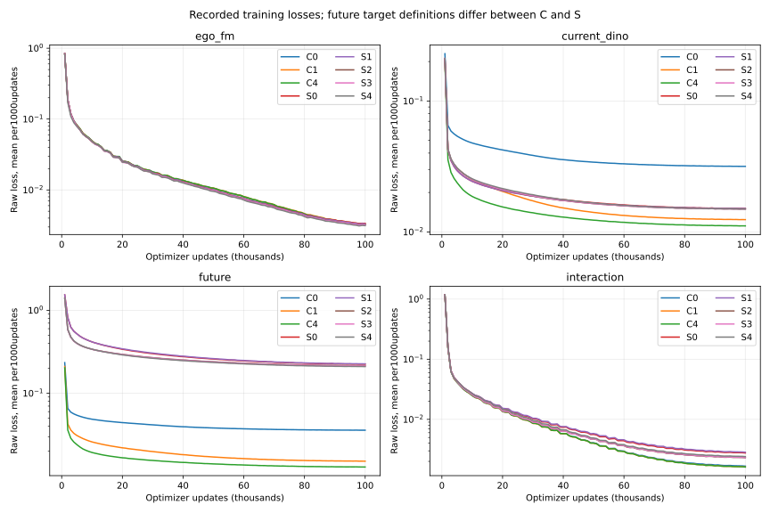
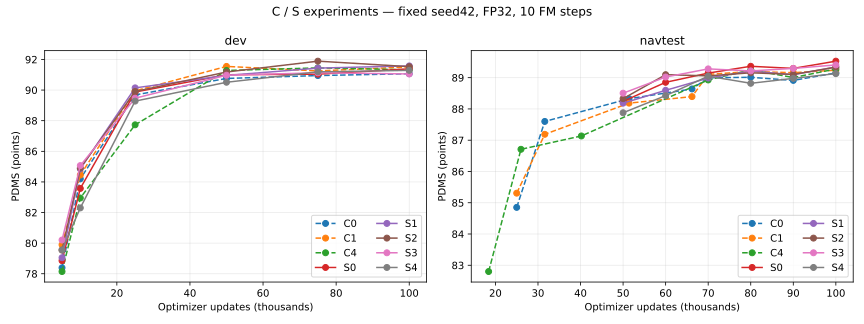

# C/S完整主seed实验结果与数据汇总（100k终点）

2026-10-05T14:02:07.948379+00:00

C0/C1/C4和S0—S4均完成100000 optimizer updates。汇总核验101次完整评测：53次Navtest、48次开发集，最终评测全部0失败。此次整理只读已有结果，新增模型推理与optimizer updates均为0。

## 共同终点

| 组 | 配置区别 | 开发集PDMS | NavtestPDMS | Navtest零分 | ADE m | FDE m |
|---|---|---:|---:|---:|---:|---:|
| C0 | DINO128×96，不池化；随机单个未来时刻 | 91.0690 | 89.1512 | 545 | 0.8595 | 1.8421 |
| C1 | DINO256×192，池化2×2；随机单个未来时刻 | 91.5147 | 89.2395 | 540 | 0.8541 | 1.8290 |
| C4 | DINO512×384，池化4×4；随机单个未来时刻 | 91.3257 | 89.2776 | 525 | 0.8519 | 1.8213 |
| S0 | C1当前目标；未来8帧逐帧DINO，无动作条件 | 91.3884 | 89.5279 | 500 | 0.8554 | 1.8248 |
| S1 | S0＋辅助未来头GT自车动作条件 | 91.5797 | 89.3411 | 529 | 0.8559 | 1.8332 |
| S2 | C1当前目标；V-JEPA2.1视频目标，无动作条件 | 91.5289 | 89.3365 | 524 | 0.8545 | 1.8260 |
| S3 | S2＋辅助未来头GT自车动作条件 | 91.0546 | 89.4082 | 516 | 0.8538 | 1.8242 |
| S4 | S3＋原动作DiT直接读取最终W | 91.2878 | 89.1293 | 550 | 0.8598 | 1.8345 |

各组保留144个W、当前DINO和同一冻结GT车辆MAE监督。C系列每场景随机抽取1/2/4秒中的一个未来；S系列监督0.5—4秒的8个真实未来帧，视频时空编码按tubelet形成4个时间位置。部署只有当前三前视、导航和合法ego状态/历史；GT动作条件只供S1/S3/S4的辅助头使用。S4是动作头读取H_A+W，其余读取H_A；均由原DDP动作头直接输出ego。

C/S未来分辨率、目标结构、归一化、监督曝光及校准权重不同。跨系列差值表示整体方案差异，不能解释为视频、动作条件或W中的单项因果效应。C2/C3/C5不在这些campaign的完整主seed结果中。旧外部89.41仅为未复现历史参考，不进入本地配对。

## 评分协议与全部分项

Navtest12146场景/136logs，开发集1696场景/16logs。统一FP32 master恢复/FP32计算、TF32关闭、10步原Euler FM、单候选、训练seed42和scene绑定采样seed42。辅助heads/教师/GT动作编码器均不参与部署。官方环境保留所有对象类别。没有scorer、oracle选轨或未来输入。

| 组 | NC | DAC | TTC | EP | Comfort |
|---|---:|---:|---:|---:|---:|
| C0 | 98.2752 | 97.1431 | 95.0272 | 83.3946 | 99.9918 |
| C1 | 98.2134 | 97.2254 | 95.1177 | 83.4068 | 99.9918 |
| C4 | 98.2752 | 97.2748 | 95.0848 | 83.4183 | 99.9918 |
| S0 | 98.2340 | 97.5548 | 95.0848 | 83.6785 | 99.9918 |
| S1 | 98.1599 | 97.3901 | 95.0519 | 83.5377 | 100.0000 |
| S2 | 98.1928 | 97.3736 | 94.9942 | 83.5320 | 100.0000 |
| S3 | 98.2463 | 97.4230 | 95.1177 | 83.5477 | 100.0000 |
| S4 | 98.1846 | 97.1513 | 95.1013 | 83.2133 | 100.0000 |

所有分数为0—100单位。零分场景保留；零分不等同于管线失败。逐项核验全部scene/log/原始metric-cache哈希、当前输入、evaluator源码、scorer/simulator源码和NumPy/SciPy/Shapely环境身份；C1开发集只使用已修正至canonical环境的结果。详见[IDENTITY.json](c_s_summary_20261005_100k/IDENTITY.json)。没有混入旧量化缓存、不同progress处理方式、BF16部署分数或不同FM步数扫描结果。

## 配对结果

| Navtest100k比较 | PDMS差值，百分点 | log-cluster95%区间 |
|---|---:|---|
| C1−C0 | +0.0884 | [-0.1782, +0.3589] |
| C4−C1 | +0.0381 | [-0.2736, +0.3431] |
| S1−S0 | -0.1868 | [-0.4820, +0.1047] |
| S2−S0 | -0.1913 | [-0.4448, +0.0479] |
| S3−S2 | +0.0717 | [-0.1841, +0.3408] |
| S3−S1 | +0.0671 | [-0.2247, +0.3762] |
| S4−S3 | -0.2789 | [-0.5619, -0.0023] |
| S0−C1 | +0.2883 | [-0.0185, +0.6056] |
| S3−C1 | +0.1686 | [-0.1312, +0.4751] |

S0的Navtest均值最高89.5279；S1开发集均值最高91.5797。S0−C1的区间跨0，不能确认稳定收益。GT动作条件没有一致提升，视频目标对逐帧目标没有明确优势。S4−S3为−0.2789，当前训练/采样seed的共同终点出现退化。不能将新完整方案预设为最优。

这里仅一个训练seed、一个采样seed；bootstrap按完整log聚类，不能代替训练复跑。比较过多个模型和多个Navtest里程碑，区间不是经过多重比较校正的确认性检验；Navtest已被多次观察，不称完全盲测。主表使用共同100k，不为各组事后挑选最佳epoch。

## 数据、初始化与训练曝光

共同训练集101592场景/1176logs；开发集1696场景/16logs；Navtest12146场景/136logs。三个划分逐场景和逐log的两两交集均为0。原始索引不上传，只提供[人口与索引哈希](c_s_summary_20261005_100k/training/DATA_POPULATION.json)。这说明本次驾驶训练的划分隔离，不保证通用Qwen/DINO预训练从未见过驾驶图像。

每组真实曝光3199752场景，约31.4961个有效遍历。全局batch32、每组8卡/microbatch4、FM repeat8；保留epoch尾batch，所以曝光不是机械的100000×32。共同100k cosine计划、LR1e-5→5e-7、warmup5000、AdamW weight_decay1e-3。Qwen/动作头/状态投影/W公共初始化逐项匹配；驾驶专用模块随机初始化，不加载旧驾驶学生/策略权重。初始化分量哈希、公共通用底座身份、实际配置、原始参数量、教师/缓存身份和checkpoint哈希保存在[COMPLETED_RUNS.json](c_s_summary_20261005_100k/training/COMPLETED_RUNS.json)。

C未来权重0.9794244300709714；S新未来权重1.1549543539882532；current1.0和interaction0.8328945981862067一致。future/interaction warmup1000，current不warmup。GT-MAE teacher为本方法共享固定资产，checkpoint SHA2569730278f9c920de649536dec108226ac9d7f27430e265e8befac19896d58336c，已训练11910updates/30epochs；本轮没有重训教师。

800个固定1000-update曲线区间覆盖全部八组100k日志；各组100000条raw-loss记录均有限，FP32 master实际更新验证均通过。曲线是按optimizer update平均的训练raw loss；不代表完整开发集辅助评价。C/S未来loss定义不同，不能直接以raw MSE大小横排能力。





## 实际记录的学生成本

| 组 | 学生allocation GPU-hours | 正式训练attempts | 总参数 | 可训练参数 |
|---|---:|---:|---:|---:|
| C0 | 457.48 | 6 | 2967581700 | 2560624644 |
| C1 | 457.23 | 6 | 2967581700 | 2560624644 |
| C4 | 511.05 | 6 | 2967581700 | 2560624644 |
| S0 | 483.48 | 1 | 2976524804 | 2569037828 |
| S1 | 440.16 | 1 | 2976524804 | 2569567748 |
| S2 | 501.44 | 1 | 2976524804 | 2569037828 |
| S3 | 425.43 | 1 | 2976524804 | 2569567748 |
| S4 | 436.76 | 1 | 2976524804 | 2569567748 |

该GPU-hours来自正式学生各attempt的最终meter，包含加载、保存和attempt失败；不是纯kernel时间，也不是独占GPU性能测试。没有将并发评测的GPU-hours再次加到学生allocation上。它不包含共享GT-MAE预训练、DINO/视频缓存、目标导出及全部评估成本，不能称完整campaign cold cost。optimizer-step耗时和checkpoint耗时另列；它们已属于allocation，不应再次相加计费。不同主机、IO和训练期间额外任务共享GPU影响实际cost，不把记录差异全部归因于算法。

S0/S2/S3原控制器记录FAILED，原因是原开发集评分/传输失败；这些原失败证据未改写。独立canonical CPU恢复已完成30/30登记开发评估，Navtest观察器完成30/30。训练status均COMPLETE100k，主表只使用完整恢复成功的最终结果，未筛掉失败场景。

## 文件与复现入口

- [完整101次评估历史](c_s_summary_20261005_100k/SUMMARY.md)
- [全部分项/零分/checkpoint/训练与评估源码CSV](c_s_summary_20261005_100k/ALL_RESULTS.csv)
- [100k终点及ego误差](c_s_summary_20261005_100k/ENDPOINT_100K.csv)
- [匿名Navtest逐场景PDMS](c_s_summary_20261005_100k/NAVTEST_100K_SCENE_PDMS.csv)、[匿名开发逐场景PDMS](c_s_summary_20261005_100k/DEV_100K_SCENE_PDMS.csv)
- [场景配对、log-bootstrap95%区间](c_s_summary_20261005_100k/PAIRED_COMPARISONS.json)
- [原始训练记录的固定区间汇总](c_s_summary_20261005_100k/training/TRAINING_CURVES_1000_UPDATE_BINS.csv)
- [实际学生meter成本](c_s_summary_20261005_100k/training/STUDENT_RECORDED_COSTS.csv)
- [通用Qwen来源/revision与无驾驶权重加载记录](c_s_summary_20261005_100k/training/PUBLIC_INITIALIZATION.json)
- [公开表格验证结果](c_s_summary_20261005_100k/VALIDATION.json)、[文件SHA256清单](c_s_summary_20261005_100k/PUBLIC_ARTIFACT_MANIFEST.json)

匿名ID使用固定SHA256前缀，保留全部场景和log聚类。配对logCSV维持原canonical log顺序，所以无需私有日志/权重即可复算全部22个100k log-bootstrap区间。

无需权重或数据集验证已提交表格：

```bash
OMP_NUM_THREADS=1 OPENBLAS_NUM_THREADS=1 python -m tools.action_video_foresight.validate_public_results \
  --report-dir reports/action_video_foresight/c_s_summary_20261005_100k
```

从本机只读原始评估与训练记录重新生成（两个output必须不存在，不覆盖旧报告）：

```bash
OMP_NUM_THREADS=1 OPENBLAS_NUM_THREADS=1 /root/miniconda3/envs/ddp/bin/python \
  -m tools.action_video_foresight.summarize_c_s_results \
  --c-root /mnt/project/ddp-full-foresight-study-artifacts/20260929 \
  --s-root /mnt/project/action-video-foresight-artifacts/20261002 \
  --c-history reports/ddp_full_foresight/navtest_milestone_automation/navtest_summary_20261001_231151/NAVTEST_HISTORY.csv \
  --output /tmp/c_s_results_replay_100k
OMP_NUM_THREADS=1 OPENBLAS_NUM_THREADS=1 /root/miniconda3/envs/ddp/bin/python \
  -m tools.action_video_foresight.collect_completed_runs \
  --c-root /mnt/project/ddp-full-foresight-study-artifacts/20260929 \
  --s-root /mnt/project/action-video-foresight-artifacts/20261002 \
  --results /tmp/c_s_results_replay_100k \
  --output /tmp/c_s_results_replay_100k/training
```

两个命令已实际运行完成；恢复/重新训练入口仍见现有QUICKSTART和原run registration，本次没有启动新训练或恢复已完成run。

## 来源与未完成项

C训练源码d1d40854299b9599b2accc382bcfc4b676dd7623；S训练与预测/评分源码1493deda247107efe076b9294863a6753391298a；Navtest观察器dd1df3b3d5b6d571226258e0cb2b33cb77d0e107；开发集canonical恢复6659529e3e4f771c2b661ec1b14529eba69d0706。本次报告/汇总源码单独提交，不冒充原训练来源。

主seed八组100k训练、开发与单采样Navtest完整；关键第二训练seed、终点5-run、C_BASE_A/C_BASE_AW/S4_NO_MAE等正式归因控制以及未训练C2/C3/C5不在本次完整结果中，不能声称已隔离全部机制或完成尺寸矩阵。现有旧100k辅助审计不自动代表S系列新100k任务已做完整能力审计。
