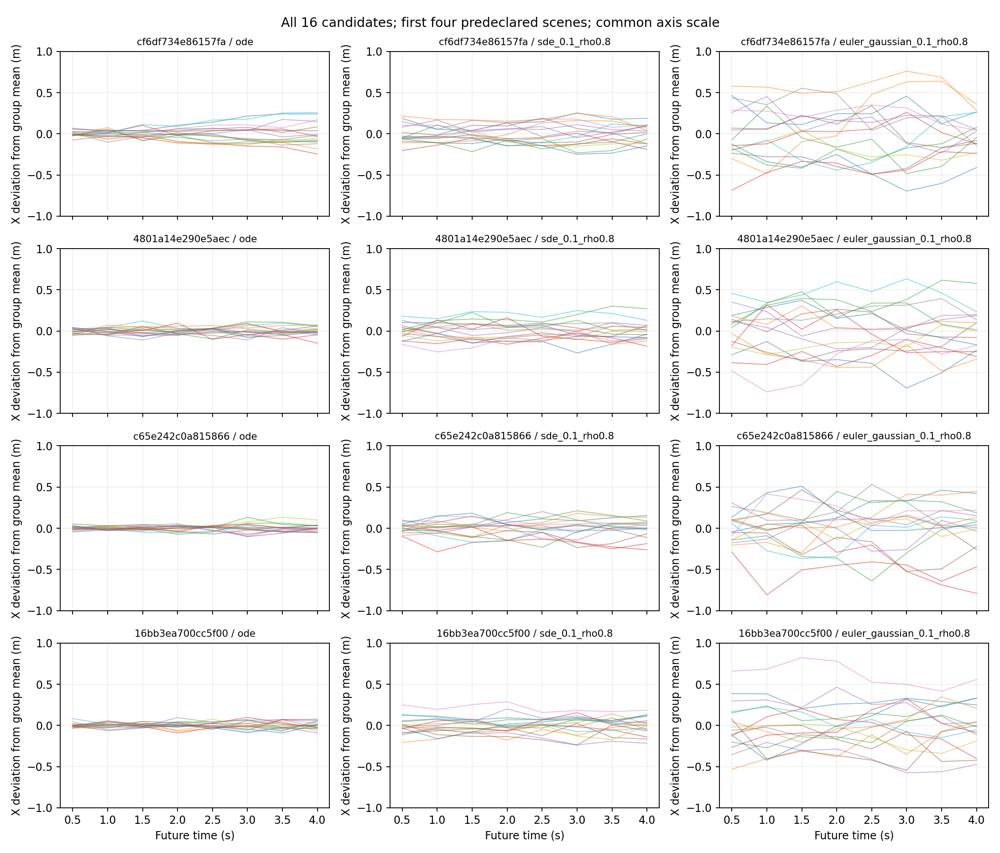
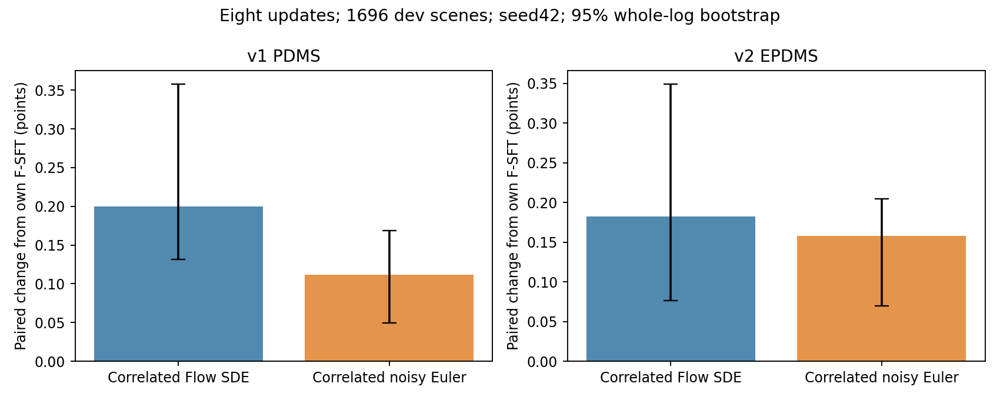
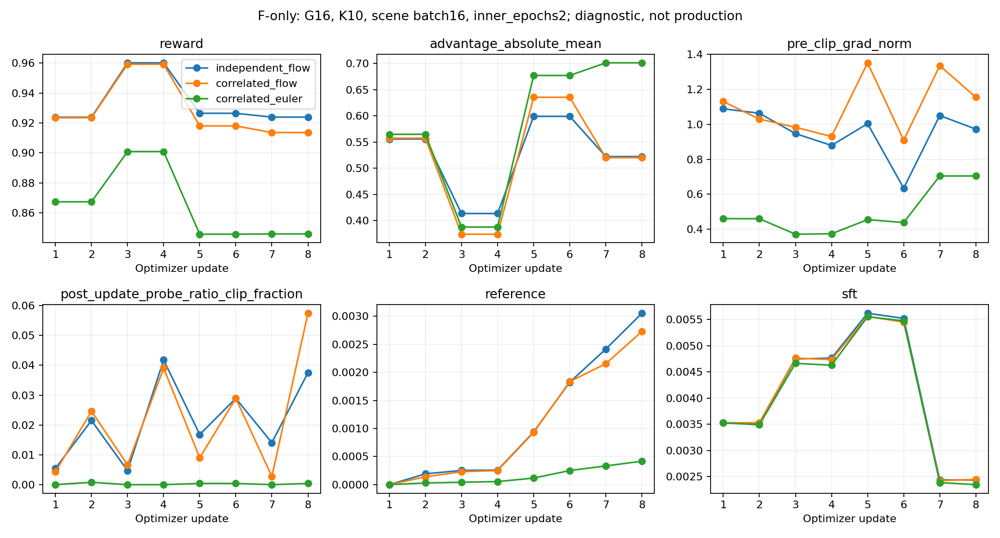

# F-only：探索不足的实现修复与真实对照

日期：2026-09-18。结论：**探索不足已被量化，新采样器能明显扩大轨迹及奖励差异；但扩大探索尚未带来优于原 G16 的收益。工程仍为 NOT_READY，不放行长训。**

只运行 F 初始化：原 action-only frozen_visual step100000，冻结自己的视觉参数，继续训练其余 SFT 参数。没有使用 U、LoRA、额外辅助任务、教师候选、筛选/重采样、修改奖励或推理后处理。

## 实际发现

固定64个训练场景/61个log，与开发集不重叠；G16、K10，全部候选保留。下表为场景内成对轨迹平均距离的场景中位数；奖励是 **v2单场景训练reward，不是开发集EPDMS**。

| 采样器 | 轨迹距离(m) | 非恒定reward组/64 | 非进度分量有差异的组/64 | reward标准差中位数 | 候选零分率 |
|---|---:|---:|---:|---:|---:|
| 原ODE随机初始噪声 | 0.0522 | 42 | 3 | 0.000825 | 1.758% |
| 原Flow SDE，eta0.1 | 0.1299 | 47 | 8 | 0.001922 | 1.855% |
| 相关Flow SDE，eta0.1/rho0.8 | 0.1218 | 46 | 10 | 0.001711 | 1.758% |
| 原Flow SDE，eta0.2 | 0.2359 | 48 | 13 | 0.004040 | 2.148% |
| 相关Flow SDE，eta0.2/rho0.8 | 0.2191 | 48 | 21 | 0.003803 | 3.320% |
| 相关noisy-Euler，eta0.1/rho0.8 | **0.3217** | **49** | **26** | **0.009901** | **5.762%** |

原eta0.1的47个非恒定组中，39组只有进度差异。相关性使候选偏移更连贯：相邻waypoint偏移余弦的中位数从0.0886变为0.7411，但没有增加覆盖率。noisy-Euler使奖励标准差约为原来的5.15倍、轨迹差异约2.48倍，同时带来更多越界和零分。这是探索/质量的实际取舍，不能只报前两项。

图中使用清单最前四个场景、所有16个候选、统一坐标轴，未挑好看的样本。偏移更大或连贯不等于已学会多种语义驾驶决策。完整逐场景数据、分量、所有不利结果在 `results/*summary`、`results/*geometry` 和原始bank中。

## 已实现的修改和依据

- `temporal_noise.py`：固定满秩AR(1) waypoint协方差；不改变初始N(0,I)或单坐标创新方差。
- `math.py`：协方差一致的score correction、采样、Cholesky log-prob和reference KL；额外实现显式 `euler_gaussian` 模式。保留sqrt(dt)，采样/密度方差一致，概率矩阵运算退出BF16 autocast。
- `rollout.py` / `model.py` / 诊断、配置入口：完整链、旧概率、当前重新编码与独立reference统一使用同一采样规格。原dimension-mean surrogate保留，明确不冒充joint概率比。
- 两份新研究YAML：固定G16/K10/eta0.1/rho0.8/chunk1/inner_epochs2。验收入口拒绝把这些实验采样器用于正式长训。
- 新测试 `test_temporal_exploration.py`：独立高精度Gaussian密度/KL/梯度、score drift、经验协方差、sqrt(dt)、rho0回归、真实生产采样函数重算、掩码/配置拒绝和CUDA autocast。
- 分析入口保存所有bank、完整数值报告、轨迹图和配对结果；报告脚本支持实际算法名称，避免误标成旧global-batch实验。

依据包括 [Colored Noise PPO](https://arxiv.org/abs/2312.11091)、[Lattice](https://arxiv.org/abs/2305.20065)、[ReinFlow实际源码](https://github.com/ReinFlow/ReinFlow/blob/e722e151bed767f3ffef47527cf697f2358af55d/model/flow/ft_ppo/ppoflow.py) 及 [probability-flow/SDE理论](https://arxiv.org/abs/2011.13456)。具体推导、锁定SHA、与原工作的差异见 [method.md](method.md)。这不是声称复现完整ReinFlow。

## 原单候选ODE的完整开发集结果

两种新配置分别从同一F-SFT重新开始、各8次实际optimizer更新。原G16是前轮保留的同预算对照；逐rank核对了所有8次更新的训练/replay顺序和policy_version一致。每组64个fresh scenes、1024候选、128次SFT replay场景暴露。候选采样链因实验变量不同而不同，没有声称跨采样器的chain相同。

所有行使用同一1696场景/16logs、seed42+token稳定噪声、原10步单候选ODE；没有best-of-N。v1用隔离进程中的真实v1 scorer；v2用官方one-stage聚合。1427/1696场景具备two-frame指标，覆盖率84.139%；其余场景按官方语义同时去掉该指标及其分母权重。开发集可能被源SFT见过，不称SFT-unseen。

| 模型 | v1 PDMS | 相对F-SFT | v2 EPDMS | 相对F-SFT |
|---|---:|---:|---:|---:|
| F-SFT | 93.482672 | — | 93.629477 | — |
| 原独立Flow SDE / G16 / 8更新 | 93.664951 | +0.182278 | 93.806579 | +0.177103 |
| 相关Flow SDE / 8更新 | **93.682641** | **+0.199968** | **93.812160** | **+0.182684** |
| 相关noisy-Euler / 8更新 | 93.594155 | +0.111483 | 93.787437 | +0.157960 |

按log而非相邻帧bootstrap，95%配对区间（分数点）：

| 比较 | PDMS delta [95%CI] | EPDMS delta [95%CI] |
|---|---|---|
| 相关Flow − SFT | +0.200 [0.132,0.358] | +0.183 [0.076,0.349] |
| noisy-Euler − SFT | +0.111 [0.050,0.169] | +0.158 [0.070,0.205] |
| 相关Flow − 原G16 | +0.0177 [−0.0879,0.2146] | +0.0056 [−0.0905,0.2004] |
| noisy-Euler − 原G16 | −0.0708 [−0.0929,−0.0576] | −0.0191 [−0.0576,0.0221] |

两种新模型相对SFT均恢复1个零分场景、没有原非零变零。对于SFT原分数≥0.9的场景，相关Flow有0/4个PDMS/EPDMS下降，noisy-Euler有18/19个下降。逐token差值和所有分量保存在 [配对结果](results/paired_results/paired_results.json) 及CSV；[与原G16比较](results/paired_results/versus_independent.json) 也保留了其退化。

结论分开看：固定开发集上的短训收益相对SFT为正；**新探索策略优于原G16的证据不足，noisy-Euler在该对照下PDMS退化。** 单个训练seed/推理seed、8次更新不能说明长训或Navtest有效，也不能因较好的单个数字选定正式配置。训练reward缺少two-frame comfort及v1/v2差异仍是目标对齐的限制，本轮没有静默修改这些指标。

还有一个实测的耦合：同样的LR不等于同样的策略变化。noisy-Euler首次联合更新的全局pre-clip梯度范数为0.460，相关Flow为1.130；更新后的同链ratio区间也明显更窄。固定Gaussian下，均值的log-prob梯度含有协方差逆矩阵，所以扩大噪声会同时改变梯度尺度。这为后续区分探索质量和更新强度提供了依据，但不能仅凭相关性断言它解释了全部性能差异，本轮没有据此盲目提高LR。

## 真实训练与验证

两个主run都在实际8×A800、BF16/ZeRO2中完成。首次更新前ratio精确为1；每轮新behavior的首次更新均为1。第二个inner epoch使用同一old log-prob、advantages、chain及场景。更新8后同链ratio范围：相关Flow [0.81677,1.07765]；noisy-Euler [0.97953,1.01946]，说明两者都实际改变了策略。

所有rank的视觉、原冻结参数与独立reference不可变检查通过。三份actor参数manifest相同：672个可训练tensor，共2,233,120,260参数；未接入inactive agent_dino_head。参数对象/alias合同及源冻结规则沿用，不仅比较numel。

实际dtype库存：存储参数/Qwen BF16，原action路径FP32运算；ZeRO2梯度累积、通信、master和Adam状态FP32，TF32关闭；局部hook统计不当成optimizer梯度。显存峰值约23.06GiB/rank。两主run含初始化/保存的墙钟分别1125s/912s，不能作为同机吞吐对照；两组开发集评估各约9分钟，用另一台机器分4+4卡并行执行。

| 验证 | 真实结果 / 退出码 | 适用范围 |
|---|---|---|
| 首轮完整CPU回归 `tests/flow_grpo tests/cluster_flow_grpo` | 222 PASS / 3 SKIP；0 | 相关Flow改动后的全部现有回归；SKIP为CUDA测试 |
| 新数学/actor/inner回归，实际CUDA | 32 PASS；0 | 第一阶段 |
| noisy-Euler扩展数学/actor/inner，实际CUDA | 34 PASS；0 | 包含真实CUDA autocast，但小模型数学不替代全DDP |
| Euler受影响配置、resume、metrics、ZeRO、scaling回归 | 78 PASS；0 | 与上行有重叠，不能相加为独立测试数 |
| 干净worktree，27be122 | 47 PASS / 1 CUDA SKIP；0 | 新数学、actor/inner、资产入口；未重新跑全Qwen CPU |
| 两种模式，真实F模型CUDA原source ODE/SFT oracle | PASS；0 | ODE最大误差0，原/新action loss均0.0013521767687052488，aux仍0 |
| 真实G16/K10、旧链重算与完整独立reference | PASS；0 | 两模式×rho0/0.8×eta0.1/0.2；ratio/KL及独立FP64概率/velocity梯度 |
| 全bank完整性 | PASS；0 | 8192个合并历史/本轮唯一候选，320个重复scene-setting的轨迹/reward完全一致 |
| 两组8更新、inner_epochs2、冻结/合同 | PASS；0 | 全模型真实BF16/ZeRO2，官方reward |
| 两种模式分别RL-only真实更新 | PASS；0 | 各1更新，官方有效优势组11/16和12/16；各672个optimizer梯度均有限非零 |
| noisy-Euler update1中断→4对连续update4 | PASS；0 | 26个完整状态文件，权重/Adam/master/RNG/pending，零容差逐项相等 |
| 两组原推理接口export | PASS；0 | 每组989个tensor完全一致，固定噪声ODE输出最大误差0 |
| 两组1696开发场景 v1/v2 | COMPLETE；0 | 不是Navtest/five-seed结果 |
| 历史BF16 chunk1/2门禁 | **FAIL，原证据保留** | 本轮没有改容差或改写历史 |
| 新采样器正式生产放行/长训 | **NOT_RUN / NOT_READY** | 正式入口拒绝实验mode/rho；没有签发READY |
| U、完整Navtest、五推理seed | **NOT_RUN（本轮范围外）** | 不用F结果替代U |

新增RL-only检查结果及完整optimizer参数清单见交付中的 `results/flow_rl_only_summary.json` 和 `results/rl_only_summary.json`。两个检查分别隔离SFT/reference损失，直接观察全局归约后、clip/Adam前的FP32梯度，不用weight decay或局部hook冒充策略梯度；8个rank的完整梯度统计一致。相关Flow的Qwen/history/action梯度L2分别0.5952/0.2583/0.9069，noisy-Euler分别0.1804/0.0415/0.4124。两组视觉及reference保持不变。

过程中两个命令调用错误在启动训练/评分前退出：supervisor误传dict而非路径，v1入口名称拼错。均以正确入口重新执行，原失败日志保留在results；没有算法FAIL被覆盖为PASS。此前所有失败证据保持原状。

## 复现身份与产物

- 训练/最终oracle实际代码：`27be122164c92da99cf0fb37d54ca3393a99709d`；第一阶段相关Flow bank/oracle：`3bd765b6daf82229b0076fc975e420cad5c1b45d`。最终交付增加报告和分析脚本，不改已验证的训练源码。
- 两主run执行源码摘要：`1d2669e4d8cc83da59cb8c4c3fd2f2bdb1c9e15db691fa75321bbd777f3f3179`。
- F权重SHA256：`9a26685aa3838a2e1b89ab2d92997664afde4b259fed6683851f42781ad16eb4`。
- processor/tokenizer/config整体摘要：`7e13bdb5ff27bd29bca3eaac59ee65ffbeb46364ae78dd436bb36db920d31d4d`。
- 锁定完整资产版本：`04a0e93c1ea44902a4f73bf6973b236442ec5c8815ce6155c186a4d98254f420`；train101592/dev1696/navtest12146，训练清单未变；本轮没有重复全量缓存构建。
- 安装版本与实际后端源码哈希、numerics、每个processor文件哈希：[执行合同](results/f_euler_correlated8/execution_context.json)。没有升级依赖。
- 原始checkpoint：`runs/correlated_exploration/f_{correlated,euler_correlated}8/checkpoints/update_000008`；各自 `export_update8` 为原接口导出。权重未提交git。
- 逐场景轨迹及事务校验：`runs/correlated_exploration/evaluation_{correlated,euler}8/`；完整状态/失败证据/worker日志均保留在原run路径。git中的报告仅复制评分/摘要，`SOURCE_COMPLETE.json`是原完整事务的标记副本，报告目录本身不是可复用的完整评估目录。
- [可复制命令](commands.md)、[方法与文献](method.md)、[文件摘要清单](evidence_manifest.json)。报告中的PASS均有对应真实退出码/结果范围；本目录不是生产验收签发记录。
