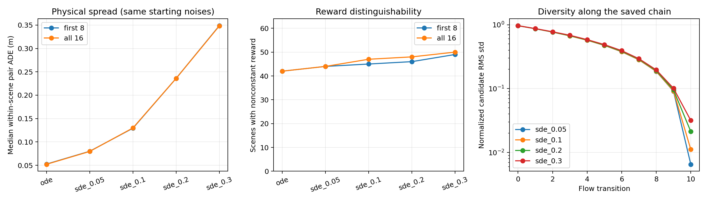
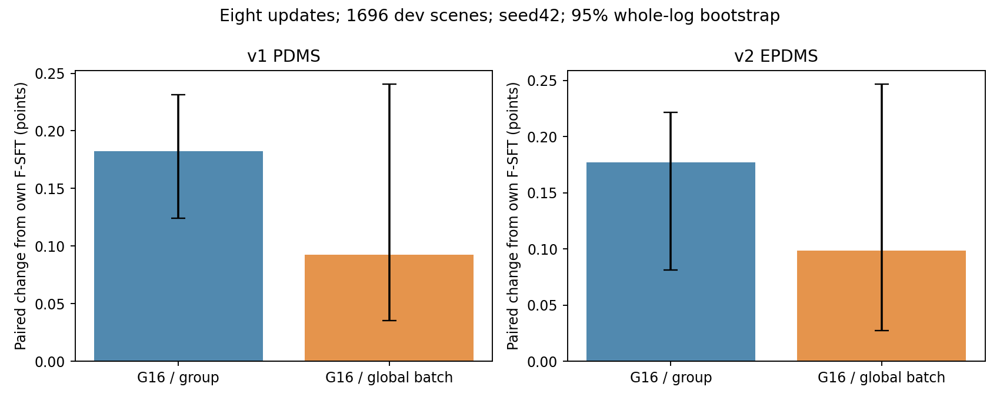
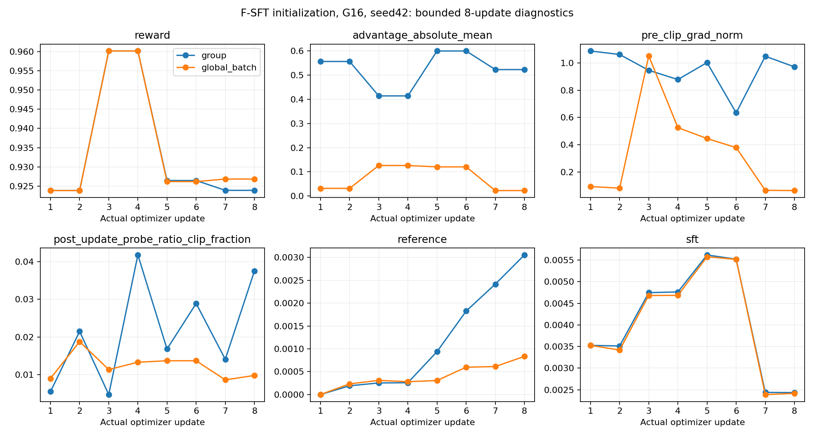

# F-only Flow-GRPO: measured exploration and bounded update results

2026-09-18. **NOT_READY for a new long run.** Bounded real BF16/ZeRO-2 runs,
RL-only gradients, inner-boundary exact resume and original-interface export
passed. The new G16 recipes have not completed an independent production release.
Historical BF16 chunk1/2 failures remain failures. Only chunk1 was exercised here.

**Effect:** both PDMS and EPDMS improved after eight updates on the fixed development
set and seed42. This does not establish durable improvement, full Navtest results,
five-seed robustness, or a solution to the previous long-run regression. The new
global-batch normalization did **not** outperform group normalization in this short
comparison. The difference's log-bootstrap confidence interval includes zero.

## What was changed and why

- `math.py`: FP64, offset-centered reward moments make identical nonbinary rewards
  produce exactly zero advantages. The original CPU counterexample is recorded;
  the same G8 CUDA values did not reproduce it. It is not blamed for the old GPU
  regression without evidence.
- `advantages.py`, `trainer.py`, `rollout.py`, `config.py`: optional `group`,
  `global_batch`, `none` scaling. The global denominator includes all ranks and all
  accumulation microbatches; each scene keeps its own mean baseline. Advantages
  and statistics are assigned once and saved through both inner epochs and resume.
  The default remains group. Primary support: locked Flow-GRPO, Dr. GRPO and TRL
  sources in [research.md](research.md), not an unexplained hyperparameter change.
- `diversity.py`, `metrics.py`, `scripts/analysis/flow_diversity.py`: save every
  candidate and chain, report physical diversity, reward spans, signal saturation,
  effective covariance rank and normalization scale. No candidate replacement.
- `scripts/analysis/{candidate_geometry,diversity_pdms_v1}.py`: analyze coherent
  variation versus waypoint jitter, and rescore **every** saved candidate using
  genuine v1 caches in a separate process. No v1/v2 Python import mixing.
- `scripts/analysis/{frozen_training_summary,frozen_paired_results}.py`: actual
  fixed-chain/contract checks, paired scene scores, whole-log confidence intervals
  and exportable figures. These reports do not sign production acceptance.
- `scripts/cluster_flow_grpo/pipeline.py`: preserve the real producer exception
  across a cancellation race. A deterministic regression test reproduced the old
  failure; the initial failed full-suite log remains in this directory.
- `scripts/cluster_flow_grpo/assets.py`: explicit reuse of the previous completed
  corpus verification after an actor-only edit, binding old/new executable hashes
  and unchanged verifier sources. It expressly reports **no fresh data-byte check**,
  and grants neither model acceptance nor an exact-resume exception. Six new
  negative/positive tests cover this binding. No repeated full-corpus scan.

There is no new LoRA, changed reward, new auxiliary task, trajectory smoothing,
best-of-N deployment, teacher candidate, reduced input resolution or extra frozen
language parameter. The two G16 runs have identical actor manifests: **672 trainable
tensors, 2,233,120,260 parameters**. F keeps its own step100000 visual weights.
U and the old long training remain stopped.

## Exploration: all 5120 trajectories, fixed before scoring

64 evenly spaced tokens from the locked training list, 61 logs, zero dev overlap;
G16, K10, seed42+token noise, same initial noise and SDE innovations across strengths.
No scene was chosen for passing or for having a favorable reward.

| Sampler | Median pairwise ADE, m | Nonconstant v2 reward groups /64 | Mean v1 PDMS | Mean v2 single-scene reward |
|---|---:|---:|---:|---:|
| Original ODE | .0522 | 42 | 93.300 | 93.003 |
| SDE .05 | .0797 | 44 | 93.309 | 93.054 |
| SDE .1 | .1299 | 47 | 92.750 | 92.784 |
| SDE .2 | .2359 | 48 | 92.268 | 92.191 |
| SDE .3 | .3482 | 50 | 90.965 | 90.707 |

These are exploratory training candidates, **not development EPDMS results**.
At noise .1 the nested first8 candidates yield 45 nonconstant groups; all16 yield
47. G16 improves coverage modestly; it does not double the number of useful groups.
39 of64 groups vary only in progress. Group reward std median is .001922.
Noise .3 adds little reward coverage and worsens v1 TTC, drivable compliance and
zero-score frequency. Adjacent-waypoint deviation correlation falls from .440
(ODE) to .089 (.1) and .005 (.3), consistent with increasingly incoherent jitter;
this statistic is not a semantic behavior-mode count.

At noise .1, 157 of4998 strictly comparable candidate pairs reverse their ordering
between v1 PDMS and the v2 training reward. The earlier first32 behavior-scene audit
had zero reversals in511 pairs; it remains recorded separately. The larger,
predeclared sample adds evidence of metric mismatch, not permission to select a
favorable subset. The v2 training reward also excludes adjacent-frame comfort.

The measured checkpoint's conditional distribution is narrow, but it is neither
fully collapsed nor incapable of policy-gradient learning. Denoising variance
contraction alone does not prove an inherent limitation of flow matching.

[Every candidate's v1 score and v2 reward](diversity_v1/candidates.csv),
[all v2 diversity statistics](diversity_summary/summary.json),
[coherence and fixed first-four scene plots](candidate_geometry/geometry.json).

## Controlled short training and complete fixed-dev evaluation

Every run starts from original F-SFT, not old step100/200/300. Actual global scene
batch16, G16, K10, SDE .1, candidate/transition chunks1, inner epochs2, LR1e-6,
Adam(.9,.95), wd.001, PPO clip .02, reference KL .01, action SFT replay .1.
Each G16 arm: **8 optimizer updates, 64 fresh scenes, 1024 fresh candidates,
128 replay scene exposures**. The first complete behavior chain, reference means,
old log-probs and rewards are exactly equal between arms, before different updates.
The action path retains its inherited FP32 computation; Qwen uses BF16.

Both arms use8 A80080GB GPUs, world8/accumulation2. Group ran on training-vla-zt2,
global_batch locally. Wall time including loading/checkpoints was946s and966s;
peak observed allocation was23.064GiB per GPU. Per-update compute was about69s.
No long job or GPU-waiting daemon was started.

Single-candidate original ODE10, seed42+token, all1696 dev scenes /16 whole logs:

| Model | v1 PDMS | Delta to F-SFT | v2 EPDMS | Delta to F-SFT |
|---|---:|---:|---:|---:|
| F-SFT | 93.4827 | — | 93.6295 | — |
| Original G8, 8 updates | 93.6288 | +.1461 | 93.7718 | +.1424 |
| G16/group, 8 updates | 93.6650 | +.1823 | 93.8066 | +.1771 |
| G16/global_batch, 8 updates | 93.5749 | +.0923 | 93.7281 | +.0986 |

G16/group's whole-log bootstrap95% intervals are [.1242,.2313] PDMS points and
[.0812,.2218] EPDMS points. G16/global_batch's are [.0353,.2405] and [.0274,.2467].
Each restores one SFT zero and creates no new zero relative to SFT, though these
are not necessarily the same restored scene. Higher mean scores do not mean no
component regression: group has one additional v2 TTC failure and two additional
history-comfort failures; global_batch has neither in this short sample.
Complete per-scene deltas, component availability and high-score declines are in
[paired_results.json](g16_paired_results/paired_results.json) and adjacent CSVs.

Two-frame comfort is available for1427/1696 scenes. The269 unavailable values keep
the official zero effective weight; they are not fabricated comfort scores. Dev
may have been seen by source SFT. Navtest was not used for selection or run stopping.

Global scaling changes both scene weighting and RL magnitude relative to replay/KL.
First-update gradient norm was1.089 (group) versus .09272 (global_batch); when a
later batch has larger safety differences, global_batch's norm exceeds group's.
It is not simply a smaller learning rate, and a short mean improvement cannot
isolate its causal mechanism. No default switch was made on these scores.

## Real update/recovery evidence, separate from unit tests

- All fresh behavior batches start with ratio exactly1 in this profile. Second
  inner epochs retain identical behavior fingerprints, old log-probs, advantages,
  observation and replay order. Current ratios change after optimizer updates.
- Separate **RL-only** G16/global_batch, original official reward, world8, one
  actual update: 11/16 groups have nonzero advantages. Actual globally accumulated
  pre-clip optimizer gradients are FP32, finite and nonzero for all672 tensors:
  Qwen309, history4, projector4, remaining action355. This is before weight decay,
  not a `requires_grad` count or a local hook claimed as a global norm.
  [Full summaries](global_rl_only_gradient_summary.json); rank0/rank7 inventories
  are retained under `rl_only_optimizer/` and all8 are in the run directory.
- All8 ranks report unchanged full reference and frozen tensor hashes, including
  F's own visual weights. No visual parameters enter the optimizer.
- Save at update1, `next_inner_epoch=1`, version0, then resume through update4:
  **exact equality across26 model/Adam/scheduler/RNG/pending-state files** versus
  continuous update4. Saved normalization statistics and advantages survive the
  inner-epoch boundary. [Exhaustive comparison](global_resume_comparison.json).
- Actual dtype inventory observes FP32 accumulation, communication, master
  weights and Adam states with BF16 stored model weights and FP32 action kernel.
  The installed, source-locked DeepSpeed0.16.9 partition wrapper is retained.
- Both exported update8 checkpoints:989 tensor entries exactly preserved;
  original `infer.VLAAgent` fixed-noise outputs exactly equal (max error0).
- `post_clip_grad_norm` remains unavailable, not an estimate presented as measured.
- CPU full regression after the pipeline fix:203 PASS,2 explicit CUDA skips,
  exit0. Targeted arithmetic/pipeline/diversity tests with CUDA:30 PASS, exit0.
  Asset-rebind targeted suite:14 PASS, exit0. These suites overlap; counts are not
  added into a fictitious unique total. Initial200 PASS/1 FAIL/2 SKIP remains saved.
- Full CPU Qwen FP32/source ODE oracle was not repeated: this edit leaves the model,
  velocity and Gaussian transition math unchanged. Historical CUDA oracle results
  are not relabeled as a new G16 qualification. No CPU test closes BF16 chunk1/2 FAIL.

First launch attempts correctly failed GPU-idle/old-source-receipt checks; no update
ran. Export verification's first attempt used an invalid CPU-affinity range and
failed before model loading; the valid attempt passed. Original failure controls
and logs remain. A report-only status reader initially expected PASS rather than
the trainer's TESTED label; its failed attempt is retained and the corrected reader
checks both the real status and all changed-tensor lists.

## Interpretation, including the LoRA option

The old regression is not explained by an absent RL gradient. Evidence points to
limited, mostly-progress exploration; metric disagreement; missing two-frame
comfort in training reward; and growing policy drift. These are distinct findings,
not a proven single cause. Eight-step improvements do not refute the old200-step
degradation or establish that normalization alone fixes it.

LoRA is technically viable for flow RL: [SimWAM](https://github.com/H-EmbodVis/SimWAM)
uses action-expert LoRA with Flow-GRPO. It restricts the update parameterization,
but does not itself supply a different trajectory distribution when group rewards
are equal. Its released v2 results explicitly do not demonstrate v2 RL gains.
The user's new permission makes it a legitimate separate experiment if preserving
the SFT policy becomes the limiting factor; this run did not change the full actor
contract to LoRA without evidence. [ReinFlow](https://arxiv.org/abs/2505.22094)
offers learnable exploration noise; structured Gaussian exploration is another
motivated direction. Either needs consistent sampling covariance, old/current/ref
probabilities and KL. Adding noise or smoothing candidates without that contract
would invalidate the current likelihood calculation. Neither alternative has been
implemented or advertised as a DDP improvement here.

## Reproduction and artifact locations

[Commands](commands.md), [reference code locks](repositories.json),
[executed source inventories and control results](execution/),
[test exit statuses](test_results.json).

Native training source commit:
`0e10a160f080bb89cb4f2bdff7f31077c3b7fe72`.
Executed native-source digest:
`989aed14a6a0e8c9aec200936b7603ba56ba200e7f71797eaf192f53f8cdfca4`.
The asset wrapper's then-uncommitted source rebind is included in the subsequent
delivery commit; each run's original dirty-diff digest is retained, not rewritten.
Python3.10.20, Torch2.5.1+cu124, Transformers4.57.0, Accelerate1.5.2,
DeepSpeed0.16.9, flash-attn2.7.4.post1; no dependency upgrades.
F weights SHA256:
`9a26685aa3838a2e1b89ab2d92997664afde4b259fed6683851f42781ad16eb4`.
Processor/config hashes are recorded in each source/environment and resume identity.

Checkpoints (preserved locally; no weight files committed):
`runs/frozen_rl_research/f_g16_{group,global_batch}/checkpoints/update_000008`.
Original-inference exports: the corresponding `export_update8/` directories.
Complete evaluation trajectories and components:
`runs/frozen_rl_research/evaluation_g16_{group,global_batch}8/`.
v1 rescoring: `runs/frozen_rl_research/v1_g16_eval/`.
Full saved64-scene candidate banks: `runs/frozen_rl_research/diversity_shard{0..3}/`.
The native long-training acceptance gate remains enforced; no READY evidence was
fabricated from these bounded tests or development improvements.
