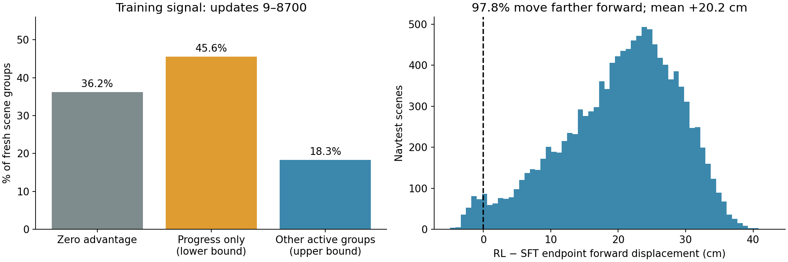

# F action-head Flow-GRPO：弱收益诊断

2026-09-20；基于真实日志、完整 navtest 配对结果和源码。没有据 navtest
改训练配方、挑种子或选择新 checkpoint。当前证据最支持：**探索集中在局部微扰，
有效组的奖励差异又主要来自 progress，因此策略学成了普遍略向前移动；安全退化
抵消了部分收益。** 这不是对某一个超参数的因果证明。

## 证据范围

- navtest：step8700 对自己的原始 F-SFT，seed42，相同 token 噪声键，12146 场景、
  136 logs，原始单候选十步 ODE。该 checkpoint 在看到成绩前选定。
- 原始完整成绩、逐场景 CSV、分量和 log-bootstrap 见
  [完整评估](../intermediate_step8700/README.md)。尚不是最终五 seed 结果。
- 日志分析覆盖 update9–12912：12904 次更新、6452 次新 behavior batch、
  103232 次场景曝光。最初 8 updates 在此前 pilot 的日志中，本次统计未混入。
  不将第二个 inner epoch 的同一组奖励重复计数。
- [训练统计](training_signal_full/summary.json) 保存分窗口摘要；
  [逐更新数据](training_signal_full/per_update.csv.gz) 保存压缩表格。
  原始日志前缀 SHA256 为
  `d81a2afd68dbbceea080242443a7e1d57cf22de913ab4ca12f9d24ac58c08b56`。
- 推理轨迹逐 token 配对，见 [轨迹变化](trajectory_changes.json) 和
  [逐场景变化](trajectory_changes.csv.gz)。



## 已经证实的现象

| 指标（百分制） | 原始 SFT | step8700 | 配对变化 |
|---|---:|---:|---:|
| v1.1 PDMS | 88.8644 | 89.0109 | +0.1465 |
| v2 one-stage EPDMS | 88.2378 | 88.5025 | +0.2647 |
| v2 progress | 87.7228 | 88.9535 | +1.2307 |
| v2 no-at-fault-collision | 98.1517 | 97.8800 | −0.2717 |
| v2 TTC | 97.5301 | 97.2995 | −0.2305 |

PDMS 配对 log-bootstrap 95% 区间为 [−0.0671,+0.3525] 分，跨零；
EPDMS 为 [+0.0615,+0.4527] 分。这些分量不是非线性总分的加法分解。
EPDMS 零分场景 602→624：39 个恢复、61 个新增；PDMS 零分 578→595。
因此目前只能确认小幅均分收益，不能称为稳定全面的策略改进。

**轨迹变化高度同向。** 同噪声 SFT/RL 对照中，97.7935% 场景的 RL 终点更靠前；
终点前向变化均值 +0.2025 m，中位数 +0.2147 m，整个轨迹 ADE 变化均值 0.1027 m。
61 个新增 EPDMS 零分场景全部更靠前，平均 +0.2271 m；35 个碰撞分量退化场景
也全部更靠前，平均 +0.2565 m。这是关联证据，不能单凭它证明“前移导致碰撞”。
但它表明当前可观测改变主要是广泛的轻微前移，尚没有展示出场景相关的避让改进。

**有随机差异，但有效探索有限。** 为对应 step8700，以下取 update9–8700：

- 69536 次新场景曝光中，25155 组（36.1755%）奖励完全相同，没有 GRPO 优势。
  全零组仅 0.0676%，不能把等分组全都说成失败场景。
- 每个 scene 的候选两两 ADE 中位数，再对场景平均：0.1245 m；FDE 对应 0.1374 m。
  XY 协方差有效秩均值 2.792（16 维 XY 向量）。这些是局部多样性统计，
  不证明有不同让行/避让意图。加大 G 不自动扩大策略分布的支持范围。
- 真正逐场景的 reward std 中位数 0.001477，组内 reward 极差中位数 0.005427。
  这些不是“各 batch quantile 的平均”。每 rank 恰有两场景，日志的 q0/q1 可恢复
  两个真实数值；std 与 span 分别恢复，不臆造二者的场景对应关系。
- 44381 个有效优势组中，**至少 31678 个（71.3774%）只有 progress 能产生奖励差异**。
  判据很保守：一个 rank 的两场景全部 32 候选，七个非 progress 分量均值都为 1；
  这些 [0,1] 分量因此逐候选全为 1。其有效组的总分差异只能来自 progress。
  其他 rank 也可能存在 progress-only 组，因此这是下界，不把剩余组全称为安全信号。
- 完整日志 update9–12912 得到相同结论：36.204% 等分组，71.461% 有效组
  至少为 progress-only；没有随训练出现明显的多样性扩张。

## 最可能的机制，以及尚不能下的结论

1. **奖励差异的分布偏向 progress，组内标准化进一步弱化了绝对收益大小。**
   `advantages.py` 当前用 `(r-group_mean)/(group_std+1e-6)`。在 epsilon 不主导时，
   小幅 progress 差异和大幅安全差异都可得到 O(1) 的优势；这不表示参数梯度一定
   等大，但会丢掉组间奖励差异幅度。大量局部 progress 排序提供了一个容易学习的
   方向。它与实际近乎普遍的前移一致，需用固定训练诊断集的梯度与干预对照确认因果。

2. **现有 KL/BC 保持“像原策略”，没有要求“安全分量不退化”。**
   KL 系数从 0.04 自适应到约 0.13–0.14，稳定期 dimension-mean conditional KL
   约 0.02。原 action flow-matching replay 系数为 0.1。这能限制漂移，但即使
   平均只前移 20 cm，也可能越过某些场景的离散碰撞/TTC 判定边界。
   不能据 KL 与 SFT 的标量 loss 大小断言它们压住了策略梯度；尚缺各项真实梯度范数
   和余弦冲突统计。直接减小 KL/BC 或增大学习率，可能同时放大安全退化。

3. **PPO 裁剪过强不是当前主要证据支持的解释。**
   update9–8700，第二个 inner epoch 更新前的 ratio 越界率平均 0.1063%；
   第二次更新后同链 probe 越界率 1.1402%。第一次 ratio≈1 是 on-policy 构造，
   不能用它单独判断没更新。完整日志第二 inner 越界率 0.0717%。
   此处 ratio 是 dimension-mean surrogate：8×4=32 维时，单 transition 的联合
   密度比为该 ratio 的 32 次方，不是同一个量；更不是最终 ODE 轨迹概率比。
   因此“clip=0.02”不能直接解释成整条轨迹只允许改变 2%。

4. **训练/评估对象存在差异，但目前没有证明它是主因。**
   训练是随机 SDE 候选的 v2 单场景 reward，不含相邻帧 two-frame comfort；
   EPDMS 是官方 v2 one-stage 相邻场景聚合，PDMS 又是另一 v1.1 协议。
   推理使用原十步 ODE。有限步、近似 velocity 下，SDE 收益不能自动当作 ODE 收益。
   需在同一固定非 navtest 集合对照 SDE 均值/上界与单候选 ODE，而不是比较不同
   训练 token 的 reward 曲线。当前日志尚无这项逐 checkpoint 配对测量。

5. **均匀的去噪步骤 credit 可能效率不佳，尚待测量。**
   当前同一个终局优势均匀赋给 10 步（discount=1）。低噪声步骤的条件梯度尺度
   与早期步骤不同；只看到总梯度正常不能证明各步骤有效。尚无按时间步划分的
   策略梯度贡献、优势符号对应的 clipping、最终轨迹敏感性统计。

现有真实 GPU/ZeRO 更新、359 个 action-head 参数梯度、Adam/master 对照、固定链
复用、exact resume 和 export 证据见 [数值验收](../README.md)。这不支持把当前问题
简单归为“没有反传/没有更新”，也不证明所有算法假设成立。action head 连同 qwen_proj
有 819,503,620 可训练参数，不能未经对照就把弱收益归因于 LoRA 或参数量太少；
本次没有使用 LoRA。历史 BF16 chunk/布局失败仍保留原状态。

## 文献/源码核对与后续优先级

| 一手来源 | 与当前问题有关的事实 | 本项目应如何使用 |
|---|---|---|
| [Flow-GRPO 固定版本 tracker](https://github.com/yifan123/flow_grpo/blob/879042cf5707f8b90daa98d147d7deac2317c5da/flow_grpo/stat_tracking.py) | 支持 per-prompt 和 global std | 对比组内/全 batch 缩放的实际梯度，不声称 global std 一定更优 |
| [ReinFlow](https://arxiv.org/abs/2505.22094) | 用可学习噪声构造可优化的随机 flow policy | 说明 Flow Matching 本身并非不能 RL；探索分布应单独验证 |
| [TempFlow-GRPO](https://github.com/Shredded-Pork/TempFlow-GRPO) | 分支探索和 noise-aware credit | 支持测量不同去噪阶段的探索/梯度，不能直接照搬图像配置 |
| [GRPO-Guard](https://arxiv.org/html/2510.22319v1) | 分析各时间步 ratio 和梯度尺度异常 | 我们的全局 ratio 均值近 1，尚未证实同类异常；不直接添加该算法 |
| [ReCogDrive 实际 planner](https://github.com/xiaomi-research/recogdrive/blob/main/navsim/agents/recogdrive/recogdrive_diffusion_planner.py) | DDIM 路径的 gamma_denoising、teacher-chain BC、log-prob 处理与本项目不同 | “BC=0.1”不能跨不同损失定义等量比较；不能照搬其采样/logprob std 下限 |
| [Flow-CPS 官方实现](https://github.com/IamCreateAI/FlowCPS) | 研究 flow RL 离散采样系数一致性 | 应先实测本项目 SDE/ODE gap，再决定是否需要采样机制调整 |

最有价值的下一轮是固定非 navtest 诊断集上的小型因果对照：先量化候选相对
原 ODE 的收益上限、安全分量组内方差、按步骤的 RL/KL/BC 梯度竞争；再分别验证
advantage 缩放与能产生平滑行为差异的探索。通过独立开发集的零分/碰撞/TTC 和总分
联合检查后才扩长训练。不把 navtest 当作调 noise、LR、奖励或停止规则的开发集。
当前证据不支持直接增加 epoch、无限加 G、改 LoRA或松开全部约束就会获得显著提升。

## 本轮实际执行

- 原一 epoch 训练已完成 update12912，原生进程退出码 0，完整 checkpoint 保留。
- 最终 5 seeds 的原协议评估接续到自身训练释放的 training-vla-zt2 八卡；
  只在原训练成功退出后处理本任务的旧控制器，不停止其他训练。
- 本轮只新增只读分析与评估接续辅助代码，未修改模型、reward、训练或验收内核。
- 分析起点代码 `97db466d6b6d804c7cb9938e5e1ec89f82d88818`；执行内核摘要保持
  `ee9900c64c4b10486a32fe312efc37e2d6f78dc01ca2eebe077f5d96f5ccd874`。
- 10 个分析/编排 CPU 测试通过，退出码 0；没有将其写成模型效果或 GPU 数值验收。

复现日志分析（使用新的输出目录）：

```bash
cd /mnt/project/DriveDreamer-Policy-action-batch
/root/miniconda3/envs/ddp/bin/python -m scripts.analysis.analyze_training_signal \
  --source runs/action_batch/qualified_w8_single/train/training.jsonl \
  --output /tmp/ddp_training_signal_review --through 12912
PYTHONPATH="$PWD/navsim:$PWD" OMP_NUM_THREADS=1 OPENBLAS_NUM_THREADS=1 MKL_NUM_THREADS=1 \
  /root/miniconda3/envs/ddp/bin/python -m pytest -q \
  tests/analysis/test_training_signal_analysis.py \
  tests/analysis/test_final_eval_handoff.py tests/analysis/test_intermediate_navtest.py
/root/miniconda3/envs/ddp/bin/python -m scripts.analysis.analyze_paired_trajectories \
  --sft /mnt/project/DriveDreamer-Policy-full-navtrain/runs/full_navtrain_epoch1/evaluation/sft_navtest_seed42 \
  --rl runs/action_batch/qualified_w8_single/intermediate_step8700_seed42/navtest_seed42_v2 \
  --output /tmp/ddp_trajectory_change_review
```
