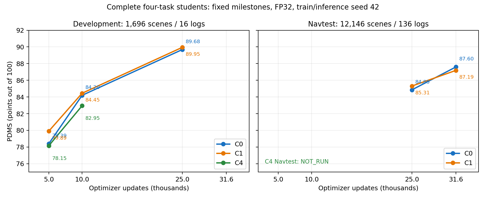

已完成开发集与Navtest评测汇总（2026-09-30）

三组都是完整四任务模型：ego FM＋当前DINO＋未来DINO＋固定车辆GT-MAE。C0为128×96、不池化；C1为256×192、2×2编码后池化；C4为512×384、4×4编码后池化。三组均保留144个W；Qwen当前图像输入相同。

开发集：从NAVSIM navtrain按完整log留出的1696场景／16logs，不参与学生或教师optimizer更新，用于评估及checkpoint选择。Navtest：完整12146场景／136logs，与训练和开发集隔离。开发集和Navtest不混算。

| 数据集 | 权重步数 | C0 PDMS | C1 PDMS | C4 PDMS |
|---|---:|---:|---:|---:|
| 开发集 | 5,000 | 78.3895 | 79.8939 | 78.1454 |
| 开发集 | 10,000 | 84.2001 | 84.4492 | 82.9499 |
| 开发集 | 25,000 | 89.6822 | 89.9494 | 未评测 |
| Navtest | 25,000 | 84.8514 | 85.3063 | 未评测 |
| Navtest | 31,600 | 87.6001 | 87.1887 | 未评测 |

所有已完成结果均为FP32、TF32关闭、训练seed42／推理seed42、10步FM、单条执行ego、无scorer或oracle，失败数均为0。C1开发集使用已完成的canonical环境重评分；全部结果的NAVSIM代码、评分器、模拟器及NumPy/SciPy/Shapely身份一致。官方完整环境与原始全精度metric cache保留，遵循已有PDMS审计；未混入EPDMS。

| 数据集 | 配置 | 步数 | PDMS | NC | DAC | TTC | EP | Comfort | 零分 | ADE/FDE (m) |
|---|---|---:|---:|---:|---:|---:|---:|---:|---:|---:|
| dev | C0 | 5,000 | 78.3895 | 96.7866 | 89.6226 | 91.2146 | 70.9840 | 99.8821 | 217 (12.79%) | 1.8024/3.4552 |
| dev | C1 | 5,000 | 79.8939 | 97.8184 | 90.2123 | 93.3373 | 71.5896 | 99.9410 | 193 (11.38%) | 1.7363/3.3222 |
| dev | C4 | 5,000 | 78.1454 | 96.0495 | 89.2689 | 91.0377 | 71.4533 | 99.9410 | 230 (13.56%) | 1.5284/2.9925 |
| dev | C0 | 10,000 | 84.2001 | 97.5531 | 92.9245 | 92.5708 | 79.9849 | 99.6462 | 156 (9.20%) | 1.1465/2.1719 |
| dev | C1 | 10,000 | 84.4492 | 97.4057 | 93.1604 | 93.6321 | 78.8738 | 99.7642 | 151 (8.90%) | 1.0609/2.1200 |
| dev | C4 | 10,000 | 82.9499 | 97.8479 | 91.4505 | 92.9245 | 77.9443 | 99.7052 | 174 (10.26%) | 1.1128/2.1653 |
| dev | C0 | 25,000 | 89.6822 | 99.3514 | 96.7571 | 96.2854 | 83.5155 | 99.9410 | 64 (3.77%) | 0.8388/1.6992 |
| dev | C1 | 25,000 | 89.9494 | 99.2925 | 97.2288 | 96.8750 | 82.9644 | 99.9410 | 56 (3.30%) | 0.8475/1.7170 |
| navtest | C0 | 25,000 | 84.8514 | 98.2957 | 93.0759 | 94.1380 | 79.4149 | 99.9918 | 1031 (8.49%) | 1.0542/2.1843 |
| navtest | C1 | 25,000 | 85.3063 | 98.3863 | 93.6358 | 94.8460 | 79.0229 | 99.9918 | 951 (7.83%) | 1.0242/2.1372 |
| navtest | C0 | 31,600 | 87.6001 | 98.6127 | 95.7599 | 95.6282 | 80.8983 | 99.9918 | 671 (5.52%) | 0.9826/2.0813 |
| navtest | C1 | 31,600 | 87.1887 | 98.2052 | 95.2330 | 94.9201 | 81.3370 | 99.9918 | 779 (6.41%) | 0.9507/2.0121 |

C1−C0配对差值（PDMS百分点，按log做10000次bootstrap）：

| 数据集／步数 | 差值 | 95%区间 |
|---|---:|---:|
| dev_5000_C1-C0 | +1.5044 | [+0.2240,+2.2899] |
| dev_10000_C1-C0 | +0.2491 | [-0.9747,+1.7150] |
| dev_25000_C1-C0 | +0.2672 | [-0.2875,+1.1072] |
| navtest_25000_C1-C0 | +0.4548 | [-0.0838,+0.9856] |
| navtest_31600_C1-C0 | -0.4114 | [-0.8905,+0.0243] |

Navtest从25k到31,600步，C0提高2.7486分（log95%区间[1.9797,3.5894]），C1提高1.8824分（[0.8398,2.9345]）。31,600步C0均分高0.4114分，但C1−C0整体区间仍跨0；C0的NC/DAC/TTC和零分更好，C1的EP及ego ADE/FDE更好。C4在共同10k开发集比C0/C1均分低，不能用它的10k与另两组25k比较。

这些结果支持继续训练后规划改善，尚不能隔离当前／未来／GT-MAE任务的独立贡献，不能证明最大教师分辨率更优，也不是最终100k或多训练seed结论。Navtest仅是用户明确要求的固定checkpoint测量，不触发训练配方、尺寸、种子或checkpoint选择。

完整汇总：[SUMMARY.csv](evaluation_summary_20260930/SUMMARY.csv)。全部62152条场景×checkpoint记录：[SCENES.csv](evaluation_summary_20260930/SCENES.csv)。来源、checkpoint及评分身份：[PROVENANCE.json](evaluation_summary_20260930/PROVENANCE.json)。

31,600步是用户批准的实际权重步数，不是精确30k。C4 Navtest、31,600步开发集及C2/C3/C5正式评测尚未完成；不存在的结果不填分数。旧89.41／89.14不是本轮配对结果。

本次只汇总已完成资产，不运行新GPU任务、不修改训练器／controller／cache。汇总脚本：`/mnt/project/ddp-full-foresight-study-artifacts/20260929/evaluation_summary_20260930/collect.py`；生成时校验每项完整人口、failure、协议、canonical评分身份及scene/GT评估对应。原始数据、目标缓存、权重和场景图片不上传。
