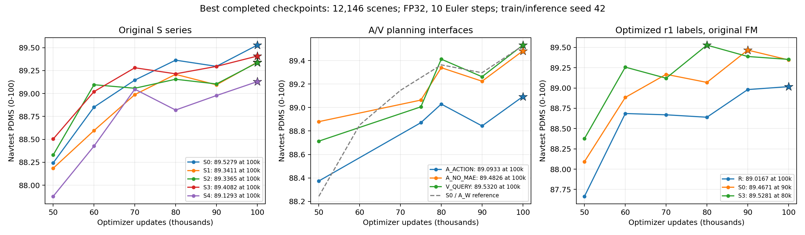

# 20261008 实验结果与数据

S 系列和 A/V 系列按各自已完整评测的最优权重比较后，原始 S0 与 V_QUERY 的规划表现基本持平。视频监督和动作条件尚未证明能提高最终规划上限；规划器直接读取最终 W，以及把 MAE 辅助头迁到动作表示，都出现了负面结果。优化轨迹标签提高进度和道路合规，同时降低碰撞与 TTC 指标，最佳综合分尚未显著超过原标签版本。新训练目标研究已暂停。

本目录保存截至 2026 年 10 月 8 日的结果、优化轨迹标签、逐场景数据、逐日志统计、冻结配置及来源校验信息。完整训练权重和图像、特征缓存保留在实验存储中，权重目录与检查点哈希见 [best_checkpoints.csv](data/best_checkpoints.csv)。

## 评测协议

完整 Navtest 包含 12146 个场景、136 个日志；开发集包含 1696 个场景、16 个日志。正式比较采用训练 seed 42、推理 seed 42、FP32 master 权重恢复与 FP32 推理、关闭 TF32、原生 10 步 Euler、单候选轨迹，不使用 learned scorer 或 oracle。部署只读取允许的当前观测，训练期辅助头和 GT 编码器在部署时移除。

PDMS 和分项 NC、DAC、TTC、EP、Comfort、Direction 均使用 0 至 100 单位，ADE/FDE 使用米。所有打包的正式评测均零失败；合法零分场景仍保留。开发集、Navtest 和诊断子集分别保存，不能将不同划分的最高分混在一起比较。

“最优”指已完成完整 Navtest 评测的检查点中 PDMS 最高的权重，并非每个已保存更新都经过评测。这是事后比较；配对区间条件于已选模型，不校正检查点选择或多重比较。一个训练种子下的日志抽样区间不代表跨训练种子稳定性。

## S 系列和 AV 系列最佳权重

原始 S0 至 S4 和三个新训练的 A/V 实验，历史最高 Navtest 分数均在 100k。A_W、V_NONE、V_MEMORY 分别复用经过[等价性核验](analysis/baseline_reuse_proof.json)的 S0、S2、S3，不能将这些别名计为独立训练重复。

| 实验 | 配置 | 最优更新 | PDMS | 零分场景 |
|---|---|---:|---:|---:|
| S0 / A_W | 逐帧 DINO，MAE 从 W 读出 | 100000 | 89.5279 | 500 |
| S1 | S0 加未来辅助头 GT 动作条件 | 100000 | 89.3411 | 529 |
| S2 / V_NONE | V-JEPA 视频监督，无动作条件 | 100000 | 89.3365 | 524 |
| S3 / V_MEMORY | 视频监督加 memory 动作条件 | 100000 | 89.4082 | 516 |
| S4 | S3 加规划器直接读取最终 W | 100000 | 89.1293 | 550 |
| A_NO_MAE | S0 去除 MAE 辅助监督 | 100000 | 89.4826 | 494 |
| A_ACTION | S0 的 MAE 辅助头从动作表示读出 | 100000 | 89.0933 | 551 |
| V_QUERY | S3 的动作同时注入 memory 和 query | 100000 | 89.5320 | 496 |

GT 动作条件只进入训练期未来辅助头，部署不读取 GT 未来轨迹。逐检查点记录见 [checkpoint_history.csv](data/checkpoint_history.csv)。



### 配对比较

以下差值以 PDMS 点表示，区间为 10000 次配对日志簇 bootstrap 的 95% 区间，seed 为 20260928。

| 比较 | 差值 | 95% 区间 | 本轮结论 |
|---|---:|---|---|
| S1 减 S0 | -0.1868 | [-0.4820, +0.1047] | 动作条件未证明有收益 |
| S2 减 S0 | -0.1913 | [-0.4448, +0.0479] | 视频监督未证明有收益 |
| S3 减 S2 | +0.0717 | [-0.1841, +0.3408] | memory 动作条件未证明有收益 |
| S4 减 S3 | -0.2789 | [-0.5619, -0.0023] | 当前直接读取 W 的接口有负面证据 |
| A_ACTION 减 S0 | -0.4346 | [-0.7502, -0.1275] | 当前 MAE 到动作表示的接口有负面证据 |
| A_NO_MAE 减 S0 | -0.0452 | [-0.3148, +0.2366] | 当前 W 侧 MAE 没有已确立的 PDMS 增益 |
| V_QUERY 减 S0 | +0.0041 | [-0.2428, +0.2418] | 表现接近，未证明超过 S0 |
| V_QUERY 减 S3 | +0.1238 | [-0.1193, +0.3643] | query 注入未证明提高规划上限 |

当前可优先保留 S0 作为默认基线，V_QUERY 作为效果接近的视频候选。上述结果支持否定 S4 和 A_ACTION 的当前实现，不支持泛化为“所有 W 表征或世界模型都无用”。

辅助任务仍能读出场景信息。S3 的同一视频目标上，打乱 W 后归一化预测 MSE 从 0.2497 增至 0.5513；冻结 MAE 解码 ADE 从 0.80 米增至 7.42 米。成功的辅助表征学习尚未建立同等的规划收益。完整同教师诊断见 [auxiliary](analysis/auxiliary)；不能按不同教师的 MSE 数值排名。

## 优化轨迹标签与原始 FM

这些训练保持原始 FM 目标，并已完成 100k。最优权重出现在不同更新数，以下是各自最佳表现比较，不能解释为同曝光量的单项因果消融。

| 实验 | 最优更新 | PDMS | 零分场景 | 相对同标签 R 的 PDMS 差值 |
|---|---:|---:|---:|---:|
| R action only | 100000 | 89.0167 | 639 | — |
| S0 r1 | 90000 | 89.4671 | 608 | +0.4503 |
| S3 r1 | 80000 | 89.5281 | 592 | +0.5114 |

S0/S3 相对同标签 R 的配对区间分别为 [0.0347, 0.8878] 和 [0.1566, 0.8885]，提供整体方案有收益的正向信号。S3 相对 S0 仅 +0.0611 点，区间 [-0.3212, +0.4241]，不能将收益单独归因于视频或动作条件。

优化标签 S0 相对原始 S0 最优结果为 -0.0608 点，区间 [-0.9261, +0.8072]；优化标签 S3 相对原始 S3 为 +0.1199 点，区间 [-0.7366, +0.9818]，均未确立综合分收益。

| S3 最优权重 | NC | DAC | TTC | EP |
|---|---:|---:|---:|---:|
| 原标签 100k | 98.2463 | 97.4230 | 95.1177 | 83.5477 |
| 优化 r1 标签 80k | 96.5627 | 98.4933 | 90.1367 | 88.0795 |

优化标签提高进度 4.53 点、道路合规 1.07 点，同时降低无责任碰撞指标 1.68 点、TTC 4.98 点，零分场景增加 76 个。研究重点应保留这一进度与安全的取舍，而非仅按接近的综合分判断。

训练目录的滚动保留策略已移除部分旧 periodic 检查点；S0 90k 和 S3 80k 的完整 native 状态仍保存在相应评测的 frozen_student 副本。索引已指向这些保留副本。

### 标签数据

| 版本 | 训练场景 | 接受优化轨迹 | 回退原 GT |
|---|---:|---:|---:|
| r1 | 101592 | 88499 | 13093 |
| V12 | 101592 | 92841 | 8751 |

[r1](data/optimized_labels/r1) 和 [V12](data/optimized_labels/V12) 均包含原始 labels.npz、identity.json 和 COMPLETE.json。NPZ 字段为 tokens、trajectories、accepted；轨迹为 float32 的 [101592, 8, 3] 数组，字段依次为局部后轴坐标 x 米、y 米、yaw 弧度，时间点为 0.5 至 4 秒、间隔 0.5 秒。accepted 为布尔接受标记。训练标签保留原始 NAVSIM token 供数据索引匹配；评测 CSV 的场景和日志使用稳定匿名 ID。

视频辅助条件仍使用 original_logged_ego，规划标签采用优化轨迹或按策略回退原 GT。V12 数据的归档不代表其新目标配置已经通过长训验证。

## C 系列历史参考

| 实验 | 100k Navtest PDMS | 配置 |
|---|---:|---|
| C0 | 89.1512 | DINO 128×96，144 W |
| C1 | 89.2395 | DINO 256×192，pool2，144 W |
| C4 | 89.2776 | DINO 512×384，pool4，144 W |

三组分辨率比较的 PDMS 配对区间均跨零。C 与 S 的未来任务时刻、目标归一化、曝光和校准权重不同，跨系列差值代表整体方案，不能归因为单一分辨率或监督机制。历史记录与分项区间见 [c_s_paired_100k.json](analysis/c_s_paired_100k.json)。

## 已暂停的新目标复验

修订目标在 r1 标签下完成 S0/S3 与原始 FM 的四组匹配冷启动训练，全部暂停在 2000 更新；每个 1000/2000 权重均完成完整开发集评测。两组配对内只有轨迹目标不同，共同学习率和 warmup 的改变不能被单独赋予因果解释。

| 模型 | 更新 | 原始 FM PDMS | 修订目标 PDMS | 差值 |
|---|---:|---:|---:|---:|
| S0 | 1000 | 50.2861 | 52.6290 | +2.3429 |
| S3 | 1000 | 41.9948 | 51.4819 | +9.4871 |
| S0 | 2000 | 66.7418 | 63.7722 | -2.9696 |
| S3 | 2000 | 67.7448 | 62.8548 | -4.8900 |

2000 更新退化的配对区间分别为 [-5.0923, -1.4213]、[-7.1474, -3.0984]。128 场景子集的四个推理种子重复也全部退化；它们是诊断推理重复，不是独立训练种子。原激进目标和修订目标均被拒绝继续长训，原四组长训保留完整状态并暂停，当前新目标研究保持暂停。完整结论、配置、因果限制和运行审计见 [objective_v2](analysis/objective_v2)。

## 数据目录

| 文件 | 内容 | 评测组数 | 逐场景记录 |
|---|---|---:|---:|
| [navtest.csv.gz](data/scenes/navtest.csv.gz) | C/S/A/V、优化标签和已完成旧新目标 Navtest | 88 | 1068848 |
| [dev.csv.gz](data/scenes/dev.csv.gz) | 历史完整开发集 | 58 | 98368 |
| [objective_v2_dev.csv.gz](data/scenes/objective_v2_dev.csv.gz) | 修订目标完整开发集 | 8 | 13568 |
| [objective_v2_diagnostic.csv.gz](data/scenes/objective_v2_diagnostic.csv.gz) | 128 场景乘四推理种子诊断 | 32 | 4096 |

合计 186 组评测、1184880 条逐场景记录和 13536 条逐日志统计。这些计数包含不同模型、检查点和种子对同一场景的重复，不是 118 万个独立场景。

- [evaluations.json](data/evaluations.json) 关联 evaluation_id、模型、更新数、划分、种子、数据覆盖率和检查点哈希。
- [checkpoint_history.csv](data/checkpoint_history.csv) 保存 146 条历史检查点评测记录；[objective_v2 results](analysis/objective_v2/results.csv) 单独保存 8 条短训主评测。
- [per_log_metrics.csv](data/per_log_metrics.csv) 包含日志均分、场景数和合法零分数；总体分应按场景数加权，而非直接平均日志均分。
- [bootstrap_log_order.json](data/bootstrap_log_order.json) 保留原始日志排序的匿名映射，使固定随机种子的 bootstrap 能精确复算。
- [source_artifacts.json](provenance/source_artifacts.json) 保存原始数据文件的相对工作区位置、字节数和 SHA256；[MANIFEST.json](MANIFEST.json) 保存仓库数据包的文件校验值。
- [configs](configs) 保存冻结的训练配置与注册记录。JSON 中的绝对路径是原训练环境的来源元数据，不是仓库内文件链接。

其中优化标签 S0 的 50k 记录保留了完整 completion receipt 和校验匹配的 complete.csv，其旧评分目录副本已经移除。归档使用保留的完整 CSV 验证分数，不补造缺失的评分目录。

## 复算与校验

在仓库根目录执行以下命令，依赖 Python 和 NumPy，不运行模型、不读取原始图像或检查点：

```bash
OPENBLAS_NUM_THREADS=1 python reports/experiment_results/20261008/tools/verify_snapshot.py
```

校验覆盖所有文件 SHA256、每组场景唯一性、失败状态、场景和日志数量、场景均分、11 组历史最优权重、两版 NPZ 完整性和标签结构，以及从归档逐场景数据重算最佳权重的配对区间。

原实验工作区仍可用时，可重新导出同类归档：

```bash
python reports/experiment_results/20261008/tools/export_workspace.py --workspace /mnt/project
python reports/experiment_results/20261008/tools/verify_snapshot.py --refresh-manifest
```

导出只读取已完成结果，不进行新训练或推理。冻结记录与当前研究暂停状态分别保存，历史报告中的创建时间和运行快照不应解释为当前仍在运行。
