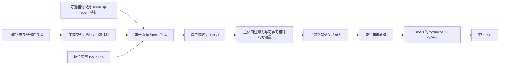

# Joint Local Scene V3：训练前代码审阅

状态：**WAITING_FOR_USER_REVIEW**。用户要求训练前先 push，因此本版尚未启动任何 V3 训练或 GPU 推理。旧 V2 step 1887 保持暂停，旧控制器没有恢复。本文描述已提交实现，不把后续视觉训练方案写成完成结果。

## 1. 本次结构变化

旧主线为“预测局部图 → 辅助图生成 → hidden 桥接 → 另一个冻结 DiT 生成执行 ego”。本版使用一个 `JointSceneFlow`：



联合状态为 `[B, N+1, 8, 4]`，ego 固定 slot 0；四个通道为 ego(t0) 中的 x/y 和 yaw sin/cos。当前目标缓存没有周车未来 yaw，相关 loss 使用逐特征 mask，不从轨迹方向猜造 yaw 标签。当前坐标作为相对位移锚点，xy 除以固定 20 m；不使用未来终点或测试集统计作归一化。

模型初始配置为 width 384、6 heads、6 blocks。每个 block 包含时间、主体、当前上下文三种注意力；时间条件在 block 内调制特征。复用现有 `ActionEncoder` 和 `GraphBlock` 的底层计算代码，**不加载旧小图权重，不构造第二个执行动作头**。确切参数量见 [PRETRAIN_IMPLEMENTATION_STATE.json](PRETRAIN_IMPLEMENTATION_STATE.json)。

`predict_action` 只接受 `predicted_inference` 来源的图。它返回整个联合样本、该样本的 ego 视图，以及唯一的 `atan2(sin, cos)` 后处理结果；xy 逐值断言相同。结构化 GT 当前状态实验使用显式的 `sample` / `execution_from_joint` 评估，不能冒充相机部署成绩。

## 2. 建议审阅顺序

| 文件 | 当前实现 |
|---|---|
| [contracts.py](../../starVLA/model/modules/joint_scene/contracts.py) | `LocalSceneGraph` 只有当前状态；`AnnotatedLocalScene` 分开持有 future、feature-valid、track IDs |
| [graphs.py](../../starVLA/model/modules/joint_scene/graphs.py) | 显式 `build_supervision_graph` / `build_inference_graph`，无未来参数，无 2 m/类别正确监督验收门槛 |
| [masks.py](../../starVLA/model/modules/joint_scene/masks.py) | 训练角色补全从具有任意有效 xy 未来点的主体抽样，允许部分轨迹；ego/周车目标均衡，缺少周车时回退 ego |
| [flow.py](../../starVLA/model/modules/joint_scene/flow.py) | 单一生成器、清除隐藏值、每步钳制、逐特征 loss、直接执行联合 ego |
| [data.py](../../tools/joint_local_scene_v3/data.py) | 复用已验证的坐标/track 标签与标定，写独立 current/labels 文件并校验内容哈希 |
| [train_mechanism.py](../../tools/joint_local_scene_v3/train_mechanism.py) | 相同初始化和两次前向的 ALL/MASK；独立噪声/时间/任务 RNG、有效坐标统计、保存恢复入口 |
| [runtime.py](../../tools/joint_local_scene_v3/runtime.py) | all-hidden、ego-hidden、neighbor-hidden、静/动态与 stationary；当前 ego 速度 CV；同一个联合样本中的间距 |
| [test_joint_scene.py](../../tests/joint_scene/test_joint_scene.py) | 本次变化涉及的针对性 CPU 测试 |

当前候选规则有意简单：50 m 内按当前距离取最多 8 个主要邻居，其余候选在主要邻居 25 m 内补充至最多 16 个。局部集合内使用稠密候选边，注意力结合可学习的相对几何偏置学习关系强度；没有预设跟随/穿越等语义方向。当前版本没有用导航改变候选排序，导航作为联合网络条件输入。低几何支持和容量外当前对象可保留在最多 64 个当前上下文 token 中；几何投影支持不是遮挡可见性或置信概率。

训练 graph 来源明确为当前标注，推理 graph 来源为当前预测。前者不依赖弱预测器通过 2 m，后者仅使用存在性、当前合法几何和局部容量规则。视觉 query assignment 到监督图的对接尚未实现；不能把这两个 builder 的存在等同于完整视觉训练已完成。

## 3. 已构建的真实数据与范围

使用旧分支已经验证的 train / training-domain holdout manifest，未修改划分；全部构建在新的 V3 artifact 目录，原始数据和旧缓存只读。

| 指标 | Train | Holdout |
|---|---:|---:|
| 场景数 | 7284 | 64 |
| 构建失败 | 0 | 0 |
| 选中周车出现次数 | 81494 | 792 |
| 其中有有效未来标签 | 80071 | 782 |
| 有有效周车角色任务的场景 | 6889 | 63 |
| ego-only 场景 | 372 | 1 |
| 有效周车 xy 坐标数 | 1216976 | 11824 |

这些数字是数据构建结果，**不是训练后的预测覆盖率或空任务实测率**。其他没有有效周车任务的场景仍保留，role 任务回退 ego。track ID 只用于标签对应/审计，不进入网络 embedding。

源 `WorldTargets` 已经过 ROI/FOV 筛选；汇总字段 `raw_current_objects` 表示这个源缓存中的当前目标数，**不等于原始日志的全部目标分母**。现有两组数据的 `current_unobserved_selected` 都是 0，不能据此声称已经覆盖低可见/视野外风险对象。完整原始人口与缺失风险上下文需要后续补充审查/数据扩展。相关物体轨迹在既有缓存中是同 track、ego(t0) 坐标，本次没有按数组下标跨时间拼接。

current 文件不含未来轨迹/有效性/track ID；labels 文件独立存放这些监督字段。`AnnotatedCorpus` 用于训练与离线机制评估，不能用来替代纯视觉部署输入加载器。数据身份、源文件哈希和路径见 [PRETRAIN_IMPLEMENTATION_STATE.json](PRETRAIN_IMPLEMENTATION_STATE.json)，仅提交汇总，不上传场景缓存或权重。

## 4. ALL / MASK 实现的准确含义

- J_ALL：同一 batch 两次独立 noise/time 的 all-hidden 前向。
- J_MASK：第一次 all-hidden；第二次角色补全。整条主体未来被隐藏，未隐藏主体只暴露其有效特征/时刻。
- 两组每个 optimizer update 都做两次前向/反向，loss 各占 1/2；初始化、data order、noise/time RNG 规则相同，mask RNG 独立。
- ego xy、neighbor xy 分别按各自有效坐标归一化；yaw 的有效特征均值乘 0.25。空邻居分母被安全处理，不伪造缺失标签。
- 记录两次前向的有效坐标数、角色选择/回退、累计前向次数、场景曝光、耗时、显存及梯度。相同前向数并不代表相同有效监督量，后者会单独报告。
- 结构化机制阶段只训练联合模型，预留视觉特征投影固定，因为该阶段没有视觉输入。视觉阶段必须解冻该投影并建立到 Reader / Qwen adapters 的真实梯度；此阶段目前未实现。

当前 `lambda_role` 配置值为 1，trainer 实际固定采用等权的两次 loss；可配置非 1 的权重尚未接入，不应据此启动非默认配方。完整训练步数/曝光还未通过吞吐与学习曲线确定，48 GPU-hour 是新一轮有限执行预算提案，并非旧 8/32 epoch 的继承约束。用户审阅前预算消耗为 0 GPU-hours、0 optimizer steps。

## 5. 已验证与未验证

CPU 上运行以下命令：**9 passed**，2.37 s。

```bash
OMP_NUM_THREADS=1 MKL_NUM_THREADS=1 OPENBLAS_NUM_THREADS=1 \
  /root/miniconda3/envs/ddp/bin/python -m pytest -q tests/joint_scene
```

覆盖当前图/ego-only 边界、有效角色目标、未知值置 NaN 后输出不变、采样每步已知点不变、直接取联合 ego、ego loss 到主体交互和视觉条件张量的梯度、无效邻居无 NaN、模型/optimizer 保存恢复。另完成 Python 编译检查和真实数据文件生成；首个 train/holdout 样本合同与哈希加载已检查。CPU tensor 梯度测试**不是**真实 Qwen 端到端梯度测试。

尚未运行任何训练，因而不能给出 ALL/MASK 学习结果、机制有效性或 PDMS。以下工作仍明确未完成：

1. GPU 小集可学习性、训练流程 exact-resume 和匹配机制训练；真实完整局部网图片、关系强/弱上下文诊断、通行先后等分析。
2. 当前 bbox + 同实例 future motion 的视觉训练；训练 matching 不设置 2 m 验收门槛，并更新 Reader/head/Qwen adapters。
3. GT 当前图向预测图的训练比例过渡；预测图全隐藏末段训练；真正端到端的 `predict_action` 相机输入封装。
4. V_EGO / V_JOINT_ALL / V_JOINT_MASK 三组的同源匹配训练与独立感知评估。
5. 模型与采样协议锁定后的完整 Navtest。周车 CV 也尚不可用：现有缓存无合法当前周车速度，不能从未来差分伪造输入。

因此本次交付是**可审阅、已通过针对性 CPU 验证的首阶段实现**，工程状态 PARTIAL，研究状态 NOT_RUN。旧模型结果不并入新表，也没有通过增加冻结桥接替代尚未完成的视觉联合训练。

## 6. 恢复规则

等待用户代码审阅反馈，禁止自动启动训练。旧 V2 控制器和检查点继续封存。新分支 `feature/joint-local-scene-v3-20260927` 以 `f662266c379c5d163b88f2fc733274ad871dfec1` 为起点；本次实际提交 SHA 以 Git/最终回复为准。

只读检查命令：

```bash
cat /mnt/project/joint-local-scene-v3-artifacts/20260927/budget_ledger.json
```

应显示 `runs: []`、`gpu_hours: 0`、`optimizer_steps: 0`。训练入口的配置/数据/输出位置均为 CLI 参数；后续只有用户确认继续后才按新的 run ID 和账本开展实验。
