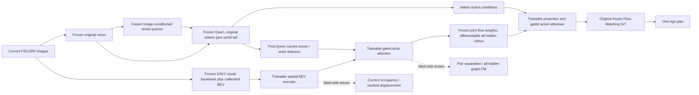

# Masked joint trajectory world model — implementation and evidence plan

User goal: jointly model ego and surrounding trajectories using actor-wise random masking, learn traffic interaction, investigate useful BEV objectives, and transfer the representation to planning. Fixed current CAM_L0/CAM_F0/CAM_R0 images. No RL, scorer, PDMS supervision, reward-labelled representation training, or future observation in deployment.

Baseline: source96ff2ee (V1.1), released Qwen3-VL2B + original Flow-Matching DiT, checkpoint9445f9d…; base loading remains strict. The old structured-world experiment is evidence, not a completed solution: final64 PRE49.47%/22.73% and POST49.95%/32.28% geometry recall/precision. Detection errors must be reported with downstream trajectory coverage. Planned old box4 repair was NOT launched before the user changed the objective.

## Algorithm

1. Current three-view visual features → image-conditioned fixed scene/agent queries → append-tail frozen Qwen. Current instance heads assign losses by current matching; GT never chooses model slots or initializes queries. Preserve native action conditions at initialization.
2. Form a fixed-size graph with ego slot0 plus K predicted agent slots. All future trajectories use ego(t0) metres; XY channels are separate from original ego normalized action/yaw channels. No GT track count/validity determines deployment computation.
3. A compact conditional flow model alternates time attention, actor attention with relative-position bias, and current-scene cross attention. Agent ordering is equivariant. The ego is distinguished only by role. Actor-wise random masking hides complete trajectories; masks are sampled without consulting labels. Missing labels enter loss masking only. At least50% of scene examples hide ALL futures, matching deployment.
4. Partial-mask GT context is a TRAINING-ONLY imputation task, explicitly privileged. This is conditional observational modelling, not proof of causal responses to an intervention. Train/evaluate an all-masked control and a context-shuffled diagnostic; report all-masked inference separately. At deployment, jointly generate ego/other trajectories from noise, with no known-future context.
5. Bridge generated graph features to original DiT through a zero-gated residual attention adapter. The planner loss must use a deployment-style all-masked rollout, never the GT-conditioned imputation hidden states. This separates lawful auxiliary teacher context from the deployed planner. Backpropagate ego imitation into graph/bridge; initially freeze original Qwen/vision/DiT. Preserve independent original-reference output and measured gate0 fidelity.
6. Compare original baseline, matched graph capacity without masked-context auxiliary training, masked graph, and a matched graph+BEV variant only after the image path is usable. All use one sample, the same ego noise,10FM steps, same split and frozen model-selection protocol. No trajectory scoring/selection.

## BEV objectives and transfer

Reuse the audited pretrained visual backbone + calibrated current-camera BEV construction as optional input (not a pretrained BEV claim). The implemented targets are spatial support-aware current occupancy, tracked future displacement at current occupied cells, and pair closest separation. A separate future occupancy raster/flow predictor was not implemented in this phase. Future/map labels are supervision only. Task-trained BEV memory is consumed by graph attention and the planner bridge; auxiliary head predictions themselves do not score or select a plan. Missing annotation/unsupported cells must not become free-space negatives. Auxiliary metrics alone cannot establish planning value.

## Evidence and finite budget

Use the remaining prior envelope conservatively: prior campaign2596 updates/1.671009907 GPU-hours; new updates plus prior <=24000, GPU-hours plus prior <=48. Start64-scene CPU unit checks, GPU frozen-baseline integration/label-poison/gate0/save-load, then bounded true-data learning. No new unlimited hyperparameter search; at most2 documented repair hypotheses. Train-log holdout before development planning evaluation; navtest never used for selection. Keep original1696 development protocol for paired planning, failure rows and component CSV. PDMS is evaluation-only and must never enter training files or model inputs.

Required conclusions: engineering status, interaction-learning evidence, planning result vs original baseline AND matched control, BEV evidence/cost. All conditional-GT metrics must be labelled as privileged diagnostics. Joint graph likelihood or improved reconstruction alone is not interaction understanding. Report fixed intermediate/final checkpoints, scene/log paired uncertainty and training-vs-sampling seeds.

## Reference provenance (ideas only, no copied implementation)

- WCog-VLA, https://arxiv.org/abs/2607.08375, v1: agent-token structured supervision and joint trajectory generation motivate interfaces. We do not use its RL, reward or Game-CoT pipeline, or claim reproduction.
- Scene Transformer, https://arxiv.org/abs/2106.08417: joint scene prediction and trajectory masking are prior art. The proposed contribution must be demonstrated in image-conditioned VLA representation-to-planning transfer, not claimed as inventing masking.
- MotionLM, https://waymo.com/research/motionlm/: context for joint conditional motion modelling; our implementation is continuous flow matching rather than token language modelling.

## Updated BEV implementation and convergence policy

The BEV side branch is now an independent current-camera pretrained visual provider → spatial task encoder → actor cross-attention → joint graph → original DiT bridge. It augments Qwen-derived actor features after Qwen rather than replacing native image tokens. A separate zero gate permits exact image-only initialization and controlled training. Online inference includes the provider and its cost. Offline features are permitted only for the frozen provider with checked current image/calibration/weight identities.

Task heads supervise covered current occupancy, per-instance future displacement at occupied cells, and unordered-pair closest future separation. The pair head is auxiliary regression only; it is not used to score candidates or select an ego plan. Missing future labels never create free-space negatives; incomplete current box geometry conservatively disables unsupported negatives. The dense motion probe uses GT occupied cells for evaluation and therefore is explicitly not end-to-end forecasting. Actual planning needs independently matched scene/object and PDM evaluation.

Following the user's warning about short runs,1000-step isolation and600-step BEV task probes are engineering checks, not convergence claims. Extended paired training uses7284 log-disjoint scenes,8 complete passes,batch16,3642 updates/variant. Loss and fixed-sample prediction curves at prescribed milestones must be reported; if unstable at the cap, the result remains INCONCLUSIVE. The previous single-seed ordering changed across recipes/checkpoints, so it cannot support a claim that masking helps or fails. The source original8192 excludes all59 holdout logs; no samples selected by quality or scores.

## Actual training and gradient boundaries

The completed large image experiment trains the joint graph first (3642updates), then freezes it and trains only the originalDiT conditioning bridge (1821updates). This is a fixed-representation transfer comparison. The small realGPU check additionally verifies ego gradients can reach a trainable graph, but the large result must not be described as joint graph/DiT fine-tuning. OriginalDiT weights never update in this campaign.

In the matched BEV phase, both arms start from the same frozen randommask graph and fresh BEV/bridge initialization. BEV encoder/fusion, graph-to-world projection and action attention are trainable; Qwen, its vision/current worldReader/heads, the pretrained provider, graph weights and originalDiT weights are fixed. Frozen graph/DiT forwards retain autograd into their trainable inputs. The task-on arm adds current occupancy, tracked displacement, pair separation and all-hidden graphFM at fixedweight0.1. That last auxiliary loss opens the BEV fusion gate while the outer action gate starts atzero. Task-off uses the same parameters and architecture; unused auxiliary prediction heads receive no optimizer update. A separately seeded and saved auxiliary RNG keeps original ego noise aligned between arms.

No future labels feed the solid deployment arrows. The conditional imputation analysis accepts privileged other-actor futures in a separate function; it is never called by the planning entry. Prediction sensitivity to blank/shuffled memory is only a use diagnostic. BEV enters after Qwen in this phase. This differs from a strict WCog implementation and does not implement Game-CoT, joint-policy RL, counterfactual dynamics, trajectoryVAE or candidate scoring.
