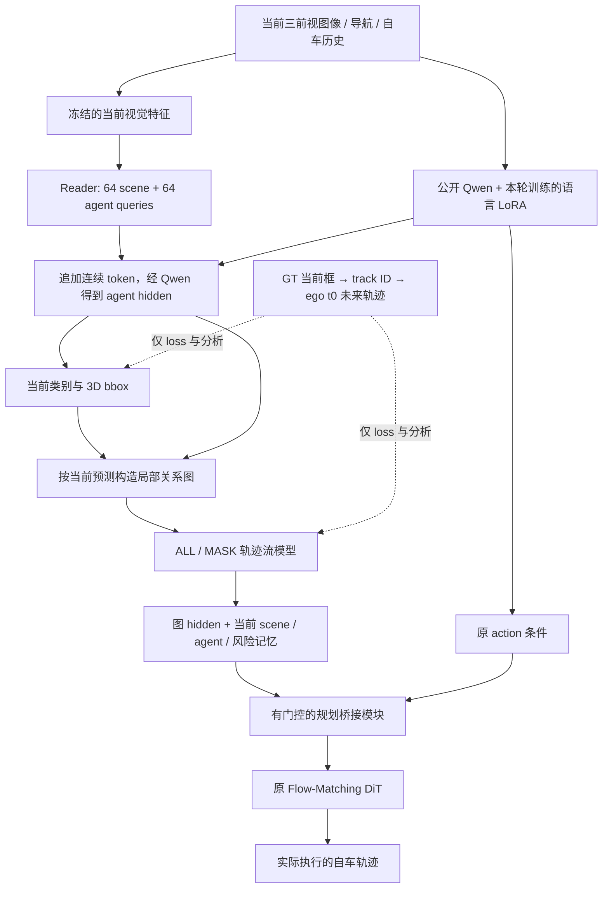

# 当前设计、实验判断与暂停交接

2026-09-27。状态：**PAUSED_BY_USER**。用户要求暂停开发、整理设计与想法并推送。本文件是当前状态入口；早期报告中的 running / queued 是历史快照。

三组规划桥接训练已经在 optimizer step **1887** 安全暂停，保存模型、optimizer、scheduler、Python/NumPy/Torch/CUDA RNG、epoch 与数据偏移。训练续跑、正式评测和最终报表控制器均已停止，不会自动继续。暂停后只整理已有日志、核对文件和提交文档，没有训练新模型或运行新的模型评测。

## 1. 研究问题和目前实现

当前分支研究局部交互轨迹掩码 V2：从当前图像预测目标和局部交互关系，学习自车与周车轨迹补全，再把所学表示送入原 Flow-Matching DiT，检验是否改善真实规划。它是早期 structured-world/BEV V1 之后的研究分支，**这一版没有 BEV provider，也没有完成早期 BEV A0/A1/A2/B/C/D/E 矩阵**。不可把本分支交付写成早期 BEV 任务的完整完成。

正式实验从公开 **Qwen3-VL-2B-Instruct** 开始，驾驶专用 DiT、history projector、Reader、检测头与后续图模块在本轮训练；不加载旧私有驾驶基础权重。所有对照共享本轮训练出的 foundation。因此研究者可按公开基模与训练配方重建，不需要旧私有基础权重；但尚未实测另一台全新环境从零安装并完整复跑，有限训练结果也不等价于充分收敛的结果。

允许输入为当前 F0/L0/R0 三前视图像、经过裁剪缩放修正的标定、导航、自车状态和允许的历史。部署不读取 GT bbox、track ID、未来轨迹、地图或 LiDAR。训练标签与当前观测独立存放。

实际 token 实现保留原 image/text/history/action prefix，将 world tokens **追加到原 action tokens 后面**，使用原因果注意力。当前框头读取经过 Qwen 的 agent hidden；world 信息经后续显式桥接送到 DiT，而非通过后置 token 反向影响原 action prefix。这与最早提出的 world-before-action 方案不同，见 [ARCHITECTURE.md](ARCHITECTURE.md)。

局部图把预测实例分为 A（可参与轨迹任务）、B（保留当前风险上下文）、C（保留原视觉路径）、D（排除显式图计算）。最多 8 个直接邻居、16 个非自车节点，包含真实计算的周车间边与有界二跳关系。选择节点、关系和 mask 不读取未来标签或未来有效性。MASK 使用 50% 全隐藏、25% 隐藏自车、25% 隐藏一个符合当前条件的周车；选中周车没有可用监督时记录空任务，不按未来标签重抽。

图模型同时输出内部自车轨迹和周车轨迹，但**内部图自车轨迹不是最终执行轨迹**。最终输出仍由原 DiT 产生。CURRENT/ALL/MASK 三个桥接模块拥有相同初始化与 17,315,969 个可训练参数；ALL/MASK 各使用自己的冻结图模型。无新 scorer、RL 或额外多种子实验。

## 2. 各阶段到底训练了什么

| 阶段 | 实际训练 | 固定或缓存 | 完成情况 |
|---|---|---|---|
| 公开来源 foundation | 新 DiT、history、Reader、当前分类/框头、共享 rank-8 Q/V LoRA、驾驶 token | 原始 Qwen/视觉固定；旧 motion head 固定；固定视觉可缓存 | 24 passes，5472 updates，174816 presentations |
| 当前检测头优化 | 532752 个当前头参数 | 上游全部固定，清除未来标签 | 16 passes，1824 updates；选中 epoch 16 |
| P2 ALL / MASK / nearest | 每个 949450 参数图模型 | 当前特征、预测图及上游固定 | 三组均 32 passes，7296 updates，233088 presentations |
| P3 CURRENT / ALL / MASK | 每组 17315969 参数桥接 | Qwen/LoRA/Reader/当前头/图/完整 819503620 参数动作头固定 | 8 passes 后共同续跑，均暂停于 step 1887 |

基础模型阶段的监督是 **ego FM + 当前分类/框**，没有训练共享语义表示的周车未来 motion loss。这是本轮设计的关键限制，不能只描述为“数据没有监督”。正式缓存共 21190 条（train 7284 + holdout 64 + dev 1696 + Navtest 12146），构建失败 0。缓存身份绑定模型、当前头、语言数值精度、选择规则及当前观测。最终推理采用 Qwen 原参数 BF16、小 LoRA FP32、原 DiT FP32；这是明确记录的数值修复，不宣称与旧 BF16 LoRA 算术完全相同。

## 3. 对 NAVSIM 标注和 WCog 的重新判断

**用户对标注的质疑是正确的。** NAVSIM 日志提供当前 bbox、track ID 和未来时刻目标记录。标定可以把当前 3D 框投影到图像；track ID 可以把同一 GT 实例的未来轨迹连接起来。需要学习和检查的是“当前模型的第几个预测 slot 对应哪个 GT 实例”，不是重新发明不存在的标签。官方字段见 [NAVSIM dataclasses](https://github.com/autonomousvision/navsim/blob/3e8291bfa89ff247231e0227778840cd0a036896/navsim/common/dataclasses.py)。

当前实现先对全部 64 个预测 slot 做一次 Hungarian assignment，再对局部图未来监督要求同类且当前中心距离小于 2 m。对全部 7284 个训练场景的只读审计，将 61894 次 active predicted neighbor 出现分解如下：

| 互斥结果 | 次数 |
|---|---:|
| 未获得 full-slot Hungarian assignment | 33191 |
| 获得 assignment，仅距离条件拒绝 | 18953 |
| 距离与类别均拒绝 | 1852 |
| 仅类别拒绝 | 613 |
| 当前关联通过，但未来全无效 | 45 |
| 当前关联通过，存在未来标签 | 7240 |

通过当前关联的 7285 次里，**99.3823% 有未来标签**；21418 次拒绝关联里，21213 次对应的 GT track 也有未来标签。因此 MASK 的 89.433% 空周车任务率主要描述这条预测实例关联管线丢失监督，不能当成 NAVSIM 的标签缺失率。未分配预测也不能一概叫假阳性：候选数量、监督区域、预测几何和全局分配都可能影响，现有分解不能单独量化各项因果贡献。完整分母、逐场景 CSV 和限制见 [SUPERVISION_REVIEW.md](SUPERVISION_REVIEW.md)、[SUPERVISION_FLOW.json](SUPERVISION_FLOW.json)。

[WCog-VLA §3.4](https://arxiv.org/html/2607.08375v1#S3.SS4) 先做当前 3D 感知预训练，再用 GT bbox **和未来轨迹**监督 VLM/world heads，之后冻结 VLM 训练联合轨迹生成。本轮先用当前框训练共享表示，冻结后才通过严格关联给局部图喂未来监督，顺序和监督范围有实质差异。论文正文没有给出足以确认其采用本实验 2 m/同类门槛的完整 query-to-GT 实现；不能猜测。其六环视输入、模型主体等也与本轮三前视 Qwen3-VL 不同。本实现是相关机制探索，不是 WCog 严格复现。

**在 loss 端用 GT 当前框匹配 query，再沿同一 track ID 取未来标签，是正常监督学习。** 这与把 GT 框/未来当部署输入、按 GT future-valid 选择节点或掩码是不同操作。当前框训练本身也没有后续图标签的 2 m 接受门槛。此前把监督关联问题笼统解释成“缺少监督”不准确，已在报告中更正。

## 4. 已有结果能说明什么

所有下表误差来自 **64 场景 / 59 完整 log 的 training-domain holdout**，与本轮增量训练 log 分开；不是训练集拟合误差，也不是 Navtest 分数。公开 Qwen 的预训练数据是否见过这些内容未知。

当前头 F1 从 0.206003 到 0.237140，最终 recall 0.319453、precision 0.188555。全训练人口图审计只保留 4406/26365（16.71%）个有观测支持且相关的 motion GT；B 类静态/未知风险上下文覆盖另算，不能补进 motion recall。

P2 主比较：两组相同训练暴露、54 个共同匹配周车、406 个有效未来点、0 个失败场景；FDE 只有 45 个有效末时刻目标。

| 图模型指标，m | ALL | MASK | 静止参考 |
|---|---:|---:|---:|
| 内部图自车 ADE | 2.209 | 2.225 | — |
| 周车 ADE | 4.002 | 3.928 | 3.637 |
| 动态周车 ADE | 4.548 | 4.614 | 5.536 |
| 静态周车 ADE | 3.344 | 3.100 | 1.345 |

总体差异小且方向混合；不能据此宣称掩码交互有效。条件补全诊断只有 3 条完整选中周车轨迹 / 24 点；related-vs-weak 条件移除只有 3 个场景在两侧都实际移除了有标签点。nearest 对照在另一共同 cohort（41 track / 308 点）上，关系 MASK 周车 ADE 4.218 m、nearest 3.981 m，而内部自车方向相反。不能把不同 cohort 的均值直接拼起来。完整表见 [P2_ASSESSMENT.md](P2_ASSESSMENT.md)。

P3 三组均完成的 epoch 8（1824 updates）历史结果：

| 实际 DiT 输出 | CURRENT | ALL | MASK |
|---|---:|---:|---:|
| 自车 ADE，m | 6.688454 | 6.645932 | 6.708071 |
| 自车 FDE，m | 9.698303 | 9.550095 | 9.627761 |
| 失败场景 / 总场景 | 0 / 64 | 0 / 64 | 0 / 64 |

零门控初始化时三组 ADE 均为 6.530142 m，实际输出完全一致。epoch 8 之后按既定规则三组共同续跑至最多 16 passes；因用户暂停，实际只各增加 63 updates。**保存的 step 1887 检查点不是上述 epoch 8 结果对应的权重；暂停检查点没有重新评测。** 历史逐场景结果完整保留在 [P3_EPOCH8_HOLDOUT_scenes.csv](P3_EPOCH8_HOLDOUT_scenes.csv)，并记录来源文件校验值。

foundation、图训练末段仍有变化；固定 epoch 上限不证明稳定收敛。当前证据同时受到基础模型成熟度、检测/关联覆盖、有效 motion 训练量和诊断样本量限制，不能用一次有限 pilot 否定方向，也不能许诺从公开基模充分训练必然复现某个增益。

**本分支正式 learned-model dev/Navtest PDMS 均 NOT_RUN，最终 model lock 未创建。** 已准备完整当前特征、官方 metric cache 和异步 GPU 轨迹/CPU 评分入口，不等于获得了规划成绩。EPDMS、Navtest Hard 也未运行。旧私有权重的分数和论文 88.9 不能填入本轮正式表。论文训练量、输入/任务与本轮条件不同，详见 [BASELINE_REFERENCE.json](BASELINE_REFERENCE.json)。

## 5. 暂停后建议审议的修改，不是已经实现的修复

1. **先验证共享 agent 表示能学会当前框和同 track 未来运动。** 将 current bbox assignment 与未来 supervision 的对应关系完整保留，明确实例/时间 mask、静态与动态目标、坐标和归一化。共享语义训练应先接受可用 motion loss，再讨论冻结后局部掩码带来的增益。
2. **分开“教会初学 query 的 loss assignment”和“信任预测身份的质量门槛”。** 2 m 门槛用于当前 frozen graph 时会抑制大量未来监督；但直接去掉它又可能给错误车辆绑定未来。需要单独验证关联质量与监督覆盖，不能靠 GT future-valid 重抽任务来隐藏问题。
3. **先隔离感知/关联瓶颈，再判断交互模块。** 若做使用 GT 当前目标的诊断，应明确标为 privileged teacher 上限，仅用于定位，不是可部署算法结果。正式部署仍只用允许的当前观测。
4. **按真实学习进度制定有限训练预算。** 发布从公开 Qwen 起点到驾驶 foundation 的完整训练；匹配对照的数据、初始化、参数范围和有效监督量。当前表说明“相同 nominal steps”不必然等于相同有效周车监督量。不能用短时 loss 停顿替代成熟规划基线，也不能在暂停期间自动增加 epoch 或预算。
5. **最终接受标准仍是 Navtest。** 候选新配方必须另开版本、记录假设和训练侧选择过程，冻结模型与协议后再做完整 Navtest PDMS；若扩展 EPDMS/Hard，应单独核实协议。旧实验和新配方不能混表、不能用测试分数反复调训练条件。

以上仅是待审议方案。本次交接没有改 matching、门槛、loss、模型或训练输入；没有开始新配方，也没有自动恢复旧队列。

## 6. 状态、预算与证据入口

| 判定 | 当前结论 | 依据或缺项 |
|---|---|---|
| engineering_status | PARTIAL | 真实训练、缓存/在线、梯度、resume 等已有证据；最终三组训练后在线一致性、完整评测和全新环境复现未完成；本轮无 BEV |
| research_status | INCONCLUSIVE | 监督覆盖低、收敛未证实、规划测试未做 |
| GRAPH_VALIDITY | PARTIAL | 当前输入边界/工程检查通过；预测图覆盖和身份可靠性不足 |
| LOCAL_COMPLETION | INCONCLUSIVE | 主比较混合，条件补全样本过少 |
| INTERACTION_DEPENDENCE | INCONCLUSIVE | 有效移除样本过少，且诊断不等于因果证明 |
| DEPLOYABLE_PLANNING | NOT_RUN | 无正式 Navtest PDMS/EPDMS/Hard 结果 |

本轮独立预算 48 GPU-hours，暂停时累计 **38.454169**，余 **9.545831**；包含加载、失败与特征工作，不包括恢复的原占卡脚本。完整终止态账本见 [PAUSE_RUN_LEDGER.json](PAUSE_RUN_LEDGER.json)，暂停检查点、状态和命令见 [PAUSE_STATE.json](PAUSE_STATE.json)。所有 campaign GPU 任务已退出。原占卡脚本恢复为本机 GPU 4–7、vla-zt2 GPU 0–7；本机 GPU 0–3 无本任务占用，见 [PAUSE_RESOURCE_RESTORE.json](PAUSE_RESOURCE_RESTORE.json)。

仓库保留源码、配置、公开数据 token/log 标识、逐场景指标、汇总曲线、失败记录与运行命令。大权重、特征缓存、原始/私有数据和真实场景图片只保留在本地 artifact 目录，没有加入 Git。

- [ARCHITECTURE.md](ARCHITECTURE.md)：实现与梯度路径。
- [ENGINEERING_EVIDENCE.md](ENGINEERING_EVIDENCE.md)：20 项工程要求的证据与未运行项；近期 37 tests 和额外 2 targeted tests 是分别记录，未混算成一次完整测试。
- [BASELINE_MANIFEST.json](BASELINE_MANIFEST.json)、[PUBLIC_QWEN_PROVENANCE.json](PUBLIC_QWEN_PROVENANCE.json)：公开来源、数据/模型/输入协议。
- [SUPERVISION_REVIEW.md](SUPERVISION_REVIEW.md)、[SUPERVISION_FLOW_scenes.csv](SUPERVISION_FLOW_scenes.csv)：7284 场景标签传递审计，失败 0。
- [P2_ASSESSMENT.md](P2_ASSESSMENT.md)、[GRAPH_LEARNING_CURVES.json](GRAPH_LEARNING_CURVES.json)：完成的图实验与局限。
- [P3_EPOCH8_HOLDOUT.json](P3_EPOCH8_HOLDOUT.json)：三组已完成 epoch 8 的原 DiT 误差，失败各 0。
- [PAUSE_RESUME.md](PAUSE_RESUME.md)：只读检查与原配方恢复说明。只有用户明确要求恢复后才能执行训练部分。
- [Quickstart](../../docs/LOCAL_INTERACTION_MASK_V2_QUICKSTART.md)：入口与已实测范围，未运行项目保留 NOT_RUN。

## 7. 版本与本地恢复位置

交接分支：`feature/local-interaction-mask-v2-20260927`。分支起点：`227e781dd54f623b12b41bd7f2d2a7b302e0a014`。交接前已核验远端提交：`025a2a7c94afafb052c8b21b9aeef35b7a52b4fb`；本交接提交的 SHA 用 `git rev-parse HEAD` 获取，推送后在用户答复中提供，不在提交内自引用未来 SHA。

真实 P2/P3 训练源码固定在 `955097588152912eeaca72eeb4ee9f736e40b530`；此交接只更新文档与已有结果汇总，不改变训练来源。公开 Qwen revision：`89644892e4d85e24eaac8bacfd4f463576704203`。本轮 foundation SHA256：`ac7cfadba298e2980a5c278183ca4a93924e1792fe7a6e4342bb730fafa8a0f4`，当前头 SHA256：`0c002ffcb58d76bcce4983048ad635068b467988244b34447844f2316dd5c6ae`。

artifact 根目录：`/mnt/project/local-interaction-mask-v2-artifacts/20260927`。冻结 foundation、图权重和三个暂停桥接权重均位于其 `formal_public_epoch24/`。当前步骤与校验值以 [PAUSE_STATE.json](PAUSE_STATE.json) 为准；不重复已经完成的大实验，不把用户暂停标成目标已完成。
