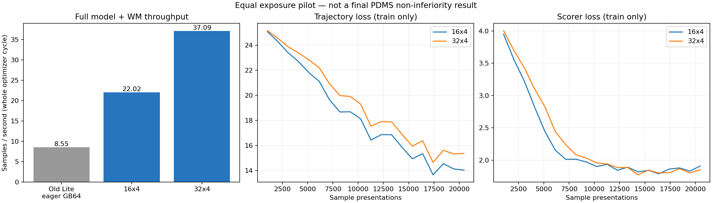

# Lite acceleration execution results

These are new system/numerical/train-only pilot measurements. No new Navtest result is claimed.

| Layout | Global batch | Samples/s | Peak allocated GiB | Status |
|---|---:|---:|---:|---|
| 16x4 | 64 | 22.022475448105723 | 41.10765027999878 | success |
| 16x8 | 128 | NOT_MEASURED | OOM | failed |
| 32x4 | 128 | 37.090319783119185 | 39.318015575408936 | success |

Selected **32x4**, global batch **128**; estimated full 27-epoch compute wall time **20.89 h**, excluding launch/checkpoint/epoch-boundary overhead. Only BaseInit is requested.

Exact budget: 807 updates/epoch, 21789 total. Completed tests: 243 passed (see pytest.log).

Formal startup is now verified in [FORMAL_STARTUP.json](FORMAL_STARTUP.json):
four hosts, eight identified training GPU processes per host, completed optimizer
step >=1, 21,249,830 FP32 trainable values and 42,499,660 actual FP32 Adam moment
values. Running source commit: `3b7d1665de4d2230abbc94213fc6c3116de0bea0`.
VQA remains stopped. This confirms training is running, not that epoch27 or the
final PDMS evaluation has completed.

The original 16x8 attempt OOMed inside a duplicated diagnostic graph. The failure is retained. After moving the isolated audit before the normal graph, the B8 real smoke completed three updates and exact student export/reload, but its 73.57 GiB peak is above the formal reserve gate.

All 24 actual attention blocks passed preregistered FP32 forward/backward tolerances. Complete BF16 policy/teacher rounding is reported separately in attention_parity.json. All trainable/optimizer/EMA master precision, physical tasks, source data, horizons, and generator/scorer function are retained.

The same sample multiset is verified for each eligible pilot. The last 4,096 presentations are compared with the preregistered 10% gross-regression screen. This initial-warmup screen is **not** unseen-log generalization or epoch-27 PDMS equivalence.

| Last 4,096 train-only sample presentations | GB64 / 16x4 | GB128 / 32x4 |
|---|---:|---:|
| Trajectory loss (lower is better) | 14.08468 | 15.23510 |
| Scorer loss (lower is better) | 1.87030 | 1.83192 |
| Official train-only selected PDMS | .582199 | .588444 |
| Official train-only Oracle@64 | .789460 | .763382 |
| Unweighted WM loss | .731618 | .741160 |

GB128's trajectory loss is 8.17% higher and candidate Oracle is 2.61 percentage
points lower at this early exposure. Scorer loss is 2.05% lower and selected
training PDMS is 0.62 points higher. These are a mixed early tradeoff, not uniformly
better performance or final Navtest scores. The choice uses the measured speed
gain and the predeclared coarse screen; final-score risk remains explicit.

## Actual locked peak learning rates

```json
{
  "action_generator": 0.000282842712474619,
  "future_predictor": 0.0001414213562373095,
  "planning_adapter": 0.000282842712474619,
  "scorer": 0.000282842712474619,
  "semantic_fusion": 0.000282842712474619,
  "semantic_qformer": 0.0001414213562373095,
  "vision_qv_lora": 4.2426406871192855e-05
}
```

EMA actual endpoints: 0.968444433863 -> 0.999200279944. 5% warmup, cosine to 10% of peak, clipping norm1; WM .01 -> .10 over first10%.

## Quality interpretation

The model is not simplified for speed. GB128 changes update count and optimization, so no guaranteed final-score claim is made. Fixed epoch27 student-only evaluation is still required. No Navtest-based LR/loss/sampler/epoch selection was performed.

Original Base/VQA epoch-one checkpoints remain immutable. A changed-batch formal run starts from the audited Base VLM and shared random planning stack, not an M0 planner or an optimizer-reset checkpoint presented as lossless continuation.

## Base-only formal command

Run only once into this new root; an existing output is rejected without an
explicit same-run resume checkpoint. No VQA job is started.

```bash
LAUNCH_FORMAL=1 \
PLANREG_PEER_HOSTS=training-vla-zt2,training-vla-zt3,training-rl-zt4 \
PLANREG_LAYOUT_LOCK=/mnt/project/DriveVLA-M0-formal-runs/lite_acceleration_20260905/formal_training_layout_lock.json \
PLANREG_SHARED_INIT=/mnt/project/DriveVLA-M0-formal-runs/task_future_lite_20260905/shared_task_future_lite_seed0_v2.pt \
PLANREG_BASE_VLM_PATH=/mnt/project/DriveVLA-M0-models/planreg-formal/InternVL3-2B-base-aligned \
PLANREG_INPUT_CACHE=/mnt/project/DriveVLA-M0-formal-runs/task_future_lite_20260905/input_cache_v2d_certified \
PLANREG_FORMAL_RUN_ROOT=/mnt/project/DriveVLA-M0-formal-runs/lite_acceleration_20260905/formal_base_fast_gb128 \
PLANREG_MASTER_PORT=29740 \
bash local_planreg_wm_v1/train_formal_task_future_lite_base.sh 0
```


