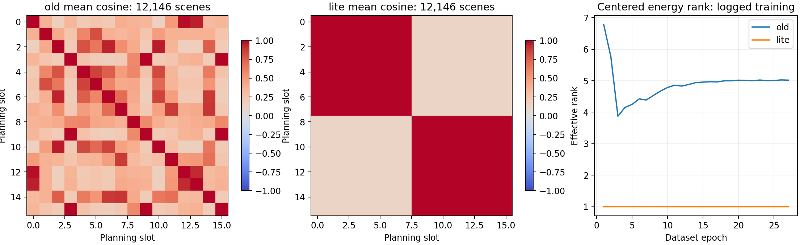
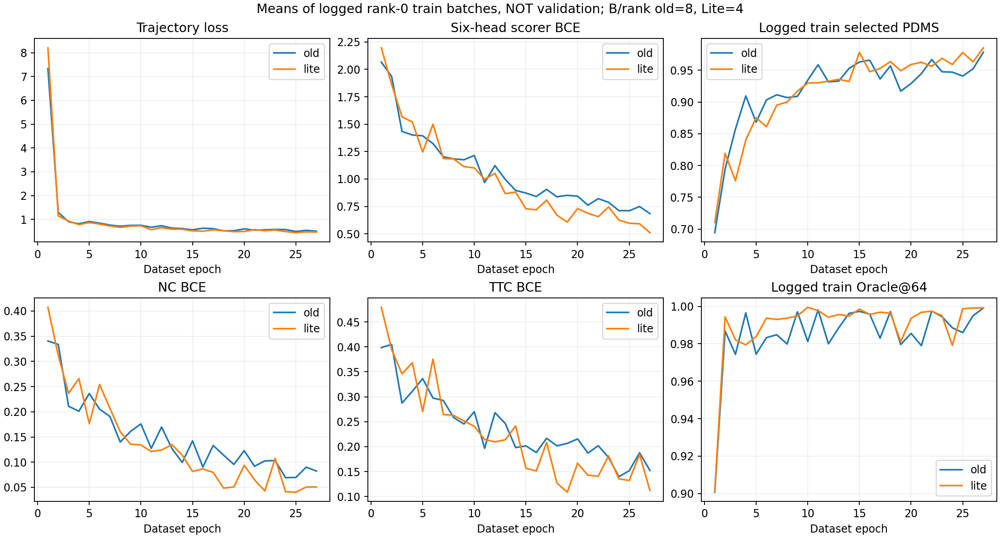
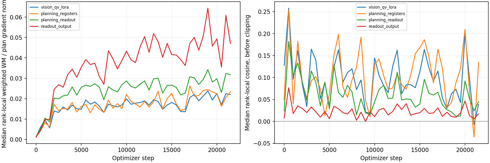

# Task-Future Lite 最终性能退化：算法与训练证据复盘

日期：2026-09-07。分析起点：`b32b1dee06fb42003a2f69490366cc46db419195`，分支 `feature/planreg-task-future-lite`。

## 结论先行

**目前最有力的结构性证据，是新加的 8 global＋8 local 读出没有形成 16 个有区分度的场景槽位，而是接近“两种场景向量，各重复八次”。** 世界模型任务可以降低训练误差，却没有打破这一瓶颈；scorer 对危险候选的过度乐观反而加重。最终呈现为：普通候选平均质量改善，但困难场景覆盖与最终选优变差。

这不是“世界模型没训练”“EMA 仍然不更新”或“多机通信把分数算错”。也不能把全部下降归因于某一个模块：两轮同时更改了读出、更新精度、语义接口、随机初始化和部分 LR，没有单变量完整对照。

证据等级：

- **已测量事实**：完整 Navtest 退化；读出组内近重复；训练日志从早期就显示 centered rank≈1；同批 WM 梯度非零；真实 FP32 参数/Adam/EMA 更新；危险选中候选的高预测置信度。
- **源码可证实的设计性质**：新读出是共享 memory 的无空间分区 attention pooling；未来分支直接损失不向视觉 teacher 回传；部署删掉物理头，收益只能间接迁移到视觉表征；物理标签不等价于官方分项。
- **强机制解释、尚非独立因果证据**：重复读出削弱候选相关的局部视觉辨别，辅助目标不足以纠正它；拟合训练候选的平均误差并未转换成测试极端候选的可靠排序。
- **未证实**：恢复哪一种读出就能拿回全部 1.14 分；Lite WM 本身必然有害；GB64 必然胜过 GB128；增加权重/epoch 必然有效。

## 1. 首先确认下降发生在哪里

主比较为两次 **BaseInit、完整 103,288 场景 trainval、GB128、27 epoch、21,789 optimizer steps**。不是与旧 epoch33 续训比，也不是 Base/VQA 配对结果。

| 指标（×100） | 上一版 epoch27 | Lite epoch27 | 变化 |
|---|---:|---:|---:|
| scorer 选中轨迹的真实 PDMS | 91.3788 | 90.2354 | -1.1434 |
| Offline Oracle@64 | 98.7239 | 98.2608 | -0.4631 |
| regret，越低越好 | 7.3452 | 8.0255 | +0.6803 |
| 候选平均 PDMS | 77.5227 | 80.0790 | +2.5562 |
| 每场景候选 P10 的均值 | 51.9619 | 59.5459 | +7.5830 |
| 每场景候选 P25 的均值 | 67.6252 | 72.1239 | +4.4987 |
| 严重误选比例 | 3.1615%（384 场景） | 4.1495%（504 场景） | +120 场景 |

严重误选定义：oracle>0.9 且 selected<0.5。Oracle 是需要官方标签的**离线候选上限**，不是部署成绩。

12,146 场景、136 日志、每场景 64 条，零无效场景；单轨迹与批量评分最大差为 0。两次均为 FP32 VLM＋FP32 action/scorer 的固定当前帧推理。完整报告、六分项、median/top5、候选唯一性/几何多样性、场景胜负和 hash 见 [完整评测](../navtest_20260907/RESULTS.md)。

selected 的配对差为 -1.1434 分，20,000 次按 log 聚类 bootstrap 的 95% CI 为 **[-1.7485, -0.4740]**。不是只有最后几个 batch 的噪声。

数值恒等式是：

```text
selected = oracle − regret
变化：−1.1434 = −0.4631 − 0.6803
```

因此候选上限与选择损失**都**变差。约 40.5%/59.5% 只是这个算术分解，**不是 generator/scorer 两个模块的因果贡献率**。它们共用视觉表征，候选集合也不同。

## 2. 最明确的设计问题：8＋8 是槽位数量，不是局部信息数量

对两版已锁定的完整候选库中 `planning_registers [12146,16,256]` 做 CPU 只读分析。它是 fusion 之前的规划读出，不是假造 token、训练期 dropout 输出或 tiny 模型。

| 最终读出指标 | 上一版 | Lite |
|---|---:|---:|
| 全 16 token 去槽位均值后的能量有效秩 | 5.03835 | **1.000338** |
| 最大 centered 主方向的平均能量占比 | 40.2493% | **99.997281%** |
| 全局 8 token 组内平均 cosine | 不适用旧分组 | **0.99999819** |
| 局部 8 token 组内平均 cosine | 不适用旧分组 | **0.99997489** |
| 全局组内 centered RMS / 原 RMS | 不适用 | **0.1258%** |
| 局部组内 centered RMS / 原 RMS | 不适用 | **0.4681%** |
| 组内差异占全部槽位方差 | 不适用 | **0.002709%** |

也就是说，几乎全部槽位差别来自“global 和 local 两组的均值不同”，不是每组内部八个查询在读不同内容。



### 2.1 为什么原有检查没有识别这个问题

- 两组各有一个不相同的向量，就能有较大的整体 std/RMS 和不接近 1 的**全体**平均 cosine。Lite 全体 cosine≈0.529，并不会看起来“全部一样”。
- 组内非常微弱的残差也能有 3 左右的有效秩；**只看归一化后的 rank、不看幅值，会把微小差别当作丰富内容**。
- 改变一个 crop 后，组内八个 token 可以**一起改变**，从而通过“local 输出对 crop 敏感”的测试，但仍没有八种局部读出。
- 原测试验证了 shape、置换不变性、图像变化有响应、梯度能到 crop；没有验证真实数据上八个查询是否形成内容分工。

不是完全不看图：Lite 跨场景内容 RMS 为 0.8552（旧版 0.5919），图像内容确实会影响输出。问题是**同一场景内部的可寻址信息冗余**，不能把它夸大成“视觉塔只剩一个标量”。

### 2.2 哪一段设计容易产生这个结果

[global_local_readout.py](../../../navsim/agents/EpisodeDrive/layers/planning_registers/global_local_readout.py)：

1. 八个 global queries 都读取同一 thumbnail register 集合。
2. 八个 local queries 都读取同一个 crop×register 全量池，没有空间分区或不同 query 的几何锚点。
3. local query 的 global summary 条件是**全部 slot 共享**的。
4. query 用小随机值初始化，当前实现没有 query 预归一化；attention 输出不保留原始逐槽位视觉内容的 residual。
5. crop 位置只进入共享 K；这可以帮助筛选，但不保证八个 query 分工。只要各 query 的注意力接近，就仍是同一个池化结果。
6. 各组末尾的 LayerNorm 可保持非零幅度，但不能恢复在池化中未区分的视觉细节。

因此，“增加 global/local 名称＋把 local 槽位从零 gate 后面拿出来”，只保证了局部内容**有入口**，没有保证**有多种独立读出**。这是本轮理想设计与实际计算之间最明显的落差。

训练日志第 1 epoch 的该有效秩均值已是 **1.00010**，27 epoch 是 **1.00044**；不是最后几轮才突然坍缩，也不能只归咎于后期 WM 权重。

### 2.3 为什么语义 query 修复没有救回来

语义路径确实有所改善：末期已记录 batch 的 semantic slot-centered RMS≈0.18，去掉固定 slot 跨场景均值后的 slot-content RMS≈0.116；不能再直接套用“旧语义槽位全部相同”的结论。

但融合是 **planning 作 Q，semantic 作 K/V**。如果同一组 planning queries 相同，读到同一个 semantic memory 的 attention 输出也相同。增加 semantic 的内容多样性，并不自动让相同的 planning queries 产生不同的局部内容。

这里的“完全相同 Q 得到相同输出”是函数性质；**最终 fusion 后的近似重复程度尚未重新导出测量**，不能把 pre-fusion 数值冒充 fusion 后测量。现有源码与 pre-fusion 事实足以把它列为首要调查方向，而不是已完成全部因果证明。

## 3. loss 更好，为什么最终决策反而更差

读取两次完整训练 TensorBoard，每次共 430 个已记录训练标量时点。下面为最后 1,000 optimizer steps 内日志的均值：

| 同定义指标 | 上一版 | Lite |
|---|---:|---:|
| trajectory loss | 0.53240 | **0.47145** |
| scorer 六头 BCE 合计 | 0.65554 | **0.49415** |
| NC BCE | 0.07382 | **0.04667** |
| DAC BCE | 0.08101 | **0.04590** |
| TTC BCE | 0.15178 | **0.10784** |
| EP BCE | 0.30890 | **0.27928** |

两轮 `DRIVEVLA_SYNC_TRAIN_METRICS=0`。这些规划指标是**稀疏记录的 rank0 train batch**，旧版每 rank B8、新版 B4，并非同一批样本，也不是完整训练集精确均值。它们支持“训练拟合没有整体崩坏、末期 loss 更低”的描述，不能单独证明泛化或过拟合程度。表征诊断在较低频率刷新，TensorBoard 可能重复记录最近快照；不能把每个标量点当独立新测量。



### 3.1 目标函数优化的是平均误差，部署执行的是 argmax

- scorer 原六头 BCE 平均监督完整 64 候选，**并没有丢掉剩余 56 条的 scorer 标签**。
- 平均 BCE 下降，可以主要来自多数容易候选的概率拟合更好。
- 部署只选最大预测分数的那一条；少量“危险但被高估”的候选会决定结果。
- NC/DAC 的乘法性质使高置信度的错误尤其昂贵。64 个候选中一个错误乐观的值，也可能赢过多个真正安全的值。

这不是要求修改 scorer，也不是证明 fixed-source scorer 本身错误，而是**相同 scorer 功能不等于相同输入表征、标定或尾部可靠性**。

### 3.2 已选中的失败候选，预测仍然非常乐观

在模型完成选中后，才按 token/index 对齐其预测与官方标签：

| 条件化统计 | 上一版 | Lite |
|---|---:|---:|
| 已选中 TTC 失败数量 | 666 | **835** |
| 这些失败候选的平均预测 TTC 通过概率 | 95.6488% | **96.8915%** |
| NC 按训练映射为 0 的已选中候选数量 | 205 | **324** |
| 这些 NC 失败/半分候选的平均预测通过概率 | 98.4962% | **99.3337%** |
| 已选中 DAC 失败数量 | 280 | **360** |
| 这些 DAC 失败候选的平均预测通过概率 | 91.5660% | **94.5379%** |
| 已选中 EP 的预测均值 | 0.91010 | **0.93326** |
| 已选中 EP 的真实均值 | 0.88516 | **0.88365** |

NC 保留原训练的 0.5→0 映射，因此上表 NC 数量不等同于“官方 NC=0 的次数”。这些是**模型已选择子集上的标定诊断**，不是全候选 ECE，也不能据此直接在 Navtest 上调温度或阈值。

本轮的主要失败表象不是“轨迹全部更差”，而是危险尾部错误仍被高估、并更频繁成为赢家。

## 4. 物理世界模型的合理动机，为什么没有兑现

### 4.1 三个物理量不等价于最终决策难点

源码：[标签提取](../../../navsim/agents/EpisodeDrive/layers/world_model/minimal_physical_targets.py)、[任务损失](../../../navsim/agents/EpisodeDrive/layers/world_model/task_future_loss.py)。

- **projected gap**：所有 actor 的外推几何距离，按区间/lag 取 min；不是责任判定，也不是官方 TTC。最小值还会切换到另一个 actor、时刻或 lag，在未知运动/遮挡下难预测。单前视当前帧未必含有决定标签的全部信息。
- **road margin**：clip 到 ±2m 以后，远离边界的误差被压缩；是几何裕度而非整个官方 DAC 标签协议。
- **route progress**：绝对弧长/40，不是受违规与 reference progress 影响的归一化 EP。已知候选和 ego 运动本来就能解释相当一部分变化。

这些是有意义的辅助目标，但**语义相关并不意味着它们能保留 scorer 做候选比较所需的充分信息**。不读取 evaluator/reference 到网络是正确的边界，不代表剩下的问题自动容易或一定可观测。

### 4.2 “三任务等权”并没有形成均衡的标量学习负担

第 27 epoch 的已记录全局有效元素归一化结果：

| 当前物理任务损失 | 数值 |
|---|---:|
| gap CE | 0.646149 |
| road SmoothL1，clip/2 | 0.017268 |
| progress SmoothL1，/40 | 0.000527 |

gap 占三项未加权数值和约 **97.3%**。系数相等不等于尺度相等，更不等于共享视觉梯度相等。**不能因此声称 gap 占 97.3% 视觉梯度**；分任务梯度未保存，尚未重测。也不能把“进度有动作捷径”错误描述为“进度支配总 WM loss”：实际标量恰恰很小。

旧版完整 register abs/delta 的 `wm_loss` 与新三物理任务的 `wm_loss` 是不同单位/定义，0.059 与 0.325 不可直接用来判断哪个世界模型更好。Lite resolved config 中保留的旧 abs/delta/horizon 字段也不代表它们在新模式仍被计算。

### 4.3 新辅助学习的收益主要依赖间接迁移，链条较长

```text
当前视觉 → planning readout → 共享物理 decoder → 当前物理标签损失
EMA 当前＋未来视觉（无梯度） → 同一个 decoder → 后见物理标签损失
后见答案.detach → 当前答案蒸馏
当前 readout → fusion → 原 generator/scorer → 最终选中轨迹
```

- 后见真实标签损失直接更新的是**共享小 decoder**，不是 EMA 视觉。
- teacher 的视觉 EMA 有平滑，但物理 decoder 与学生共享，不是一个已经证明更准确、独立收敛的教师。
- 前向给了未来画面和 logged pose，仍不保证它看到某区间最小风险；未来画面还可能晚于风险发生时刻，或看不到另一个候选会接近的 actor。
- 蒸馏是 `0.25 × lambda`，从一开始对 stop-gradient 后见答案进行约束，**没有先证明匹配时段上 teacher 优于当前分支**。
- 正常部署删掉物理头。因此答案更准也不能直接替代 scorer；只能寄希望于所塑造的共享视觉被 scorer 利用。

这一设计不是无效的数学结构，但“后见分支存在”与“它是好老师”，以及“物理回答更准”与“选优更可靠”，是三个需要分别验证的命题。

### 4.4 正式训练前的 probe 实际已给出警告

这是**旧的已运行训练日志划分 probe，本次只重新审阅，不是新实验**。8 train logs＋8 development logs，150 steps，冻结上游。详见 [原可学习性报告](../BOUNDED_REAL_RESULTS.md)。

| development 输入 | Gap Brier↓ | Road MAE(m)↓ | Progress MAE(m)↓ |
|---|---:|---:|---:|
| 当前视觉＋动作 | 0.72849 | 1.01521 | 5.36745 |
| 同容量 action/ego-only | 0.80329 | 1.07535 | **4.35318** |
| 错配当前图像 | **0.66409** | 1.22506 | **3.68978** |
| 后见（只观察 0/2/5 bins） | 0.76362 | 1.08998 | 5.64943 |
| 错配未来、保留相同 pose/bins | **0.75531** | 1.09860 | **5.14594** |

当前与后见的总体值用不同 bins，**不能直接当作匹配时间的教师优势测试**。正确未来与错配未来使用相同 bins/pose，可比较，但没有稳定优势。小样本不证明方法必然失败，却也没有提供可进入大规模训练的正向方法证据。

不合理之处在于：把“可拟合、finite、梯度正确”当成了“辅助目标学到了必要视觉且能改善决策”的替代证据。这个证据缺口此前就存在，不能等最终掉分后再把预期收益当作已经成立。

### 4.5 8 条辅助候选与 64 条最终选择之间还存在覆盖差

每个 scene encounter：1 GT＋从 64 中均匀取 7 条。某一条特定非 GT proposal 被抽到的概率为 7/64≈10.94%。这不意味着它长期永远不被监督，也不意味着 scorer 缺标签；**原 scorer 仍监督全部 64**。

但辅助任务没有特意检验高分误判尾部是否得到足够有效视觉监督，而部署分数对这些尾部非常敏感。平均物理损失改善不是困难候选选优能力的充分指标。当前证据不授权据 Navtest 难例名单改训练采样。

## 5. 梯度和精度：哪些简单归因应排除

读取正式运行每 500 step 保存的 **32 ranks × 44 时间点 = 1,408 个 rank-local 同批审计**。每条记录内比较相同 batch/参数、clip 之前的 planning loss 与加权 WM loss；没有混用来自不同 batch 的两个 norm。

后期 step16000–21500（12 次×32 ranks）：

| 参数集合 | WM/plan norm 中位数 | cosine 中位数 | cosine<0 比例 |
|---|---:|---:|---:|
| Vision Q/V LoRA | **1.9604%** | +0.0720 | 29.17% |
| Internal planning registers | 2.0613% | +0.0917 | 36.20% |
| Planning readout 参数 | **2.8329%** | +0.0458 | 31.51% |
| Readout 输出张量 | 4.6707% | +0.0175 | 30.21% |



这是 rank-local 比较的分布，**不是把 32 个梯度向量 all-reduce 后的 global cosine**。总体没有持续强负相关、压倒性 WM 的证据，也不是完全没有 WM 影响。较小的整体 norm 不排除少数重要参数方向受影响；不能从它反推“绝对无害”或自动增加 lambda。

真实精度记录 step21501：

- trainable：21,249,830 个值，均 FP32；
- Adam moments：42,499,660 个值，均 FP32；
- EMA master 本次改变 4,070,217 / 4,091,136 个受追踪值，teacher/student 距离非零；
- WM 从 step0 非零；current gap/road 的已记录有效计数为 8192（GB128×K8×H8）；future gap 末期均值约 3060/3072。

因此没有“未来全部 invalid 导致没训”或“本轮又因 BF16 EMA 吞更新而没学习”的证据。FP32 修复是数值正确性，不保证原 LR 在新的真实更新动力学下最优；不能为了追回旧分数再恢复错误精度。

## 6. 这不是干净的单模块消融，不能把锅全部甩给 WM 或 GB128

| 控制因素 | 上一版 epoch27 | Lite epoch27 |
|---|---|---|
| VLM checkpoint SHA | 同一 Base VLM | 同一 Base VLM |
| 数据与曝光 | 103,288；807×27 steps；GB128 | 相同 |
| train/val overlap | 0；最终合并 trainval | 相同 |
| 有效 train log SHA | `7d093fbc…f10afaa` | 完全相同 |
| 全局 batch / 布局 | GB128 / 16×8 | GB128 / 32×4 |
| readout | thumbnail＋gated crop residual | global/local 8＋8 二次池化 |
| 新建视觉参数与 EMA 更新 | 旧精度路径 | FP32 trainable/master |
| semantic query / mask | std1e-6 / 旧接口 | std0.02 / 有效 token mask |
| 主干规划/scorer LR peak | 3.0e-4 | 2.8284e-4 |
| Vision Q/V LoRA LR peak | 5.0e-5 | 4.2426e-5 |
| Q-Former LR peak | 1.5e-4 | 1.4142e-4 |
| 旧 predictor / 新物理 decoder LR | 3.0e-4 | 1.4142e-4（不同模块） |
| 世界模型 | K1 GT register abs/delta | K8 物理当前＋后见＋蒸馏 |
| 随机 planning init artifact | 旧独立 artifact | 新独立 artifact |

重新读取两份 shared init：相同 shape 的 scorer 六头 **24/24 tensors 都不同**，trajectory query 也不同。相同 seed 不保证更改拓扑、改变 RNG 消耗顺序后仍得到相同随机 planning stack。Base/VQA **同版本内**共享初始化的要求不受影响；不能把它混同于这两次**跨版本**初始化相同。

本轮期望 GB64 的短程对照里，GB128 的 trajectory loss 已高 8.17%、train Oracle 低约2.61点；吞吐筛选通过仅说明没有超过预注册的 10% 粗筛，不是最终分数不劣保证。但两次已完成主实验本来都是 GB128，**不能把两者差异简单解释成“本轮 batch 翻倍”**。

两版 fixed-source scorer 功能、BCE、detach、64 candidates、long-2、prev_weight=0 没有在本次分析中改变。旧无效中间头冻结不是“少了四层有效生成器”，也不是已证实根因。scorer parity 保证函数，不保证上游可供选择的信息相等。

## 7. 本质上哪里设计/验收不合理

1. **把“能读局部”当成“读到了多个不同局部”。** 共享池、共享条件的多个 learned queries 可以一起收敛；无零 gate 仅修复一条通路被关掉的问题，没有解决读出冗余。整体 std 与简单响应性不足以验收。
2. **把相关的物理辅助任务，当成了部署选优目标的充分代理。** 几何间隙、道路裕度、绝对进度与 NC/TTC/EP 并不一一对应，动作已知与不可见未来同时给任务带来捷径和不可约误差。
3. **把“额外未来输入”默认为高质量教师。** 同参数 decoder 的当前/后见路径没有匹配 bins 的可靠教师优势证据；早期答案也在蒸馏。不能靠降低双方差异证明视觉学到了未来。
4. **把平均可拟合性当成决策泛化。** 训练 BCE、更高候选均分和更分散热力图，都可能与 argmax 的罕见高置信度错误并存。
5. **一次更改多个因素，缺少中间方法有效性检查。** 真实更新/shape/吞吐验证完成了，却没有把贯穿训练的 rank≈1 与弱 learnability 证据提升为人工复核项。这是我们的验收流程不足，不应归咎于用户要求提速。

## 8. 建议下一步：先修最有证据的问题，不立即扩大训练预算

以下是建议，**本轮未实施、未启动训练，也未用 Navtest 调参**。

- 第一优先级：在 train-only、按 log 分开的新 pilot 上区分“内部 registers 已丢信息”还是“二次 readout 压扁”。记录 pooling 前后、fusion 后的实际内容差异与每个空间扰动影响哪些 slot。现有测试只证明输入能影响输出，不够。
- 用一条保持逐槽位**视觉内容**的通路作对照，或让局部查询有明确但可学习的空间读取职责。不要靠往输出加固定 query ID、强制全 token 正交或追求16满秩来制造通过。具体结构需 pilot 验证，不能承诺换了就回到94。
- 保持 FP32、原 scorer、传感器、scheduler/曝光等可控因素；先只比较读出这一因素。不同 topology 时对可对应的 generator/scorer/Q-Former 显式按 key 复制初始化，不仅重新设同一个 seed。
- 保留 WM 接口和任务边界，但在同 bins/同 mask/同 pose 上验证 correct-current、action-only、correct-future 和 shuffled-future。后见优势不成立时不要继续声称蒸馏提供了更准目标，更不能仅凭 loss 数值提高 lambda。
- 分任务量化视觉梯度与任务可观测性，再决定尺度与训练设计。现在的记录只分 plan/总 WM；97.3% 标量比例不是改权重的充分理由。
- 选优验收必须包含真实训练/开发日志上的高置信度失败、top1 regret、NC/TTC 尾部，而不只看全候选平均 BCE。仍保持 exact scorer，不在本次报告里偷偷加入 ranking、新 scorer 或 Navtest replay。
- 小 pilot 的 development logs 必须在这个 pilot 的规划训练中留出。旧完整 trainval 模型已见过所有这些日志，不能用它声称未见验证。锁方法后再完整27epoch、固定终点评估；不要根据本次 Navtest 挑另一个已训 epoch。

**不建议现在直接再续训6epoch、盲目加大WM权重，或再跑一轮多模块叠加的完整训练。** 现有低秩问题从早期持续到终点，单纯更多更新未显示能纠正；同时 loss 已更低而测试错误更严重，缺的不是一句“继续降 loss”。

## 9. 本轮执行与复现

本次没有修改模型/标签/scorer 的功能代码，没有重新训练，也没有重新进行 GPU 模型推理。四台压力脚本保持运行。本次新结果是对已保存真实训练记录与完整 FP32 候选库的只读分析。

新增 [分析脚本](../../../scripts/analyze_task_future_lite_regression.py) 与 [定义测试](../../../tests/test_task_future_regression_analysis.py)；完整标量、数据/配置/权重来源 hash、初始化比较、梯度分布均保存于 [analysis.json](evidence/analysis.json)。原始大权重和候选库仍在运行目录，不随报告上传。

```bash
PY=/mnt/project/DriveVLA-M0-stage2/reproduction_diagnostics/envs/navsim_py39_exact/bin/python
export PYTHONNOUSERSITE=1
export PYTHONPATH=/mnt/project/DriveVLA-M0-planreg-task-future-lite:/mnt/project/DriveVLA-M0-env/lib/python3.9/site-packages
export OMP_NUM_THREADS=1 OPENBLAS_NUM_THREADS=1 MKL_NUM_THREADS=1
"$PY" scripts/analyze_task_future_lite_regression.py \
  --old-run /mnt/project/DriveVLA-M0-formal-runs/formal_dual_init_gb128_asyncpdm_20260903/formal_base_init_wm_seed0 \
  --lite-run /mnt/project/DriveVLA-M0-formal-runs/lite_acceleration_20260905/formal_base_fast_gb128/formal_task_future_lite_base_init_wm_seed0 \
  --old-bank /mnt/project/DriveVLA-M0-formal-runs/evaluation/base_epoch27_seed0_fp32_navtest_20260904T1415Z/candidate_bank.npz \
  --lite-bank /mnt/project/DriveVLA-M0-formal-runs/evaluation/lite_epoch27_navtest_20260907/lite_epoch27/candidate_bank.npz \
  --evaluation-root /mnt/project/DriveVLA-M0-formal-runs/evaluation/lite_epoch27_navtest_20260907 \
  --output /absolute/new/postmortem-output
```

脚本拒绝覆盖输出。第一版中间统计已移至运行目录 `postmortem_intermediate_20260907` 保留，仓库内提交最终可复现结果；未删除旧权重、旧候选库或旧审计。

本轮已运行 7 个测试文件，共 **26 passed、14 warnings、33.43s**：分析统计定义、当前帧导出、exact scorer、student export、global/local 接口、Lite loss、同批梯度隔离。warnings 为 Matplotlib/Pyparsing 弃用提示，非跳过测试。另运行 scorer parity 审计及代码编译/空白检查，结果见 [执行记录](VALIDATION.md)。

**NOT_RUN / 不能声称**：

- 新的可学习性训练、匹配 bins 的最终 checkpoint 教师优势测试：本轮为只读诊断，不启动新训练；引用的150step probe明确是历史证据。
- 新模型的完整六头 oracle substitution / 全候选分项标定：本轮主批量评分产物保留完整64条总分，但并未保存每条的完整六分项；没有据不完整数据虚构结果。当前报告只分析已选中分项。
- fusion 后完整真实 token/空间注意力重放、分任务共享视觉梯度：现有导出与审计未包含这些量，需要另行有界诊断。
- 多seed、单变量完整27epoch、GB64最终分数、无WM配对：均不存在本轮结果，不能做因果或最优配置结论。
- 全历史测试集合：本轮为报告及只读工具，执行相关26项；旧243项通过记录不是本轮重新运行结果。

本次结论是“读出冗余已被测量、选优尾部恶化已被测量、方法中间证据不足”，而不是“已经找到保证达到94分的修复”。Lite 仍只是训练期多候选物理回答辅助，标准部署不使用后果预测；没有加入推理期多轨迹后果搜索、物理分数替代或坐标修正。
